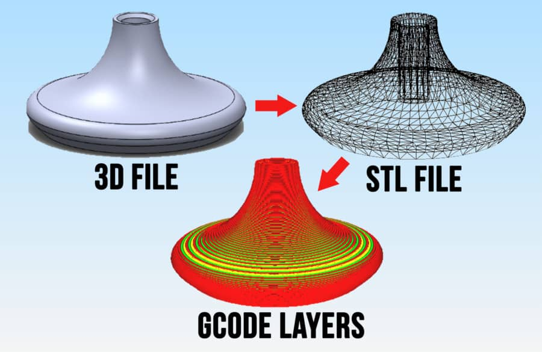

What is Slicing?
================

One of the most important steps of 3D printing is turning your CAD files into instructions for the printer can carry out and read. 
This is done in a software called a slicer, which turns CAD files, into machine-readable, G-Code Files.

|

The basis of this software is that it takes a mesh file, normally an STL file, and splits it into layers and lines that the 3d
printer can digest. You get to select various parameters about how it will instruct the printer to follow this data, such as the
speed, thickness of lines, temperatures, thickness of the slices, amount of walls, the patterns on the inside of the part, and 
even more. Most slicers will have over 200 options available to you if fine-tuning is something you're interested in, but there's
only about 10-20 settings that you absolutely have to be concerned with.

G-Code files are also notably just compilations of G-Code commands. G-Code commands tell the printer how to move, where to move, 
and what to turn on and off. These G-Code commands can be useful to learn if your printer has a command line or you want to eventually 
write start-up or shut-down scripts for your prints. 

