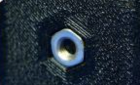
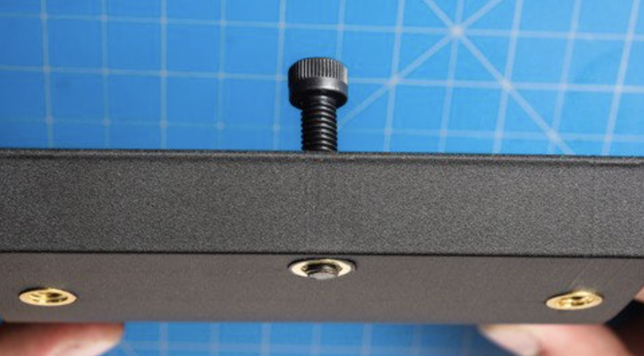

Working With Screws
===================

3D printed parts typically interact quite often with your hardware and screws. A lot of teams simply use locknuts to secure 3D printed parts 
but while they are strong, they may not always fit or work for your application. Thankfully, there a quite a few other ways to secure 3D printed 
parts without much effort:

.. image:: images/variousscrewmounting.png
  :align: center
  :width: 55%
  :alt: An image showing various screw interactions with 3d prints.

|

Plastic Threading
-----------------
For low strength, simple, and aesthetic applications you can simply thread a screw directly into an undersized 3D printed hole. An M4 screw could 
be threaded into a 3.3mm hole for example, and hold rather well. Specialized thread forming screws, similar in look to wood or concrete screws, 
make this process a lot easier and increase holding strength.

.. warning:: While simple to implement, threading directly into plastic should not be used for parts that need to be removed. When plastic threads
             are commonly screwed/unscrewed, they lose their strength extremely quickly. This method is best for combining parts that are never 
             expected to be separated for maintenance or repairs.

Embedded Nuts
-------------
Nuts and Locknuts can be embedded into prints, removing the need for a wrench when tightening a screw. Simply inset the shape and size of the nut into a print
and drop it in when attaching the part. These should hold very well, especially if placed in mid-print (pausing the print midway through to place a nut embedded 
inside)

|

Heat Set Inserts
----------------

An increasingly common solution to securing screws to 3d printed parts, heat set inserts are small brass components that can be melted into a 3d printed part using 
a soldering iron. There are custom soldering iron tips specifically for this purpose. There's lots of sizes available for whatever purpose you need (Amazon, 
Aliexpress, whatever storefront you prefer), but keep in mind that inserts with a "chamfer" will be a lot easier to put in. 

A very important best practice when using heat set inserts is to place them on the print where when the screw is tightened, they will be pulled farther into the print 
instead of out. This increases longevity.

  This part uses heat set inserts as described above, where tightening the screw pulls them farther into the part.

|

If you'd like a more in-depth guide on using heat set inserts or are considering doing so for your team, go read through `Markforged's article on the topic. <https://markforged.com/resources/blog/heat-set-inserts>`_.