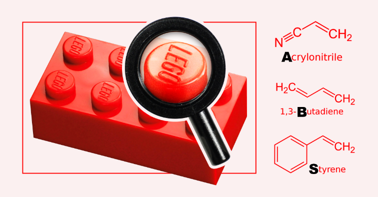
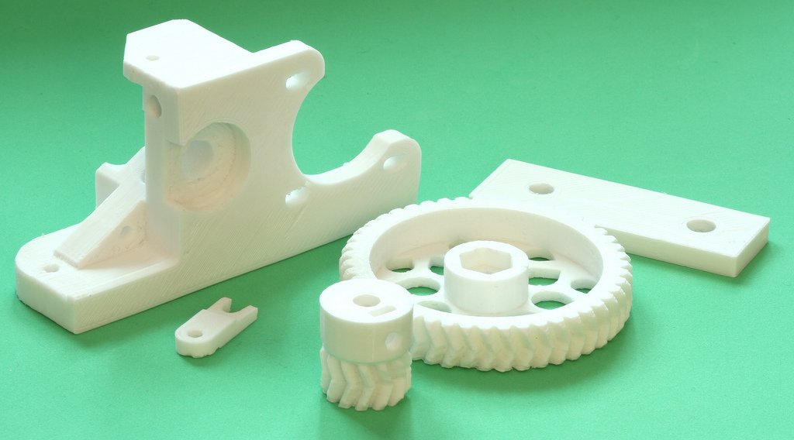
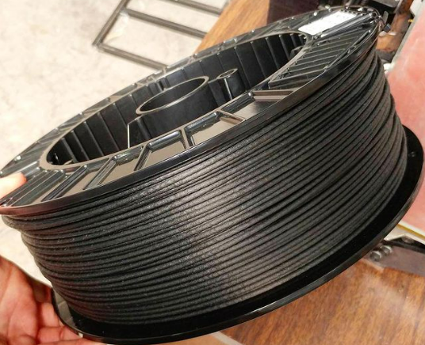
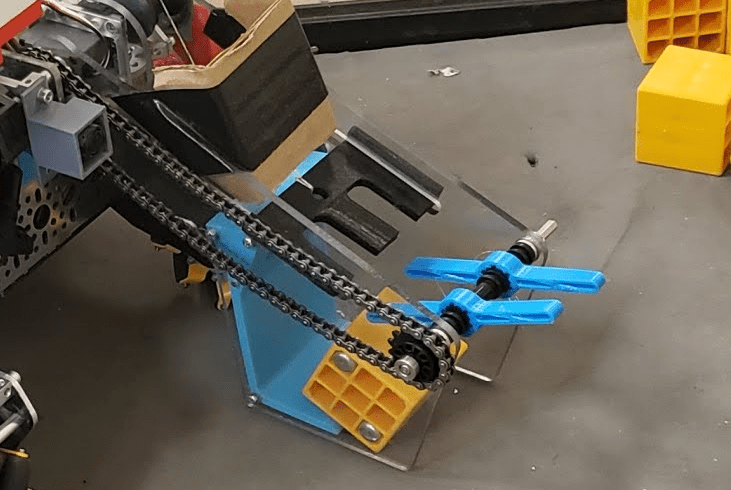

Advanced Filaments
==================

.. warning:: If your printer's hotend (the part that melts the filament) has a PTFE (Teflon) lining where the PTFE tube 
             goes all the way down to the heat block (common in lower price printers like the base Ender 3), then you 
             should not be printing at or above 250° C. Doing so will cause the PTFE tube to degrade and melt, potentially 
             releasing toxic fumes. If you need to print at these temperatures (used for some of the advanced filaments 
             listed here), and you have a PTFE lined hotend, you can look at upgrading to an all-metal hotend.

ABS (Acrylonitrile Butadiene Styrene)/ ASA (Acrylonitrile Styrene Acrylate)
-------------------------------------

  ABS can best be recognized as the plastic used for Lego Bricks.

|

Before PLA became readily available, ABS was the most common filament used for 3D printing. Nowadays, it's regarded as a 
more advanced filament with a specilized setup needed. ABS is very strong, having a high ductility and able to withstand 
shock loads well. These strengths come with major difficulties, however, as an enclosure is often needed to increase the 
ambient temperature in order to prevent severe part warping. This enclosure is also a good idea due to ABS's production of
styrene when it melts, a carcinogenic gas that can cause headaches. ABS should only be printed within filtered enclosures
or in extremely well ventilated areas. If you have a proper setup with a heated enclosure, ABS can be very worth your time,
but if you don't have a setup for it, it's not worth the pain to try and print it. Notably, ABS can be very inexpensive and 
often found near the same price as PLA or even cheaper.

.. note:: ASA, a slightly more expensive but similar material, prints at approximately the same temperatures but prints 
          slightly easier and produces considerably less styrene. It also may not require an enclosure for smaller prints. Alongside that, it's UV Resistant and typically offers slightly better mechanical properties compared to most ABS plastics.

* ABS hotend temperatures: 230-250° C
* ABS bed temperatures: 100-120° C
* ABS enclosure temperature: 30-40° C

.. note:: It is important to properly vent/filter fumes emitting from ABS/ASA, as prolonged exposure to either can lead to poisoning. Typically it's recommended to use an activated carbon air filter, however most enclosures aren't airtight, and therefore it's also important to leave your printer somewhere safe if you plan on printing large or numerous parts.

Polyamide Filaments
-------------------

  A collection of Nylon parts, including gears, a great usecase for Nylon

|

.. note:: Nylon is a category of Polyamide, and these generalizations should apply to all filaments based on Nylon or a general Polyamide.

Being more of a category of filaments, polyamide (PA) based filaments can boast impressive capabilities while being relatively
easy to print. These show their strength in extreme durability and resistance to wear, making them ideal for gears and 
pulleys if you can safely print them. Common filaments in this category include Pure Nylon, Polyamide, PA-KV (kevlar filled nylon), 
and PA-CF (carbon fiber filled polyamide). Polyamide filaments will commonly require printing temperatures in excess of 250° C, 
making an all-metal hotend necessary, and require heated bed temperatures in the range of 80-100° C. Some of these 
filaments are abrasive, requiring a hardened steel nozzle on your hotend to avoid damage. These filaments are also 
**extremely** hygroscopic, making proper storage a necessity even while actively printing. Nylon prints also tend to shrink when cooling.

Carbon Fiber Filaments
----------------------

  The abrasiveness of Carbon Fiber filament is visible.

|

Carbon fiber (CF) filled filaments are everywhere, bringing increased stiffness and strength to many parts while keeping them
light. You can find PLA-CF, PETG-CF, PA-CF, CF-ASA, PC-CF, and many others. CF filled filaments typically keep many
properties from the filament they are based on, including how hygroscopic the filament is, the printing temperatures, and 
the ease of printing. The one large difference is the abrasion of the filament, meaning that you need a hardened steel nozzle
or other abrasion resistant nozzle for your hotend.

.. note:: Carbon Fiber reinforced PLA is one of the most commonly used CF Filaments, but comes with a notable drawback that it becomes incredibly brittle. It's important to to keep these kinds of trade-offs in mind, as while it's seen as "stronger", it doesn't hold up as well as most regular PLAs when it comes to dealing with impacts and may suffer from poor layer adhesion.

TPU/TPE (Thermoplastic Polyurethane/Elastomer)
----------------------------------------------

  An intake using custom TPU parts to grab game elements.

|

TPU and TPE are flexible filaments that can be used to create parts that are flexible and can bend. These filaments are sold 
under a variety of different durometers (a measure of a material's hardness). You will find 95A durometer the most common 
durometer due to it's printability. TPU/TPE's flexibility grants it an extremely high impact resistance, making it very 
durable as well. In FTC, TPU/TPE is often used to make flexible components such as intake rollers, wheel bumpers, and 
occasionally low-load toothed belts. Finally, TPU is extremely hygroscopic, and proper filament storage practices should
be used.

.. note:: Since TPU/TPE is very flexible, printers with a Bowden extrusion system, where the extruder motor and gear is 
          not located near the hotend, will have a very difficult time printing with it.

* TPU hotend temperatures: 210-250° C
* TPU bed temperatures: Heated bed not required, but do not exceed 60° C
* TPU printing speeds should never exceed 50mm/s on a direct drive printer and 20mm/s on a bowden printer
* Direct drive extrusion system highly recommended
