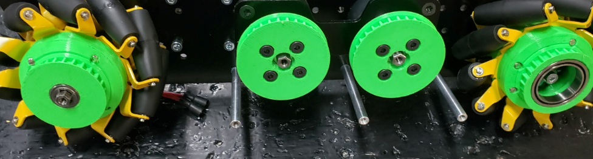
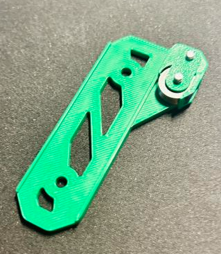

Common Filaments
================

.. tip:: These common filaments come in the most variety of color. Printing parts in colors that match a team's brand 
         is an easy way to customize a robot!

This page will go through the most common filaments and their properties. While each filament has advantages and 
disadvantages, most teams will find that the filaments listed on this page, PLA (Polylactic Acid) and PETG 
(Polyethylene Terephthalate Glycol) will be their best choice for strength, durability, cost, and aesthetics.
These filaments are the easiest to print with, and are available from many different manufacturers at a low cost. 
Many other filaments that will be discussed add some specific property (ex: TPU/TPE for flexibility), but are more 
difficult to print with, and are often more expensive.

The temperatures listed here are simply a range of the common temperatures for that filament, and may vary depending on 
the specific filament.

PLA (Polylactic Acid)
---------------------

  A custom drivetrain with PLA parts used across it.

|

Polylactic Acid, or PLA, is the most common 3D printing filament used today. It is made from biological sources such as 
corn starch or sugar cane. PLA is easy to print with, and is usually the best choice for most robot parts. It prints at 
a low temperature, and tends to warp very little. PLA is very stiff, but can be brittle, especially under shock loads 
(impacts), and parts should be designed with this in mind.

PLA is also sold in a massive number of variations from different manufacturers, like PLA+ or PLA Pro. These filaments 
contain different additives to improve the properties of the filament, such as increased strength or better printability. 
While more expensive, these filaments can be a great option that make PLA much more capable.

* PLA hotend temperatures: 190-230° C
* PLA bed temperatures: 20-60° C; PLA does not require a heated bed, but it is recommended.

.. warning:: Warning #1 about PLA: Due to the relatively low melting point of PLA, it is not advisable to leave PLA parts 
             in locations such as a hot car, as this can produce severe warping in those parts.

.. warning:: Warning #2 about PLA: PLA is extremely sensitive to UV light and sunlight. After multiple days outside during
             something such as an outreach event, if your robot is not under shade you may experience part failures. Make 
             sure to account for this and either avoid long outdoor outreach events with your robot exposed or be prepared
             to replace parts after such events.

PETG (Polyethylene Terephthalate Glycol)
----------------------------------------

  A linear slide insert printed in PET-G filament.
  
|

PETG is another very common filament that some consider an upgrade to PLA. Being only slightly more difficult to print 
with than PLA, PETG often has more stringing and other artifacts on parts. PETG's tensile strength is a technically 
lower than that of PLA, however it is much more flexible and less brittle. Because of this, PETG is more resistant to 
shock loads than PLA, and is a good choice for parts that may be impacted. PETG is also more resistant to heat than 
PLA, and is unlikely to warp when left in a hot location.

* PETG hotend temperatures: 230-250° C
* PETG bed temperatures: 60-80° C

.. warning:: PETG is well known for bonding extremely well to print beds, especially those made out of glass and PEI, 
             to the point of tearing chunks out of the print surface. If you are printing with PETG, it may be a good 
             idea to apply some glue stick or hairspray to the surface to prevent this.

