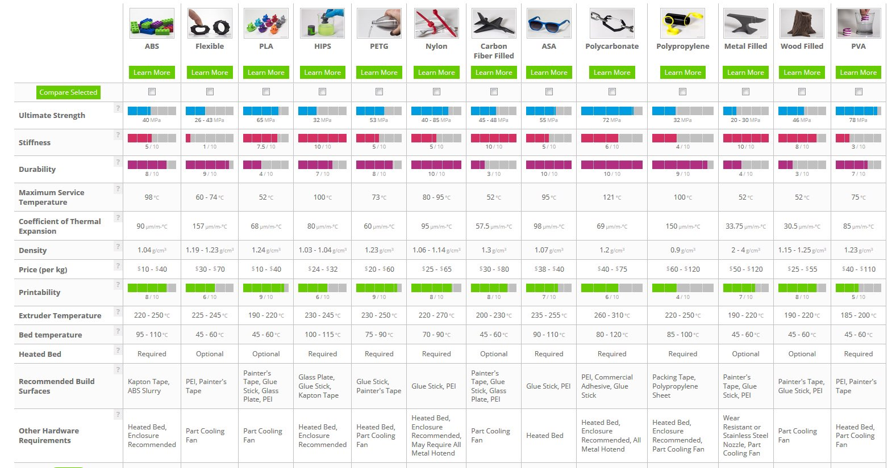

Filament Choice
===============
There are many different materials and colors of plastics called "filaments" that can be used for 3D printing, but for FTC there are only
a few that are of practical use for most teams. Since this guide is currently only addressing FDM (Fused Deposition Modeling) 
printing, materials like resin (used in SLA printing) will not be discussed.
|

.. warning:: Currently, the majority of commercial 3D printers use a 1.75mm diameter filament, so when shopping for filaments, teams should take 
             care to avoid other diameters, such as 2.85mm, as these will not work with most printers.

|

This section is all about FDM filament choices for 3D printing. There are a variety of plastics that are commonly used,
with some being more common than others, and some fulfilling specialty use cases. There are specialized to FTC 
descriptions in this section, but if you want a simple comparison chart like shown below, check out this `Filament Properties Table
<https://www.simplify3d.com/resources/materials-guide/properties-table/>`_. 

|

This section also talks about proper ways to store filament and the ever present complaint of "moisture in filament" in
the filament storage section.

.. toctree::
    :maxdepth: 1

    Common Filaments <common_filaments/common_filaments>
    Advanced Filaments <advanced_filaments/advanced_filaments>
    Filament Storage Details <filament_storage/filament_storage>
