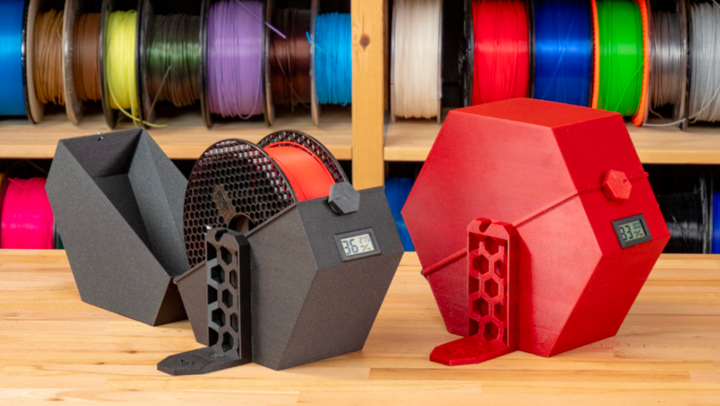

Filament Storage Details
========================

General Guidelines
------------------

Here are some general guidelines for how careful you should be to store filaments.

* Can be left in open air, sealed storage preferred: ABS, ASA
* Sealed storage highly recommended: PLA, PET-G
* Sealed storage highly recommended while printing and storing: TPU/TPE, Polyamides

Why We Need Filament Storage
----------------------------

  A large sealed bin can be customized to fit your use with silica packets thrown in.

|

It's important to keep in mind that filaments need to be stored in a specific way- and even the basic filaments PLA and PET-G are no exception. 
Filaments are **hygroscopic** (absorb moisture from the air), and that affects print quality majorly if not taken care of. Store filaments in a 
closed and sealed container, preferably kept dry with spare silica packets, and don't leave them out whenever possible. 

If you suspect a filament has taken on water, look up a drying temperature for it, and put it in the oven or a specialized filament dryer at that 
temperature for a few hours to get rid of the water.

.. tip:: An easy way to tell if a filament has taken on moisture is if you hear a slight popping noise when printing- this is the moisture forming 
         bubbles in the filament as it's heated.

Storing While Printing
----------------------

Some more sensitive hygroscopic filaments don't just need to be stored in sealed containers, but also need to be printed while in a sealed container.
Lots of companies sell or design "dryboxes" for this purpose, such as SUNLU's filament dryer box, BambuLab's AMS setup, or custom designs such as 
one by Prusa Research. Do your own research and find out which of these is best for you if you deal with extremely sensitive filaments.

  Prusa's filament drybox solution, 3D printed and DIY.

|

