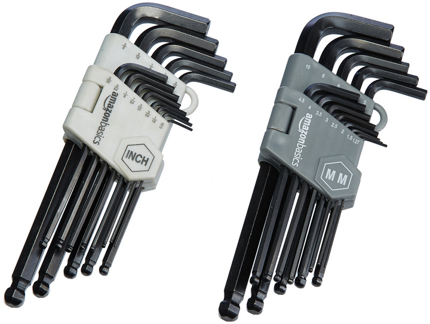

Common 3D Printing Tools
========================

Allen Keys
----------

Allen keys are essential for operating your printer, even if you don't plan on upgrading, 
regular maintenance and repairs will require these. It's suggested that you buy high quality allen 
keys that won't strip your screws from the start (this goes for other tools as well!). The most common 
sizes for allen keys on today's printers are **2.0mm and 2.5mm** but we'd recommend stocking other sizes 
as well.

|

Screwdrivers
------------

Screwdrivers are another tool to keep handy for repairing your printer especially for operating in spots 
hard to reach with allen keys and for screws other than hex key. It's suggested to get a kit with many 
small bits such as the one pictured below for easy maintenance, unless you already know exactly what type 
and size screws are utilized on all your 3d printers.

|

Flush Cutter
------------

Flush cutters, otherwise known as diagonal cutters, snips, or snippers by teams, are an extremely versatile 
tool that can be used for cutting and trimming things on your printer or your prints. A cheap pair like 
pictured below is still great for 3D Printing and general use, just make sure that they stay sharp!

.. figure:: images/flushcutters.png
  :align: center
  :width: 55%
  :alt: A screwdriver kit with many types of bits.

|

PTFE Cutter
-----------

Many people think that they can just cut PTFE tube with scissors or flush cutters, but fail to realize the
downsides of this. The compression of scissors or flush cutters can compress the sides of the tube or deform
it, and when some PTFE tubes have little room for error, this can make a tube unusable. Specialized PTFE tube 
cutters like the one pictured below can make sure that one of the most important parts of filament transport
on your printer is good quality. The one pictured below is clamped onto a PTFE tube, spun around it a few times,
and then the cut will be complete with little effort.

|

Calipers
--------

Calipers are a precision measuring tool used to measure distances often down the the hundredth of a millimeter. 
These are incredible useful for dialing in pressfits and slipfits, ensuring dimensional accuracy, and tuning 
your printer. We'd recommend getting a quality pair with solid reviews that will last you a while and remain 
precise.

.. figure:: images/calipers.png
  :align: center
  :width: 55%
  :alt: A nice set of calipers, for accurate measurement.

|

Files/Sandpaper
---------------

Files and sandpaper are great for getting a nice surface finish and potentially modifying prints if they didn't 
initially fit your usecase. Oftentimes, quickly filing a part down can save you loads of print time so it's 
great to have some on hand.

|

Putty Knives
------------

At its core, a putty knife can basically be used as a spatula to pull 3D prints off the bed. This is a must have 
for print removal to avoid touching the bed while it's still hot and to give yourself some extra leverage on those
prints that are really stuck.

.. figure:: images/puttyknife.png
  :align: center
  :width: 55%
  :alt: A standard putty knife for print removal.

|

Electrical Tools
----------------

Crimpers, a soldering iron, and a good wire stripper are very important to have on hand if you plan modifying your 
3D Printer or replacing electrical components. The ability to make your own wires is invaluable, and can often save 
you a lot of time from ordering materials.

.. figure:: images/crimpingtool.png
  :align: center
  :width: 55%
  :alt: A good quality wire crimper, the Engineer PA-09.

|