Common 3D Printing Upgrades
===========================

A pretty common thing to do with 3D Printers is upgrade them over time, here's a few of the most 
common upgrades for any printer.

Removeable/Flexible Beds
------------------------

A lot of printers come with cheap "BuildTak" (typical stickers) beds that work just fine, but some people
desire more removeable prints with better adhesion and more customizability, which is fulfilled by removable 
beds. WhamBam, Bambulabs, and generic Amazon sellers will typically carry these beds for various prices. 
You'll see some terms which we'll explain here. PEI is the "gold standard" nowadays, simply being a sheet
of material that sticks well to 3D prints when heated. More advanced options includev PEX, which expands when
heated and holds onto 3D prints better, and then as it cools completely releases the parts. Powder-Coated PEI/Textured
PEI are by far the most popular flexible beds now, being cheap, simple, more resistant to damage than PEI or PEX
flexible beds, and having exceptional print adhesion.

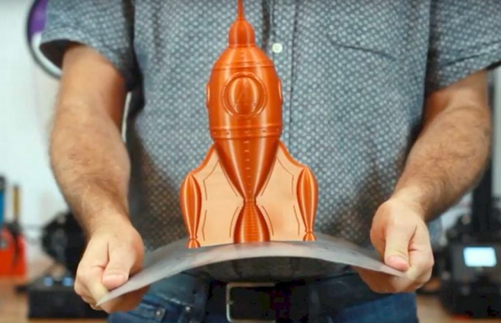

|

Glass Beds
----------

Glass beds are also a great upgrade, they stay flat and last a long time. They also tend to be a lot cheaper than 
flex beds! A glass bed combined with something like glue stick or hairspray works really well to keep prints secure. 
Most glass beds found on Amazon will work, look for the keywords Carborundum or Borosilicate when looking for glass 
beds for your printer size.

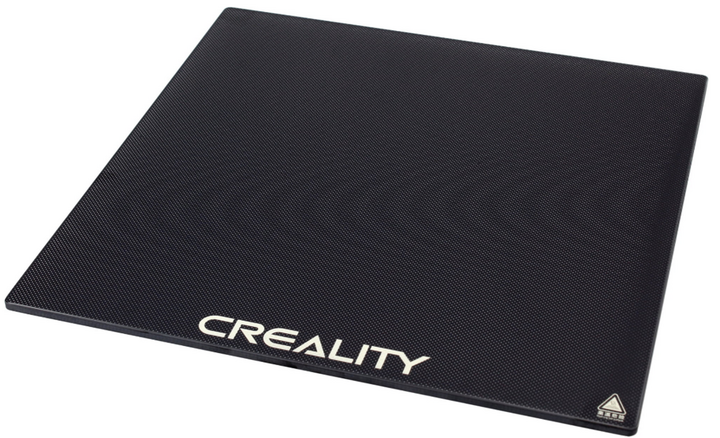

|

Hotend Upgrades
---------------

A hotend upgrade can be very beneficial for printing with different filaments, speeding up prints, and general reliability. 
Learning how to mount hotends often takes some CAD skills or a quick Thingiverse search, but hotend upgrades are very 
worth it. Typically, you will need a hotend structure, heater wire, and thermistor to do a full upgrade (and some wiring 
tools to connect it to your board). Here are a few hotends from different price ranges that are well regarded and used.

* **Low End:** E3D V6, All-Metal Microswiss Hotend. 

* **Mid Range:** Phaetus Dragonfly, Creality Spider.

* **High End:** Phaetus Dragon HF, Slice Engineering Mosquito, E3D Revo.

* **Speed Printing/Engineering:** These hotends are not for the faint of heart and typically require designing custom mounts. They
  are also typically in a very high price point. These include the Mosquito Magnum, Phaetus Dragon UHF, the Goliath, and the Nova.

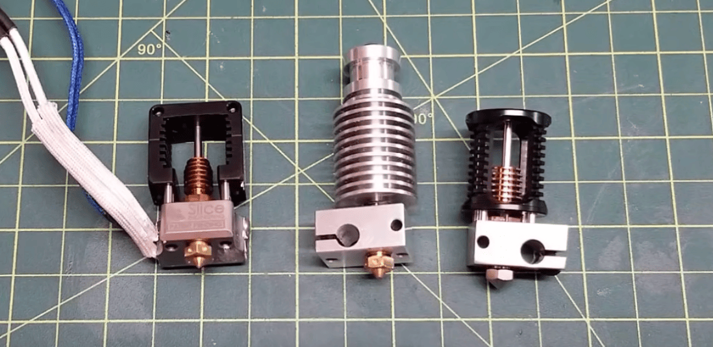

  Left to Right: Slice Engineering Mosquito, E3D V6, Phaetus Dragon

|

.. note:: A quick way to increase your hotend's flow rate without breaking the bank and buying a new hotend is by
          buying and utilizing something called a **CHT Nozzle**. These nozzles split filament flow into 3 parts, 
          allowing each section to melt faster, and resulting in a considerably higher flow rate of plastic.

|

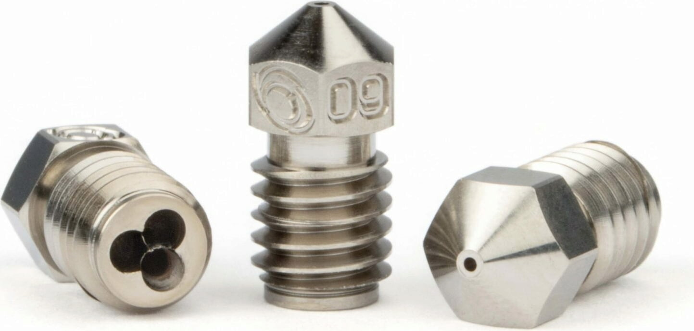

  This Bondtech CHT nozzle splits flow into three.

|

Silent Stepper Boards
---------------------

Older printers or low end printers tend to be very loud stock, which is why silent stepper boards are a great 
upgrade. These boards use more advanced stepper drivers to smooth inputs, causing steppers to make less 
whining and whirring noises. For most printers you will have to do some research for the best replacement 
board for you, but for base model Ender 3 printers, the main compatible boards are the SKR Mini E3 and the 
SKR Mini Turbo, both of which are drop-in replacements and take no time at all. Luckily, most printers nowadays
include this option stock, so it's not a concern for many.

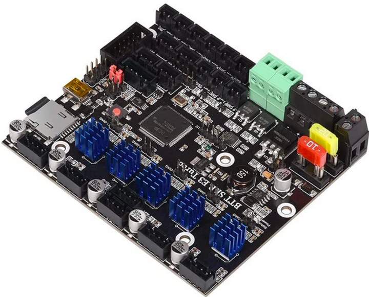

  An SKR e3 Turbo with TMC2209 Stepper Drivers, the current standard for silent printing.

|

ABL or Auto-Bed Leveling uses either a mechanical or inductive sensor on your toolhead to probe your bed in 
different locations and uses software to improve your first layer quality and adhesion. While it requires learning 
a bit about firmware, auto bed leveling is extremely worth it. More and more printers are coming with auto bed 
leveling stock, butcif yours didn't and you'd like to upgrade, these options are common:

* Mechanical Sensors: BLTouch, CRTouch
* Inductive Sensors: Omron TL-Q5MC2-Z, Pinda Inductive Probes

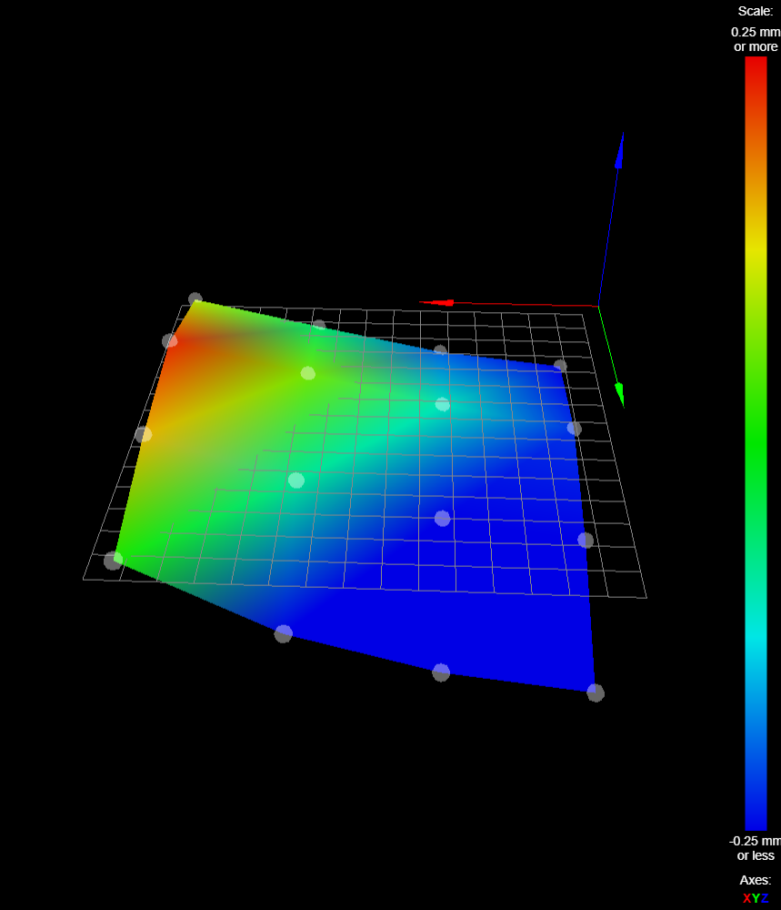

  An example autoleveling reading, showing the imperfections in the bed that the printer will compensate for.

|

Raspberry Pi/Network Functionality
----------------------------------

Network functionality is becoming frequent in 3D printing, with many interfaces allowing you to interact with your
printer remotely, and stop/start/watch prints while you aren't even there. Many companies have begun including 
this feature stock with newer printers, however, even if you have a printer without network functionality,
using something such as a Raspberry Pi or old android phone, you can make quick work of this feature
using various online guides. If you're using a printer with **Marlin** firmware (you can read through
your printer's documentation or sale postings to check) you should research **Octoprint** setup guides. 
If you are using a printer with the **Klipper** firmware, you should research **Fluidd** and **Mainsail** setup guides.

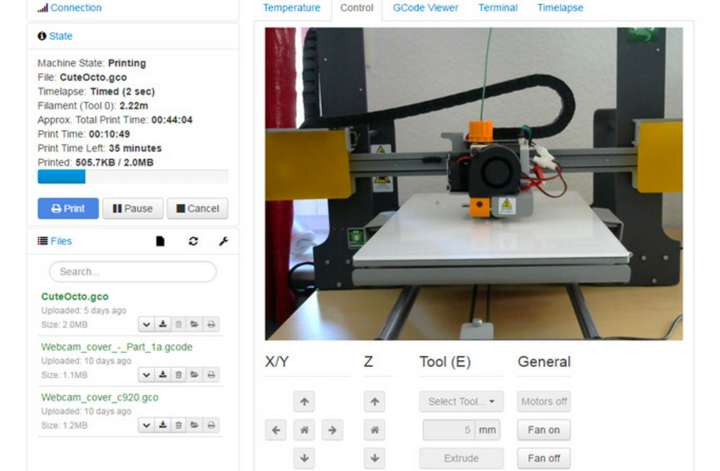

  An Octoprint Control Panel for a Prusa

|

Dual Z-Axis Support
-------------------
A common issue people have with Ender 3's and other budget printers is the droop of the Z gantry if it's only 
driven by a lead screw on one side. This directly results in inconsistencies in prints due to a less stable frame.
A fairly common solution to this is to add a lead screw on the other side, evening it out. This requires a board 
upgrade and an extra stepper. There are plenty of kits for this, or you could attempt to DIY it yourself. 

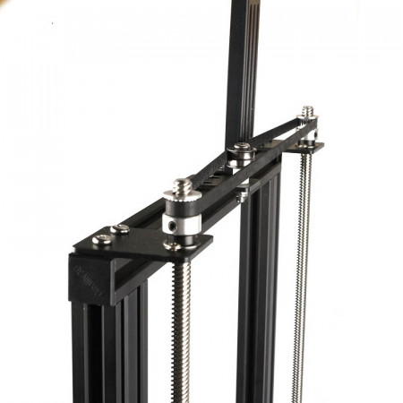

|

Part Cooling Upgrades
---------------------

As talked about in Terminology, hotend and part cooling are vital to part quality and preventing jamming issues. 
If you want to print PLA at higher speeds, it's reccomended to upgrade your cooling fans to be larger and more 
efficient. 5015 and 4020 fans are a great upgrade from stock cooling, and can handle most of what's thrown at them. 
There are plenty of mounts available for these fans if you search up your printer model and the desired fan size
(fan sizes are given in width-depth, so a 5015 comes in a 50mm circle that is 15mm thick) If you want a cooling 
upgrade with a lot of science behind it, take a look at Voron Design's **AB-BN** or **Stealthburner** projects, 
cooling systems that were completely engineered with air flow simulation.

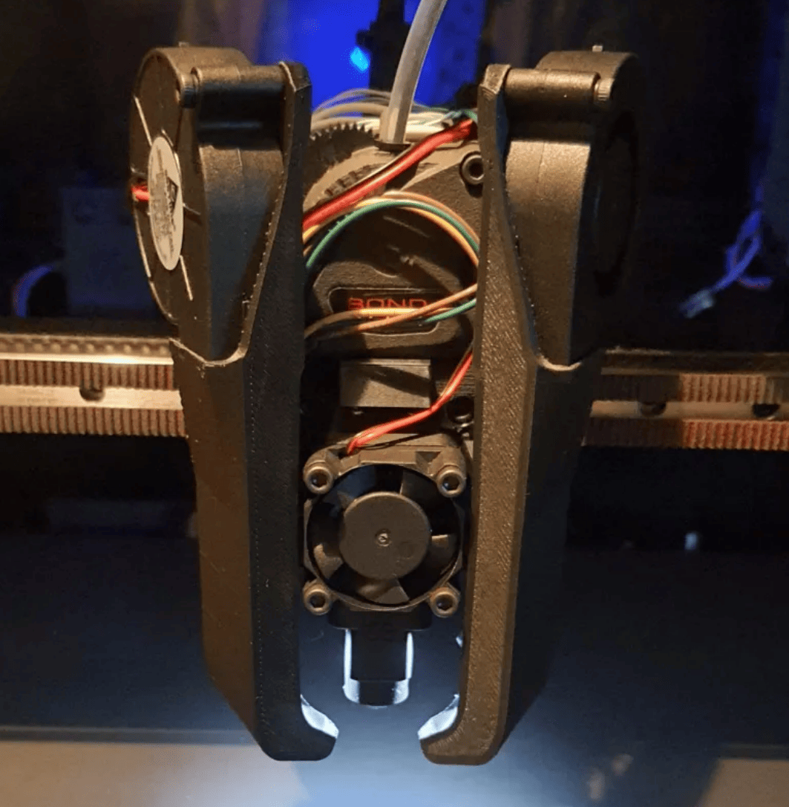

  An example cooling setup with dual 5015 fans (Mantis).

|

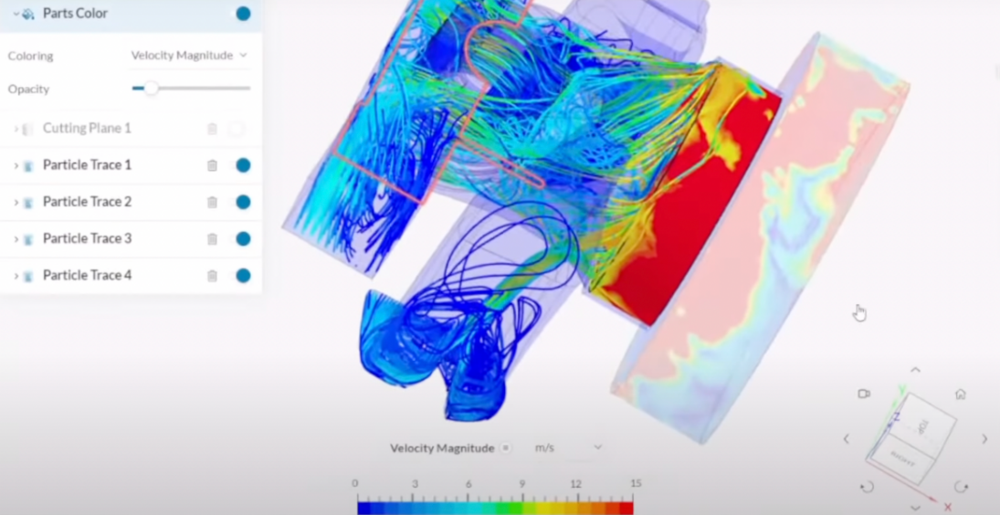

  Simulations of how air runs through a hotend cooling setup (Voron).

|

Linear Rails
------------

A lot of 3D Printers use V-wheels for linear motion out of the box, however these can degrade, flex, and lose 
dimensional accuracy fairly easily. Steel linear rails helps make your carriage a lot more stable and unlocks 
the ability to print much faster. While this upgrade can be very valuable, it's important to keep in mind that 
this is one of the most expensive upgrades here, as good quality linear rails can cost upwards of 40$ apiece.

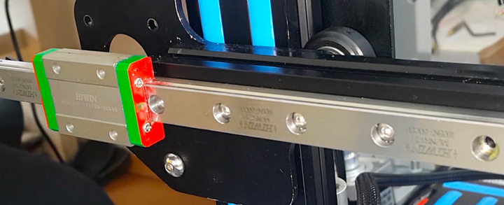

  This is a MGN12 (12mm wide MGN style linear rail) being used for the x axis of a printer.

|

Cable Drag Chain and Wire Management
------------------------------------
To avoid entanglement and fatigue of wires, a lot of people choose to add drag chain to their printers to guide their 
movement. These chains can either be printed or purchased from a vendor like IGUS/Digikey, so if you're interested 
in wire management, either shop around or take a look around on Printables/Thingiverse and find a set for your printer model.

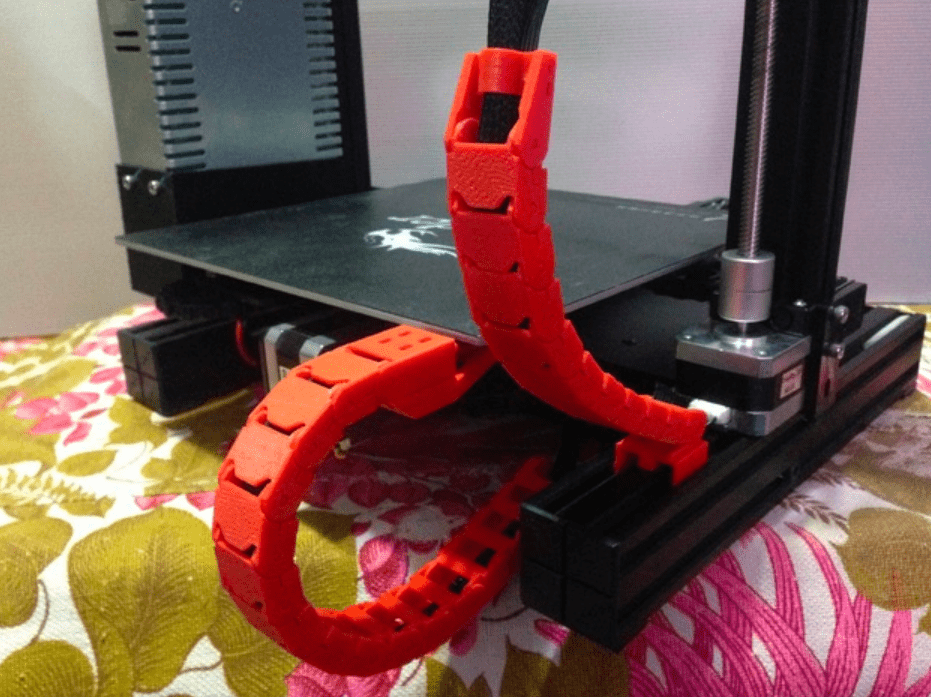

|

Miscellaneous Printed Upgrades
------------------------------
The 3D Printing community is heavily into modifying their printers...using their printers. There are a plethora of upgrades 
that you can just print yourself! Many are for aesthetics like V-Slot covers and LED lights, but others can improve 
functionality such as filament guides and belt tensioners. These upgrades are definitely worth exploring if you have some downtime!

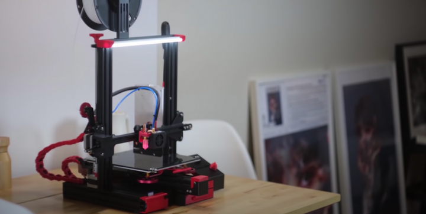

  Scott Yu-Jan's heavily upgraded Ender 3

|