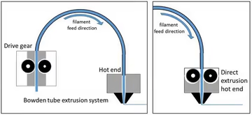
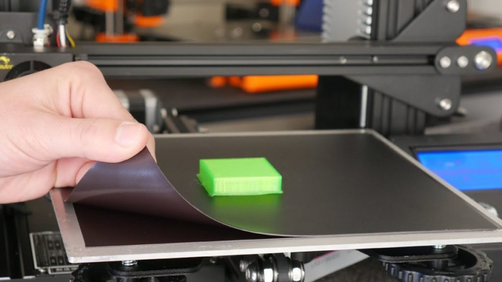
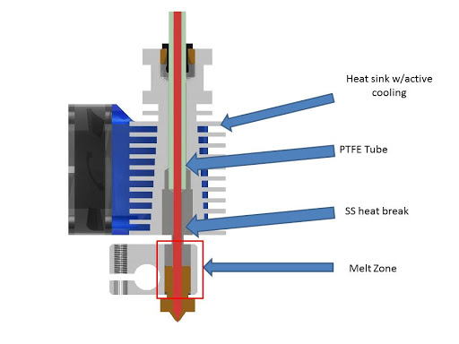
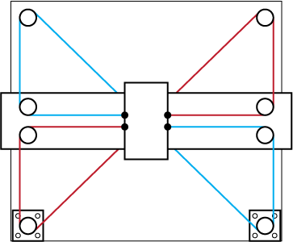

Hardware Tradeoffs
==================

.. note:: While these tradeoffs are important to consider they will not make or break your ability
          to print parts for most applications. Even the most basic entry printers will work well 
          for FTC but if your team has specific needs (printing flexible materials for instance) 
          it's recommended to look through these hardware tradeoffs for education.

|

Direct Drive vs Bowden:
-----------------------

Direct drive extrusion systems have a couple advantages over Bowden, most 
notably the ability to print with a wider range of materials (particularly flexibles) as well as 
more consistent extrusion and retraction. However Bowden printers are almost always cheaper so we'd 
recommend evaluating what kinds of printing your team needs and go from there.

|

Glass vs Flexible Beds
----------------------
Glass and flexibles beds are both common choices. Glass beds will usually last longer, are easier to maintain,
and are more resistant to print head damage. Good Glass beds are also typically cheaper. Flex beds make prints 
easier to take off and typically have better first layer adhesion, but will run you a premium on cost and are
relatively easy to damage or scrape.

|

PTFE Lined vs All-Metal Hotends
-------------------------------- 

PTFE tubing is a common low friction tubing used in 3D printing. PTFE lined hotends have a section of this tubing 
that goes right up to the heated area. These are typically the cheaper option, but it is not recommend to use
them whatsover if you plan on 3D printing anything beyond PLA/PETG. PTFE at temperatures over standard printing temps 
(normally ~250C is the limit) can "off-gas", putting off dangerous VOCs (Volatile Organic Compounds). All-Metal 
hotends are more expensive, but remove this dangerous PTFE tube placement. Safety should always be your top priority,
so look at All-Metal as long as you're planning on printing at higher temperatures. Notably, Ender series printers come 
stock with a PTFE lined hotend, so buying all-metal is one of the large upgrades that many do to their Ender 3s.

|

Cartesian vs CoreXY 
-------------------

Cartesian motion 3D printers, otherwise known colloquially as "bed-slingers" have been the standard for most consumer 
level printers and are practically everywhere, with one stepper controlling each axis, and a moving bed with not much 
complexity. An alternate form of 3D printer movement taking the is called CoreXY. These methods of control use a 
differential to control both X and Y axes with variable quantities of energy from 2 motors. This increases power 
and speed while decreasing gantry weight. Some of the most notable CoreXY printers include Vorons, BambuLab printers, 
and the Creality K1. Due to a lot of engineering effort, CoreXY is now considered the faster of the two kinematic, 
and is recommended to increase manufacturing speed. Cartesian printers are more tried and tested however, and Cartesian
printers like the Prusa mk3, Prusa mk4, and Ender 3 are a better option if you desire the incredible resources and 
consistency behind them.

