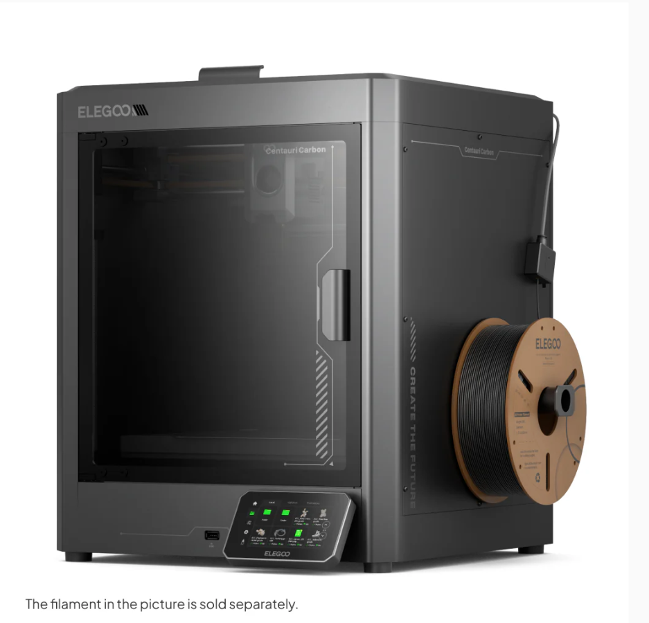

Budget Printers (Under $400 USD)
================================

.. note:: In general, you get what you pay for with 3D printers, and budget printers will have more limitations and potential issues than higher-end printers.
  However, there are some good options in the budget range that can be a great starting point for teams on a tight budget or those new to 3D printing.

Bambu Lab A1 Mini ($219)
-------------------

The A1 mini is Bambu Lab's entry-level printer, and is increasingly popular in the competition robotics community. It is a good option for teams that want a reliable, easy-to-use printer with a small footprint,
and it can be a great first printer for PLA/PETG robot parts.

The smaller build volume should be fine for most robot parts, but it may be limiting for larger parts or for printing multiple parts at once.
The A1 mini is also not recommended for printing with ABS/ASA/PC/PA or carbon/glass fiber reinforced filaments, so if your team wants to print with those materials, you may want to consider a slightly more high-end printer.

A1 mini Features
^^^^^^^^^^^^^^^^
* Build volume: 180 x 180 x 180 mm
* High speed (up to 500 mm/s) and acceleration (up to 10,000 mm/s²)
* All-metal hot end; max hot end temperature: 300 °C
* Textured PEI build plate included; max build plate temperature: 80 °C
* Low-FPS basic monitoring camera with timelapse support
* Sensors: filament run out sensor, filament odometry, filament tangle sensor
* Easy-to-use colour touchscreen interface
* Power loss recovery
* Best suited filaments: PLA, PETG, TPU, PVA

A1 mini Drawbacks
^^^^^^^^^^^^^^^^^
* Smaller build volume limits larger robot parts
* ABS/ASA/PC/PA and carbon/glass fiber reinforced filaments are not recommended
* Lower max bed temperature (80 °C) can limit adhesion for some higher-temp materials

.. image:: images/bambulaba1mini.png
  :align: center
  :width: 55%
  :alt: Picture of a Bambu Lab A1 mini

|

Elegoo Centauri Carbon ($289-$300)
----------------------------

This is a newer printer that has been getting a lot of attention for offering high-end features at a budget price. It has a CoreXY motion system, high acceleration capability, and a high-temperature hotend, which allows it to print a wide range of materials.
It also has a large build volume for its price point, making it a good option for teams that want to print larger parts or multiple parts at once.
There is also an enclosure, which makes it more suitable for printing with materials that require a controlled environment.
However, there is no colour changing system compared to competing printers on the market.

Centauri Carbon Features
^^^^^^^^^^^^^^^^^^^^^^^^
* Build volume: 256 x 256 x 256 mm
* High speed (up to 500 mm/s; 250 mm/s recommended) and high acceleration (up to 20,000 mm/s²; 10,000 mm/s² default)
* Print accuracy up to ±0.1 mm with recommended layer height of 0.2 mm (range: 0.1-0.4 mm)
* Broad material support: carbon/glass fiber reinforced filaments, PLA, PETG, ABS, ASA, TPU, PET, PC, PA
* Dual-gear direct drive extruder with 0.4 mm brass-hardened steel nozzle
* Max hot end temperature: 320 °C
* Max heated bed temperature: 110 °C
* 121-point auto bed leveling and full-auto calibration
* Camera with timelapse support, filament runout sensor, and power loss recovery
* 4.3-inch color capacitive touchscreen with USB and Wi-Fi connectivity

Centauri Carbon Drawbacks
^^^^^^^^^^^^^^^^^^^^^^^^^
* Newer platform with a smaller long-term FTC-specific knowledge base than older, more established models
* Single-nozzle design with no built-in multi-color printing system
* No colour changing functionality
* Large machine footprint and higher weight may be less convenient for smaller workspaces
* Advanced materials still require good print settings, drying/storage, and ventilation practices to print reliably
* Slicer and software ecosystem is less mature than the largest community ecosystems

|

Bambu Lab P1S ($399)
------------------------

If the frills on higher-end Bambu machines such as LIDAR, touchscreen, and a hardened extruder didn't sound all that useful to you, the P1S
could be a good option, especially considering the price has dropped significantly over the past few months. You still get an enclosure and auxiliary cooling, while the P1P doesn't, which allows you to
print filaments like ABS/ASA without difficulty, but this printer needs a fair few upgrades to print filled filaments
and more advanced engineering filaments safely.

P1S Features
^^^^^^^^^^^^
* Good value, especially since the P1S has been superseded by the P2S, which has made the P1S price lower
* Extremely fast CoreXY motion system
* Auto Bed Leveling
* Removable Beds of All Surfaces
* All-Metal Direct Drive Extruder
* WiFi Printing capabilities and remote print monitoring
* 256mm x 256mm x 256mm Print Volume
* Heated chamber allows for more advanced engineering materials
* Low-FPS basic monitoring camera with timelapse support
* Automatic print failure detection
* Easy to set up and use

P1S Drawbacks
^^^^^^^^^^^^^
* Replacement parts are proprietary from Bambu Lab (albeit well-priced). For some components, third-party replacements are available, but for others, you are reliant on Bambu Lab for replacements.
* Carbon Fiber rods can wear out over time
* No easy-change hotends (you need tools to change the hotend)
* Monochrome screen with no touchscreen capabilities
* No local AI capabilities, leading to more potential print failures compared to newer Bambu Lab printers
* Reliant on Bambu Lab for future firmware/software updates

.. image:: images/bambulabp1s.png
  :align: center
  :width: 55%
  :alt: Picture of a Bambu Lab P1S

|      

.. note:: Just because you buy a budget printer doesn't mean you can't upgrade it later to be even better! 
           (Take a look at Common Upgrades)

|

Other Budget Printers/Ender Clones ($120-$200)
----------------------------------------------

If you're ok with forgoing the huge knowledge base behind the Ender-3 series in exchange for a lower price and a few more features 
out of the box, some Ender-3 clones can be a good option. Notable ones include the Elegoo Neptune and Sovol SV06 ACE series. It's notable that while these are more or less "Ender 3 Clones", all of the companies and printer
models listed here are still established companies with community trust and acceptable customer service.
These printers can be a great buy and are often cheaper but **make sure to do research** before purchasing.
Don't spend over $200 on an Ender 3 clone, as you can get a lot more features, an enclosure, and better quality software for just a bit more money with printers like the A1 Mini or Centauri Carbon.

Common Features
^^^^^^^^^^^^^^^
Ender 3 Clones typically have at least a couple of the following...

* Auto Bed Leveling
* Upgraded Print Surface
* Built in Belt Tensioners
* Coloured Touchscreen

Common Drawbacks
^^^^^^^^^^^^^^^^
* Less troubleshooting help/knowledge base compared to the Ender 3
* Potentially outdated technology compared to more modern printers
* Quality control issues can be more common on some models/brands
* Any drawbacks of the individual printer. Make sure you keep an eye out for things you want in a printer when researching.

.. figure:: images/anycubicviper.png
  :align: center
  :width: 55%
  :alt: Picture of an Anycubic Viper

  Anycubic's Viper

|