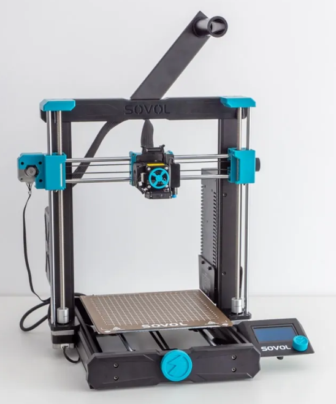

Budget Printers (Under $300 USD)
================================

.. note:: Just because you buy a budget printer doesn't mean you can't upgrade it later to be even better! 
           (Take a look at Common Upgrades)

|

Creality Ender-3/Pro/V2 ($100-$250)
-----------------------------------

Who's the Ender 3 for? 
^^^^^^^^^^^^^^^^^^^^^^

If you're looking for the most cost effective printer that will still do a great job, this is a great option. 
The Ender-3 series is an open source classic in the FTC and 3D printing community. It has a huge support network 
and despite it's low cost, has proven itself to be a very capable printer. 

Ender 3 Features
^^^^^^^^^^^^^^^^
All Ender 3s have:

* A huge support network
* Tons of printable and purchasable upgrades
* Open Source Hardware
* 220mm x 220mm x 250mm Print Volume

The Ender 3 Pro has:

* A more stable Y axis
* A more powerful power supply
* A flexible bed

The Ender 3 v2 has: 

* A glass bed
* Built in belt tensioners
* The power supply and Y axis from the Pro

.. note:: The V2 and Pro can often be found on sale for the same price as the base model, making them very good options.

Ender 3 Drawbacks
^^^^^^^^^^^^^^^^^
* Technology is dated due to initial release in 2018 (Lack of Auto Bed Leveling)
* PTFE Lined Hotend 
* Bowden Style Extruder 
* V-Roller Motion system and singular lead screw setup causes frame flexing.
* Can take a bit or tweaking/upgrading to work consistently.

.. figure:: images/ender3.png
  :align: center
  :width: 55%
  :alt: Picture of a Creality Ender 3

  Creality Ender 3 Base Model

|

Sovol SV06 ($259)
-----------------

Who's the SV06 for? 
^^^^^^^^^^^^^^^^^^^

If you're willing to spend just a little bit more money for more quality of life features out of the box, 
the Sovol SV06 is a good option. It maintains an Ender-like frame but adds in modern features that 
the Ender lacks which can save tinkering and maintenance time down the road.

SV06 Features
^^^^^^^^^^^^^
* Auto Bed Leveling
* Flexible Bed
* All-Metal Direct Drive Extruder
* Built in Belt Tensioners
* Dual Z-Axis
* 220mm x 220mm x 250mm Print Volume

SV06 Drawbacks
^^^^^^^^^^^^^^
* Known Quality Control Issues from factory (X-Axis not flat)
* Not many slicer profiles available (Slowly being solved)

|

Other Budget Printers/Ender Clones ($150-$300)
----------------------------------------------

Who are these for? 
^^^^^^^^^^^^^^^^^^

If you're ok with forgoing the huge knowledge base behind the Ender-3 series in exchange for a few more features 
out of the box, some Ender-3 clones can be a good option. Notable ones include the Elegoo Neptune, Anycubic Vyper, 
and Voxelab Aquila. It's notable that while these are more or less "Ender 3 Clones", all three companies and printer
models listed here are still established companies with community trust and acceptable customer service.
These printers can be a great buy and are often cheaper but make sure to do research before purchasing.

Common Features
^^^^^^^^^^^^^^^
Ender 3 Clones typically have at least a couple of the following...

* Auto Bed Leveling
* Upgraded Print Surface
* Built in Belt Tensioners
* Colored Touchscreen

Common Drawbacks
^^^^^^^^^^^^^^^^
* Less troubleshooting help/knowledge base compared to the Ender 3
* Any drawbacks of the individual printer. Make sure you keep an eye out for things you want in a printer when researching.

.. figure:: images/anycubicviper.png
  :align: center
  :width: 55%
  :alt: Picture of an Anycubic Viper

  Anycubic's Viper

|

