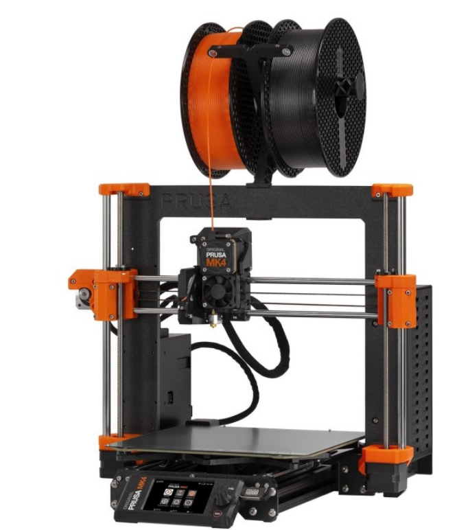
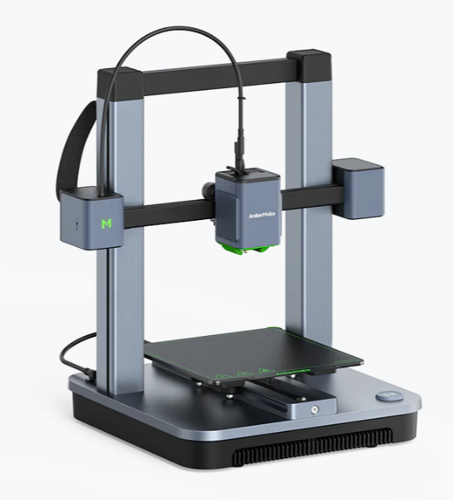
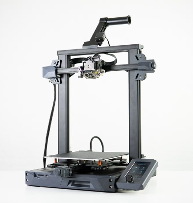
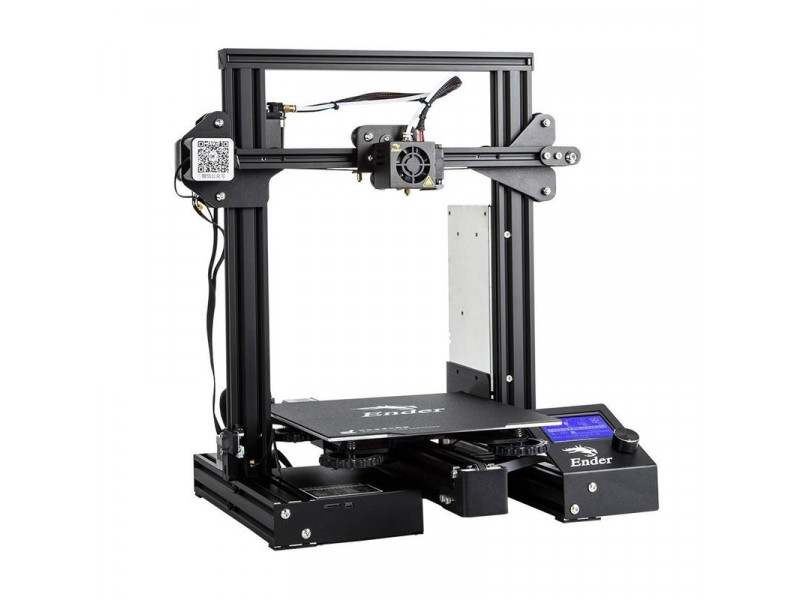

Discontinued 3D Printers
=============================

These are printers that were formerly recommended by FTCdocs but have been discontinued by the manufacturer.

However, they may still be found on the used market, but **don't pay too much for them**.

These last-generation printers may still be good options for teams on a budget (unless stated otherwise), but it is important to check if they have the features listed above and to be aware of any potential issues that may arise from buying a discontinued printer.

Software and firmware updates are less frequent for discontinued printers, so it is important to check if the manufacturer will continue to support the printer with updates and replacement parts.

Third-party parts may be available for some discontinued printers (on Aliexpress for example), but it is important to check the quality, safety, and reliability of these parts before purchasing.

Most of the prices and printer descriptions below are an archive copied from the time when they were still recommended, but some notes have been added to the descriptions to reflect the fact that they are now discontinued and to warn teams of any potential issues that may arise from buying a discontinued printer.

Prusa MK3S+ ($649-$899)
-----------------------

If you're looking to buy a printer that just works every time, the Prusa MK3S+ is amazing. Prusa has had millions 
of hours running these machines, and just about every issue with this printer has been found, patched, and pushed 
to the consumer. If it's any testament to their consistency, the 3D printed parts used on the Mk3s+ are printed 
mostly on Mk3s+ printers. This is Prusa's previous flagship printer and is more tested and cheaper than the Mk4, 
but if you are looking at Prusa make sure to explore the Mk4 as well due to it's more updated features. 

Mk3s+ Features
^^^^^^^^^^^^^^
* Easy to Repair
* Auto Bed Leveling
* Removable Spring Steel Sheets
* All-Metal Direct Drive Extruder
* 250mm x 210mm x 210mm Print Volume
* Unrivaled consistency as a workhorse

Mk3s+ Drawbacks
^^^^^^^^^^^^^^^
* Slow printing speed
* Dated technology (such as lack of WiFi)
* Last generation 3D printer, Mk4 improves on issues

.. image:: images/prusamk3.png
  :align: center
  :width: 55%
  :alt: Picture of a Prusa Mk3

|

Prusa MK4 ($799-$1099)
----------------------

This printer is for anyone interested in consistency with an improved featureset. The Prusa MK4 
is the successor to the MK3S+ with the same reliability and consistency hallmarks but adds newer 
features such as WiFi as well as being much faster and more user friendly. This machine is still 
in it's early stages of development and improvement as of 2023, and will surely make leaps and 
bounds in consistency, features, and software optimization as Prusa finds more issues and patches 
them.

Mk4 Features
^^^^^^^^^^^^
* High Speed (Nearing comparison to BambuLab printers)
* Auto Bed Leveling
* Removable Spring Steel Sheets
* All-Metal Direct Drive Extruder with a planetary gearbox
* WiFi Printing capabilities and remote print monitoring
* 250mm x 210mm x 210mm Print Volume

Mk4 Drawbacks
^^^^^^^^^^^^^
* Cartesian kinematics make matching the speed of CoreXY printers difficult

|

Bambu Lab P1P ($599)
-------------------

Built for speed by Bambu Lab, the P1P is a CoreXY machine with well engineered proprietary hardware and software. 
A machine that is proving very reliable for many despite Bambu Lab's short time in the 3D printer marketplace so
far, the P1P is an amazing mid range option with a lot of manufacturing capability for it's cost. This printer is 
also compatible with Bambu Lab's multimaterial system, and can be upgraded to their new offering, the P1S, for just
150$ if your needs eventually outgrow the P1P. 

.. note:: This printer is a PLA workhorse, being able to print it about as fast and well as the Bambu Lab X1C at half the 
          price. Even if you have the budget for an X1C, it may be worth considering buying 2 P1Ps instead if you don't 
          need all the bells and whistles the X1C has and plan to only print PLA/PETG.

P1P Features
^^^^^^^^^^^^
* Extremely fast CoreXY motion system
* Auto Bed Leveling
* Removable Beds of All Surfaces
* All-Metal Direct Drive Extruder
* WiFi Printing capabilities and remote print monitoring
* 256mm x 256mm x 256mm Print Volume
* Automatic print failure detection

P1P Drawbacks
^^^^^^^^^^^^^
* Replacement parts are proprietary from Bambu Lab (albeit well-priced). Some third-party replacements are available, but for some components, you are reliant on Bambu Lab for replacements.
* Carbon Fiber rods can wear out over time
* Reliant on Bambu Lab for future firmware/software updates
* No colour screen, only monochrome with no touchscreen capabilities
* Poor quality & low FPS camera
* No local AI capabilities, leading to more potential print failures compared to newer Bambu Lab printers

.. image:: images/bambup1p.png
  :align: center
  :width: 55%
  :alt: Picture of a Bambu Lab P1P

|

BambuLab X1C ($1199-$1449)
--------------------------

This printer is for you want a no-compromises 3D printer that can handle pretty much anything you throw at 
it with incredible speed and reliability while using engineering-grade filaments. This printer comes at $1199 
for just the printer and $1449 for the combo that includes BambuLab's multimaterial system which can handle 4 
filament rolls at once.

.. note:: This printer is **expensive** and is targeted towards advanced filaments. The P1P can print basic filaments
          such as PLA/PETG about as fast and well as the BambuLab X1C at half the price. If you have the budget for 
          an X1C, it may be worth considering buying 2 P1Ps instead if you don't need all the bells and whistles the 
          X1C has and plan to only print PLA/PETG.

X1C Features
^^^^^^^^^^^^
* Extremely fast CoreXY motion system
* Auto Bed Leveling
* Full Color Touchscreen
* Removable Beds of All Surfaces
* All-Metal Direct Drive Extruder
* WiFi Printing capabilities and remote print monitoring
* 256mm x 256mm x 256mm Print Volume
* Heated chamber allows for more advanced engineering materials
* LIDAR sensor for flow calibration and first layer quality checking
* Stock hardened hotend capable of most filled and abrasive filaments
* Automatic print failure detection

X1C Drawbacks
^^^^^^^^^^^^^
* Replacement parts are proprietary from Bambu Lab (albeit well-priced)
* Carbon Fiber rods can wear out over time
* Reliant on Bambu Lab for future firmware/software updates
* This printer doesn't shine if you don't use it for advanced filaments, and may not be worth the cost if you don't plan to

.. image:: images/bambulabx1c.png
  :align: center
  :width: 55%
  :alt: Picture of a BambuLabs X1C

|

.. warning:: **All printers below this line should be avoided.** They are either unreliable, poor value in 2026, require parts that are no longer available, or have other significant issues that make them unsuitable for FTC teams.

|

AnkerMake M5 ($699)
-------------------

.. warning:: This printer should be avoided as AnkerMake has pulled out of FDM 3D printing and will no longer produce or sell the M5.
  Reports online show that parts are dwindling in availability, and as they are not common parts, it may be difficult to find third-party replacements.

Anker's new entry into the 3D printer market, the AnkerMake M5, is a very reasonably priced printer for the features it
brings. With print failure detection, speed printing capabilities, and an extremely friendly interface with almost no setup, 
the M5 is a great option.

M5 Features
^^^^^^^^^^^
* Cartesian Motion System optimized for speed
* Auto Bed Leveling
* Removable Bed
* Direct Drive Extruder
* WiFi Printing capabilities and remote print monitoring
* 235mm x 235mm x 250mm Print Volume
* Automatic print failure detection
* Extremely friendly software and setup for new users

M5 Drawbacks
^^^^^^^^^^^^
* Replacement parts are proprietary from AnkerMake, and parts are no longer available
* Reliant on Anker for future firmware/software updates
* Cartesian motion system limits speed, still doesn't match CoreXY machines at a similar price range
* PTFE Lined Hotend
* V wheel motion system can wear after long extended use
* Not very good software

.. image:: images/ankerm5.png
  :align: center
  :width: 55%
  :alt: Picture of a AnkerMake M5

|

AnkerMake M5C ($399)
--------------------
.. warning:: This printer should be avoided as AnkerMake has exited the FDM 3D printing market and will no longer produce or sell the M5C.
  Replacement parts are becoming increasingly scarce, and since they use proprietary components, third-party alternatives may be difficult to source.
  Additionally, the M5C lacks a built-in screen and relies entirely on the companion app. If AnkerMake discontinues app support, the printer will become unusable.

Anker's budget 3D printing machine, the AnkerMake M5C, is an absolute bargain for the features and speed it brings. 
This printer has speed printing capabilities and an extremely friendly interface with almost no setup. This is one of
the cheapest printers that can reach 0.5m/s speeds while printing, which alone makes it stand out.

M5C Features
^^^^^^^^^^^^
* Cartesian Motion System optimized for speed
* Auto Bed Leveling
* Removable Bed
* All-Metal Direct Drive Extruder
* WiFi Printing capabilities
* 220mm x 220mm x 250mm Print Volume
* Extremely friendly software and setup for new users

M5C Drawbacks
^^^^^^^^^^^^^
* Replacement parts are proprietary from AnkerMake, and parts are no longer available
* Reliant on Anker for future firmware/software updates
* Limited on speed compared to CoreXY, but still has unrivaled speed at this price and availability
* No screen on the printer, all monitoring must be done digitally
* V wheel motion system can wear after long extended use

|

Creality Ender-3 S1/Pro/Plus ($379-$549)
----------------------------------------

.. warning:: This printer isn't really a good value anymore in 2026, so it should be avoided. As this printer is discontinued, it is more suited for advanced users, especially since the PTFE hotend needs to be replaced.

If you want a printer that can do most things well at a reasonable price, the Ender-3 S1 is 
a good fit for you. It has a standard build volume but is packed with pretty much every modern 
and quality of life upgrade installed out of the box, although you are paying for this premium. 
Additionally, it has a similar community backing to that of the original Ender-3 series due to
similarities between the S1s and the originals.

S1 Features
^^^^^^^^^^^
All Ender 3 S1s have at least:

* Auto Bed Leveling
* Removable Spring Steel Sheets
* Direct Drive Extruder
* Built in Belt Tensioners
* Dual Z-Axis
* 220mm x 220mm x 270mm Print Volume

The S1 Pro also has:

* All-Metal Direct Drive Extruder

The S1 Plus has: 

* 300mm x 300mm x 300mm Print Volume

S1 Drawbacks
^^^^^^^^^^^^
* PTFE Lined Hotend on Normal and Plus Versions
* No stock network capability
* Speed limited compared to other printers at this price range

  This is the Ender 3 S1 base model.

|

Creality Ender-3/Pro/V2 ($100-$250)
-----------------------------------

.. warning:: This printer isn't really a good value anymore in 2026, so it should be avoided. As this printer is discontinued, it is more suited for advanced users, especially since the PTFE hotend needs to be replaced.

If you're looking for the most cost effective printer that will still do a great job, this is a great option. 
The Ender-3 series is an open source classic in the FTC and 3D printing community. It has a huge support network 
and despite it's low cost, has proven itself to be a very capable printer. 

Ender 3 Features
^^^^^^^^^^^^^^^^
All Ender 3s have:

* A huge support network
* Tons of printable and purchasable upgrades
* 220mm x 220mm x 250mm Print Volume

The Ender 3 Pro has:

* A more stable Y axis
* A more powerful power supply
* A flexible bed

The Ender 3 v2 has: 

* A glass bed
* Built in belt tensioners
* The power supply and Y axis from the Pro

.. note:: The V2 and Pro can often be found on sale for the same price as the base model, making them very good options.

Ender 3 Drawbacks
^^^^^^^^^^^^^^^^^
* Technology is dated due to initial release in 2018 (Lack of Auto Bed Leveling)
* PTFE Lined Hotend 
* Bowden Style Extruder 
* V-Roller Motion system and singular lead screw setup causes frame flexing.
* Can take a bit of tweaking/upgrading to work consistently.

  Creality Ender 3 Base Model

|

Sovol SV06 ($259)
-----------------

If you're willing to spend just a little bit more money for more quality of life features out of the box, 
the Sovol SV06 is a good option. It maintains an Ender-like frame but adds in modern features that 
the Ender lacks which can save tinkering and maintenance time down the road.

SV06 Features
^^^^^^^^^^^^^
* Auto Bed Leveling
* Flexible Bed
* All-Metal Direct Drive Extruder
* Built in Belt Tensioners
* Dual Z-Axis
* 220mm x 220mm x 250mm Print Volume

SV06 Drawbacks
^^^^^^^^^^^^^^
* Known Quality Control Issues from factory (X-Axis not flat)
* Not many slicer profiles available (Slowly being solved)

.. image:: images/sovolsv06.png
  :align: center
  :width: 55%
  :alt: Picture of a Sovol SV06

|