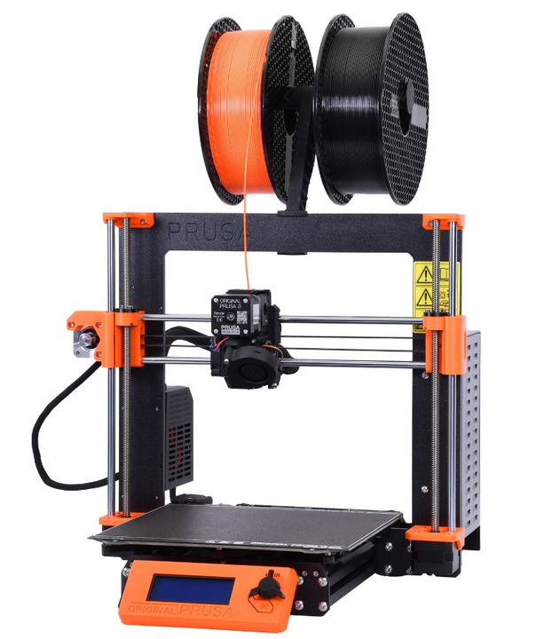
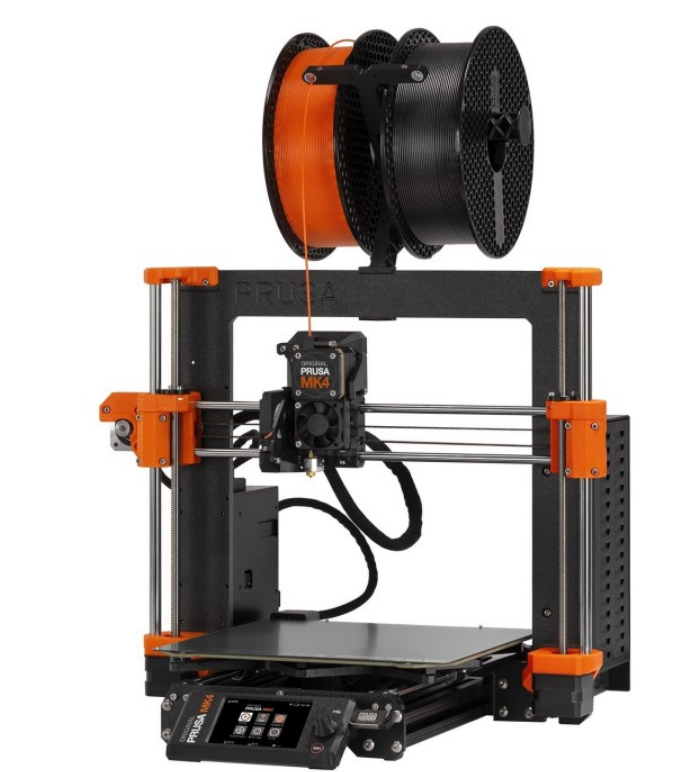
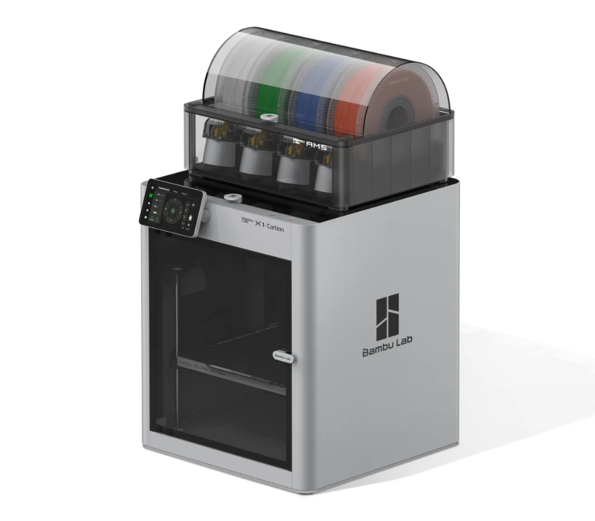
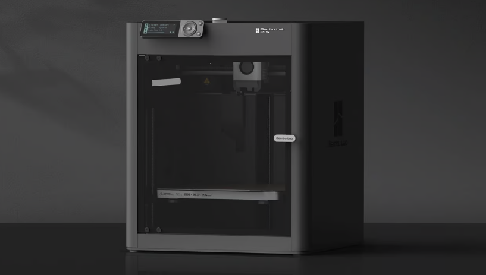
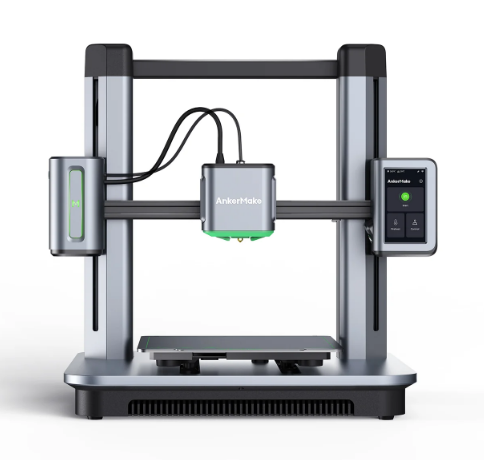

High-End Printers ($600+ USD)
=============================

.. note:: Tip for both of the Prusa printers listed on this page. You can now order Prusa printers from either their 
          headquarters in Czechia or their subsidiary and sole authorized reseller **PrintedSolid**, based in Delaware. 
          If you live in the USA and plan to order a Prusa printer, save yourself the headache of customs and long shipping 
          times and order from their USA subsidiary.

Prusa MK3S+ ($649-$899)
-----------------------

If you're looking to buy a printer that just works every time, the Prusa MK3S+ is amazing. Prusa has had millions 
of hours running these machines, and just about every issue with this printer has been found, patched, and pushed 
to the consumer. If it's any testament to their consistency, the 3D printed parts used on the Mk3s+ are printed 
mostly on Mk3s+ printers. This is Prusa's previous flagship printer and is more tested and cheaper than the Mk4, 
but if you are looking at Prusa make sure to explore the Mk4 as well due to it's more updated features. 

Mk3s+ Features
^^^^^^^^^^^^^^
* Easy to Repair
* Auto Bed Leveling
* Removable Spring Steel Sheets
* All-Metal Direct Drive Extruder
* 250mm x 210mm x 210mm Print Volume
* Unrivaled consistency as a workhorse

Mk3s+ Drawbacks
^^^^^^^^^^^^^^^
* Slow printing speed
* Dated technology (such as lack of WiFi)
* Last generation 3D printer, Mk4 improves on issues

|

Prusa MK4 ($799-$1099)
----------------------

This printer is for anyone interested in consistency with an improved featureset. The Prusa MK4 
is the successor to the MK3S+ with the same reliability and consistency hallmarks but adds newer 
features such as WiFi as well as being much faster and more user friendly. This machine is still 
in it's early stages of development and improvement as of 2023, and will surely make leaps and 
bounds in consistency, features, and software optimization as Prusa finds more issues and patches 
them.

Mk4 Features
^^^^^^^^^^^^
* High Speed (Nearing comparison to BambuLab printers)
* Auto Bed Leveling
* Removable Spring Steel Sheets
* All-Metal Direct Drive Extruder with a planetary gearbox
* WiFi Printing capabilities and remote print monitoring
* 250mm x 210mm x 210mm Print Volume

Mk4 Drawbacks
^^^^^^^^^^^^^
* Cartesian kinematics make matching the speed of CoreXY printers difficult

|

BambuLab X1C ($1199-$1449)
--------------------------

This printer is for you want a no-compromises 3D printer that can handle pretty much anything you throw at 
it with incredible speed and reliability while using engineering-grade filaments. This printer comes at $1199 
for just the printer and $1449 for the combo that includes BambuLab's multimaterial system which can handle 4 
filament rolls at once.

.. note:: This printer is **expensive** and is targeted towards advanced filaments. The P1P can print basic filaments
          such as PLA/PETG about as fast and well as the BambuLab X1C at half the price. If you have the budget for 
          an X1C, it may be worth considering buying 2 P1Ps instead if you don't need all the bells and whistles the 
          X1C has and plan to only print PLA/PETG.

X1C Features
^^^^^^^^^^^^
* Extremely fast CoreXY motion system
* Auto Bed Leveling
* Full Color Touchscreen
* Removable Beds of All Surfaces
* All-Metal Direct Drive Extruder
* WiFi Printing capabilities and remote print monitoring
* 256mm x 256mm x 256mm Print Volume
* Heated chamber allows for more advanced engineering materials
* LIDAR sensor for flow calibration and first layer quality checking
* Stock hardened hotend capable of most filled and abrasive filaments
* Automatic print failure detection

X1C Drawbacks
^^^^^^^^^^^^^
* Replacement parts are proprietary from Bambu Lab (albeit well-priced)
* Carbon Fiber rods can wear out over time
* Reliant on Bambu Lab for future firmware/software updates
* This printer doesn't shine if you don't use it for advanced filaments, and may not be worth the cost if you don't plan to

|   

BambuLab P1S ($699-$949)
------------------------

If the X1C's frills such as LIDAR, touchscreen, and a hardened extruder didn't sound all that useful to you, the P1S
could be a good option. You still get an enclosure and auxiliary cooling, while the P1P doesn't, which allows you to
print filaments like ABS/ASA without difficulty, but this printer needs a fair few upgrades to print filled filaments
and more advanced engineering filaments safely.

P1S Features
^^^^^^^^^^^^
* Extremely fast CoreXY motion system
* Auto Bed Leveling
* Removable Beds of All Surfaces
* All-Metal Direct Drive Extruder
* WiFi Printing capabilities and remote print monitoring
* 256mm x 256mm x 256mm Print Volume
* Heated chamber allows for more advanced engineering materials
* Automatic print failure detection

P1S Drawbacks
^^^^^^^^^^^^^
* Replacement parts are proprietary from Bambu Lab (albeit well-priced)
* Carbon Fiber rods can wear out over time
* Reliant on Bambu Lab for future firmware/software updates

|   

AnkerMake M5 ($699)
-------------------

Anker's new entry into the 3D printer market, the AnkerMake M5, is a very reasonably priced printer for the features it
brings. With print failure detection, speed printing capabilities, and an extremely friendly interface with almost no setup, 
the M5 is a great option.

M5 Features
^^^^^^^^^^^
* Cartesian Motion System optimized for speed
* Auto Bed Leveling
* Removable Bed
* Direct Drive Extruder
* WiFi Printing capabilities and remote print monitoring
* 235mm x 235mm x 250mm Print Volume
* Automatic print failure detection
* Extremely friendly software and setup for new users

M5 Drawbacks
^^^^^^^^^^^^
* Replacement parts are proprietary from AnkerMake (albeit well-priced)
* Reliant on Anker for future firmware/software updates
* Cartesian motion system limits speed, still doesn't match CoreXY machines at a similar price range
* PTFE Lined Hotend
* V wheel motion system can wear after long extended use

|   

DIY Printers (Voron, HevOrt, VZBot)
-----------------------------------

.. warning:: For teams just getting into 3D printing or teams that haven't had experience with at least 2-3 other 
             printers we would highly advise against a DIY printer. These printers are **projects** and take significant 
             effort and upkeep, which make them a poor choice for a first or second printer.

If you want to take a deeper dive into 3D Printing and achieve both extreme speeds and quality, a DIY printer 
may be a good choice. DIY printers can be tailored to your specific needs and perform extremely well but are 
typically a huge time and financial commitment.

Features
^^^^^^^^
Most well-documented DIY Printers feature...

* Extremely fast CoreXY motion systems
* Auto Bed Leveling
* Removable Spring Steel Sheets
* Direct Drive Extruders with All Metal Hotends
* Large Build Volumes (250mm^3 or more)
* Klipper Firmware and live dashboards for print monitoring
* High customizability and a strong community that creates modifications

Drawbacks
^^^^^^^^^
* Extremely complex to assemble, wire, and configure
* Have to source your own parts, no "official" place to buy from
* Huge time commitment
* Huge financial commitment (typically $1000+)

.. image:: images/voron24.png
  :align: center
  :width: 55%
  :alt: Picture of a Voron 2.4

|   
