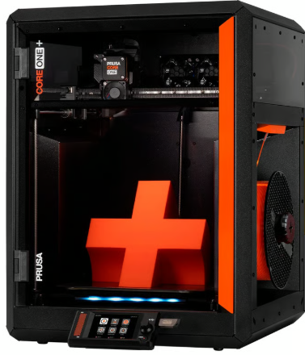
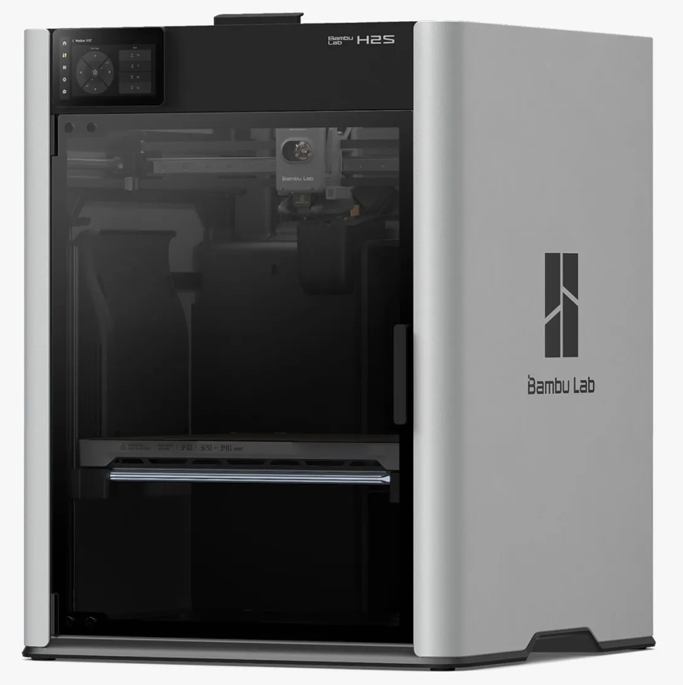
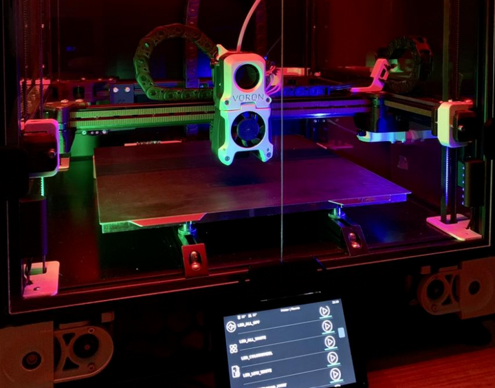

High-End Printers ($800+ USD)
=============================

.. note:: Tip for both of the Prusa printers listed on this page. You can now order Prusa printers from either their 
          headquarters in Czechia or their subsidiary and sole authorized reseller **PrintedSolid**, based in Delaware. 
          If you live in the USA and plan to order a Prusa printer, save yourself the headache of customs and long shipping 
          times and order from their USA subsidiary.

          Also, if you want a Prusa printer, assembling it yourself is a great way to learn about how the printer works and can save you some money, but if you want to skip the assembly process, you can also order it pre-assembled for an additional cost.

Prusa Core One+ ($1099 non-assembled, $1319 assembled)
----------------

The Prusa Core One+ is aimed at teams that want a higher-speed, CoreXY-style printer while staying in the Prusa ecosystem.
Since product configurations can change over time, confirm the exact build volume, enclosure status, and included hardware options before purchasing.

Core One+ Features
^^^^^^^^^^^^^^^^^
* Build volume: 250 x 220 x 270 mm
* CoreXY-style motion system (typically enables higher speeds than bed-slingers)
* Fully automatic first layer calibration (load cell) and automatic mesh bed leveling (print area)
* Nextruder direct-drive extruder with quick-swap nozzle system
* Enclosed chamber with max chamber temperature: 55 °C
* Max nozzle temperature: 290 °C; max heatbed temperature: 120 °C
* Networking and remote monitoring: Ethernet, Prusa Connect + mobile app support; NFC receiver + optional ESP Wi-Fi module (delivered with the printer)
* MMU3 support

Core One+ Drawbacks
^^^^^^^^^^^^^^^^^^
* Higher upfront cost than many mid-range options
* CoreXY machines tend to be more mechanically complex to tune and maintain (belts, idlers, etc.)
* Max nozzle temperature (290 °C) may be limiting for some high-temp materials
* Large/heavy printer (22.5 kg; 415 x 444 x 555 mm)
* Wi-Fi uses the ESP module (confirm what is included with your region/config)
* Lead times and regional availability can vary

|

Bambu Lab H2S ($1299)
---------------------

The H2S is positioned as Bambu Lab's higher-end offering. It is a good choice for teams that want a large, feature-rich printer with a streamlined user experience,
but it is usually more expensive than other Bambu Lab models.

For FTC teams, the main reason to choose the H2S is faster design iteration with fewer failed prints: its high-speed CoreXY motion system helps you go from CAD to a usable part quickly,
while the enclosed, actively heated chamber expands the range of materials you can print reliably. The large build volume also makes it easier to print bigger robot parts (or multiple smaller parts)
in fewer runs, and the built-in monitoring/failure-detection features help reduce wasted time during long prints.

H2S Features
^^^^^^^^^^^^
* Fast CoreXY motion system for rapid iteration
* Auto Bed Leveling
* Large build volume: 340 x 320 x 340 mm
* Enclosure with active chamber heating (up to 65 °C) for more reliable prints with engineering materials
* All-metal hotend; max nozzle temperature: 350 °C
* Hardened extruder gear/nozzle for abrasive filaments (carbon/glass fiber reinforced)
* Built-in camera monitoring and automatic print failure detection/monitoring
* Air purification/filtration (G3 pre-filter, H12 HEPA, and activated carbon, per manufacturer spec)
* Wi-Fi printing and app/PC remote monitoring

H2S Drawbacks
^^^^^^^^^^^^^
* Reliant on Bambu Lab for firmware/software updates and long-term support
* Replacement parts are largely proprietary (availability and pricing depend on region); some third party parts are available but others need to be purchased from Bambu Lab
* Expensive compared to other Bambu Lab models, and some features may be unnecessary for teams new to 3D printing
* High peak power requirements (up to 2050 W @ 220 V / 1170 W @ 110 V)
* Large, so may not fit in all workspaces

|

DIY Printers (Voron, HevOrt, VZBot)
-----------------------------------

.. warning:: For teams just getting into 3D printing or teams that haven't had experience with at least 2-3 other 
             printers we would highly advise against a DIY printer. These printers are **projects** and take significant 
             effort and upkeep, which make them a poor choice for a first or second printer.

If you want to take a deeper dive into 3D Printing and achieve both extreme speeds and quality, a DIY printer 
may be a good choice. DIY printers can be tailored to your specific needs and perform extremely well but are 
typically a huge time and financial commitment.

Features
^^^^^^^^
Most well-documented DIY Printers feature...

* Extremely fast CoreXY motion systems
* Auto Bed Leveling
* Removable Spring Steel Sheets
* Direct Drive Extruders with All Metal Hotends
* Large build volumes (often ~250 mm or larger in X/Y/Z, depending on the build)
* Klipper Firmware and live dashboards for print monitoring
* High customizability and a strong community that creates modifications

Drawbacks
^^^^^^^^^
* Extremely complex to assemble, wire, and configure
* Have to source your own parts, no "official" place to buy from
* Huge time commitment
* Huge financial commitment (typically $1000+)

|   