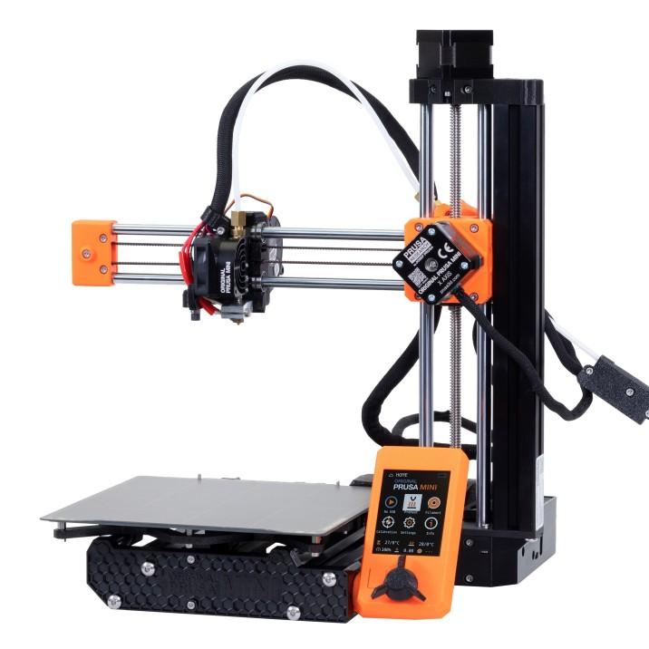
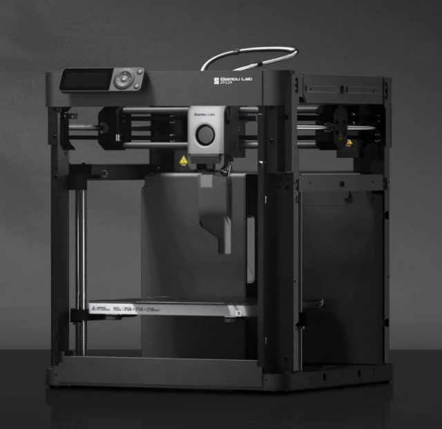

Mid-Range Printers ($300-$600 USD)
==================================

Prusa Mini ($429)
-----------------

Who's the Prusa Mini for? 
^^^^^^^^^^^^^^^^^^^^^^^^^

If you're ok with paying a premium and getting a smaller build volume in exchange for a printer that just works
every time, the Prusa Mini is a great option, as Prusa has had millions of hours running these machines. Just 
about every issue with this printer has been found, patched, and pushed to the consumer.

SV06 Features
^^^^^^^^^^^^^
* Auto Bed Leveling
* Removable Spring Steel Sheets
* Prusa's consistency guarantee
* Open Source Hardware
* Easily Transportable
* 180mm x 180mm x 180mm Print Volume

Prusa Mini Drawbacks
^^^^^^^^^^^^^^^^^^^^
* Premium price
* Cantilever/unsupported X axis
* Lead times due to printer desirability

.. note:: You can now order Prusa printers from either their headquarters in Czechia or their subsidiary and sole authorized
          reseller PrintedSolid, based in Delaware. If you plan to order a Prusa printer, save yourself the headache of 
          customs and long shipping times and order from their USA subsidiary.

|

BambuLab P1P ($599)
-------------------

Who's the P1P for? 
^^^^^^^^^^^^^^^^^^

Built for speed by BambuLab, the P1P is a CoreXY machine with well engineering proprietary hardware and software,

P1P Features
^^^^^^^^^^^^
* Extremely fast CoreXY motion system, many times faster than an Ender or Prusa
* Auto Bed Leveling
* Removable Beds of All Surface
* All-Metal Direct Drive Extruder
* WIFI Printing capabilities and remote print monitoring
* 256mm x 256mm x 256mm Print Volume

P1P Drawbacks
^^^^^^^^^^^^^
* Replacement parts are proprietary from Bambu Lab
* Carbon Fiber rods can wear out over time
* Reliant on Bambu Lab for future firmware/software updates

|   

Creality Ender-3 S1/Pro/Plus ($379-$549)
--------------------

Who are the S1s for? 
^^^^^^^^^^^^^^^^^^^^

If you want a Jack of All Trades style printer, the Ender-3 S1 is pretty great. It has a 
standard build volume but is packed with pretty much every modern and quality of life upgrade 
installed out of the box, although you are paying for this premium. Additionally, it has a 
similar community backing to that of the original Ender-3 series.

P1P Features
^^^^^^^^^^^^
* Extremely fast CoreXY motion system, many times faster than an Ender or Prusa
* Auto Bed Leveling
* Removable Beds of All Surface
* All-Metal Direct Drive Extruder
* WIFI Printing capabilities and remote print monitoring
* 256mm x 256mm x 256mm Print Volume

P1P Drawbacks
^^^^^^^^^^^^^
* Replacement parts are proprietary from Bambu Lab
* Carbon Fiber rods can wear out over time
* Reliant on Bambu Lab for future firmware/software updates

|   