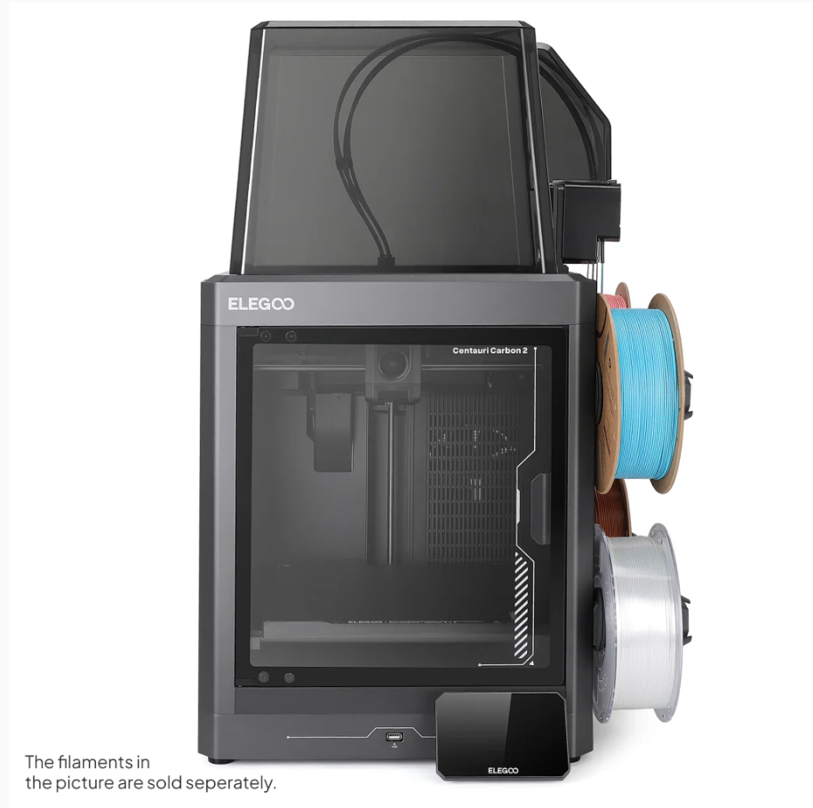
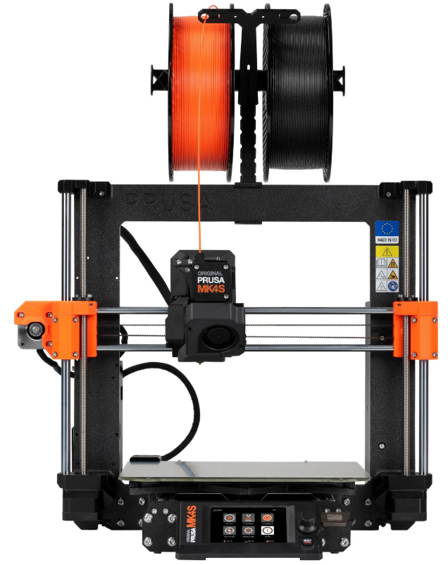
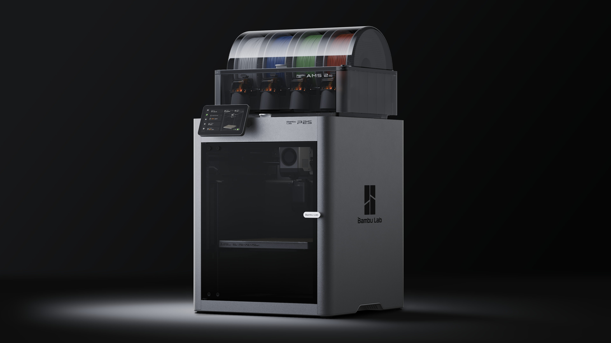

Mid-Range Printers ($300-$800 USD)
==================================

.. note:: Tip for both of the Prusa printers listed on this page. You can now order Prusa printers from either their 
          headquarters in Czechia or their subsidiary and sole authorized reseller **PrintedSolid**, based in Delaware. 
          If you live in the USA and plan to order a Prusa printer, save yourself the headache of customs and long shipping 
          times and order from their USA subsidiary.

          Also, if you want a Prusa printer, assembling it yourself is a great way to learn about how the printer works and can save you some money, but if you want to skip the assembly process, you can also order it pre-assembled for an additional cost.

Elegoo Centauri Carbon 2 Combo ($449)
--------------------------------------

The Centauri Carbon 2 Combo is a newer CoreXY printer aimed at teams that want high speed, multicolor capability, and stronger material support without stepping into premium flagship pricing.
It keeps the same 256 x 256 x 256 mm build volume as many popular FTC-friendly printers, but adds higher maximum nozzle temperature, AI-assisted monitoring, and a larger touchscreen.
For teams printing both fast PLA parts and occasional engineering-grade components, it offers a strong feature set at this price point.

Centauri Carbon 2 Combo Features
^^^^^^^^^^^^^^^^^^^^^^^^^^^^^^^^
* Build volume: 256 x 256 x 256 mm
* High speed (up to 500 mm/s; 250 mm/s recommended) and high acceleration (up to 20,000 mm/s²; 10,000 mm/s² default)
* Print accuracy up to ±0.1 mm with recommended layer height of 0.2 mm (range: 0.1-0.4 mm)
* 4-colour multicolour capability included
* Broad material support (ideal: PLA, PETG, TPU, ABS, ASA, PLA-CF; capable: PETG-CF, ABS-CF, ASA-CF, PET-CF, PA-CF, PET, PC, PA)
* Dual-gear direct drive extruder with 0.4 mm brass-hardened steel nozzle
* Max hot end temperature: 350 °C
* Max heated bed temperature: 110 °C
* 121-point auto bed leveling and full-auto calibration
* Camera with AI intelligent detection and timelapse support, filament runout sensor, and clog detection
* Power loss recovery and auto filament unloading
* 5-inch color capacitive touchscreen with USB and Wi-Fi connectivity
* Quiet operation (up to 45 dB)

Centauri Carbon 2 Combo Drawbacks
^^^^^^^^^^^^^^^^^^^^^^^^^^^^^^^^^
* Newer platform with a smaller long-term FTC-specific troubleshooting knowledge base than older, widely adopted models
* Larger machine footprint and higher weight can be harder to fit in compact workspaces
* Advanced and fiber-filled materials still require good drying, ventilation, and tuned profiles for reliable printing
* Multicolour workflows generally add setup complexity and can increase print time/material waste depending on part design
* Ecosystem maturity and long-term parts/support experience are still developing compared to the most established platforms

|

Prusa Mini+ ($559)
-----------------

If you're ok with paying a premium and getting a smaller build volume in exchange for a printer that just works
every time, the Prusa Mini+ is a great option, as Prusa has had millions of hours running these machines. Just 
about every issue with this printer has been found, patched, and pushed to the consumer.

Prusa Mini+ Features
^^^^^^^^^^^^^^^^^^^
* Auto Bed Leveling
* Removable Spring Steel Sheets
* Prusa's consistency guarantee
* Open Source Hardware
* Easily Transportable
* 180mm x 180mm x 180mm Print Volume

Prusa Mini+ Drawbacks
^^^^^^^^^^^^^^^^^^^^
* Premium price
* Cantilever/unsupported X axis
* Slightly obsolete technology
* Lead times due to printer desirability
* No stock network capability

.. note:: You can now order Prusa printers from either their headquarters in Czechia or their subsidiary and sole authorized
          reseller **PrintedSolid**, based in Delaware. If you live in the USA and plan to order a Prusa printer, save 
          yourself the headache of customs and long shipping times and order from their USA subsidiary.

.. image:: images/prusamini.png
  :align: center
  :width: 55%
  :alt: Picture of a Prusa Mini

|

Prusa MK4S ($719 non assembled, $1009 assembled)
-------------------------------------------------

The Prusa MK4S is the latest Prusa bed-slinger aimed at teams that want consistent prints with minimal manual calibration.
If your team values repeatability and ease of use over absolute maximum speed, the MK4S is a strong fit: it combines a Nextruder direct-drive toolhead,
automatic mesh bed leveling (print area), and Prusa Connect printing so students can spend more time designing parts and less time troubleshooting.

MK4S Features
^^^^^^^^^^^^^
* Build volume: 250 x 210 x 220 mm (9.84 x 8.3 x 8.6 in)
* Automatic mesh bed leveling (print area)
* Nextruder direct-drive extruder and removable PEI spring steel sheets
* Max nozzle temperature: 290 °C; max heatbed temperature: 120 °C
* Printing via USB drive / LAN / internet via Prusa Connect
* Sensors and safety features: filament sensor, loadcell sensor, and power panic
* Supported materials: PLA, PETG, Flex, PVA, PC, PP, CPE, PVB (ABS/ASA/HIPS/PA with Original Prusa Enclosure + filtration add-on)

MK4S Drawbacks
^^^^^^^^^^^^^^
* Some materials (ABS/ASA/HIPS/PA) require using the Original Prusa Enclosure with a filtration add-on
* Max nozzle temperature (290 °C) may be limiting for some high-temp materials
* Wi-Fi uses the ESP module (delivered with the printer; confirm what is included with your region/config)

|

Bambu Lab P2S ($799)
------------------------

For FTC teams that want fast iteration, reliable first layers, and stronger enclosed-material support, the P2S is a high-performance option with a familiar 256 x 256 x 256 mm build volume.
Its motion system, high flow capability, and mature software stack make it well-suited for quickly producing drivetrain parts, mechanisms, and repeated spare prints during build season.
Teams that plan to run many prints per week or want broader engineering filament support may find the P2S worth considering despite the higher price.

P2S Features
^^^^^^^^^^^^
* Build volume: 256 x 256 x 256 mm
* Very high speed (up to 600 mm/s) and acceleration (up to 20,000 mm/s²)
* High hotend flow rate (up to 40 mm³/s)
* Hardened steel extruder gears and hardened steel nozzle (0.4 mm included; supports 0.2/0.4/0.6/0.8 mm)
* Max hot end temperature: 300 °C
* Flexible steel build plate with textured PEI included; max heated bed temperature: 110 °C
* Broad filament support including PLA, PETG, ABS, ASA, TPU, PA, PC, PVA, and multiple CF/GF-reinforced materials
* Built-in camera (1080p/30 fps), door sensor, filament runout sensor, filament tangle sensor, and power loss recovery
* 5-inch touchscreen with app/PC control and dual-band Wi-Fi
* Activated carbon VOC filtration and particulate filtration support

P2S Drawbacks
^^^^^^^^^^^^^
* Slightly Higher price than many mid-range alternatives
* Advanced features and high-speed tuning can increase setup complexity for newer teams
* Ethernet and several enterprise/network-security features are not available
* Replacement parts and long-term ecosystem are more vendor-dependent than open-platform printers

|