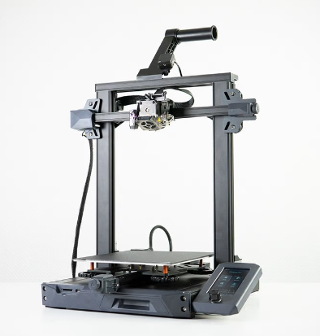

Mid-Range Printers ($300-$600 USD)
==================================

AnkerMake M5C ($399)
--------------------

Anker's budget 3D printing machine, the AnkerMake M5C, is an absolute bargain for the features and speed it brings. 
This printer has speed printing capabilities and an extremely friendly interface with almost no setup. This is one of
the cheapest printers that can reach 0.5m/s speeds while printing, which alone makes it stand out.

M5C Features
^^^^^^^^^^^^
* Cartesian Motion System optimized for speed
* Auto Bed Leveling
* Removable Bed
* All-Metal Direct Drive Extruder
* WiFi Printing capabilities
* 220mm x 220mm x 250mm Print Volume
* Extremely friendly software and setup for new users

M5C Drawbacks
^^^^^^^^^^^^^
* Replacement parts are proprietary from AnkerMake (albeit well-priced)
* Reliant on Anker for future firmware/software updates
* Limited on speed compared to CoreXY, but still has unrivaled speed at this price and availability
* No screen on the printer, all monitoring must be done digitally
* V wheel motion system can wear after long extended use

.. image:: images/ankerm5c.png
  :align: center
  :width: 55%
  :alt: Picture of a AnkerMake M5C

|   

Prusa Mini ($429)
-----------------

If you're ok with paying a premium and getting a smaller build volume in exchange for a printer that just works
every time, the Prusa Mini is a great option, as Prusa has had millions of hours running these machines. Just 
about every issue with this printer has been found, patched, and pushed to the consumer.

Prusa Mini Features
^^^^^^^^^^^^^^^^^^^
* Auto Bed Leveling
* Removable Spring Steel Sheets
* Prusa's consistency guarantee
* Open Source Hardware
* Easily Transportable
* 180mm x 180mm x 180mm Print Volume

Prusa Mini Drawbacks
^^^^^^^^^^^^^^^^^^^^
* Premium price
* Cantilever/unsupported X axis
* Lead times due to printer desirability
* No stock network capability

.. note:: You can now order Prusa printers from either their headquarters in Czechia or their subsidiary and sole authorized
          reseller **PrintedSolid**, based in Delaware. If you live in the USA and plan to order a Prusa printer, save 
          yourself the headache of customs and long shipping times and order from their USA subsidiary.

.. image:: images/prusamini.png
  :align: center
  :width: 55%
  :alt: Picture of a Prusa Mini

|

BambuLab P1P ($599)
-------------------

Built for speed by BambuLab, the P1P is a CoreXY machine with well engineered proprietary hardware and software. 
A machine that is proving very reliable for many despite BambuLab's short time in the 3D printer marketplace so
far, the P1P is an amazing mid range option with a lot of manufacturing capability for it's cost. This printer is 
also compatible with BambuLab's multimaterial system, and can be upgraded to their new offering, the P1S, for just
150$ if your needs eventually outgrow the P1P. 

.. note:: This printer is a PLA workhorse, being able to print it about as fast and well as the BambuLab X1C at half the 
          price. Even if you have the budget for an X1C, it may be worth considering buying 2 P1Ps instead if you don't 
          need all the bells and whistles the X1C has and plan to only print PLA/PETG.

P1P Features
^^^^^^^^^^^^
* Extremely fast CoreXY motion system
* Auto Bed Leveling
* Removable Beds of All Surfaces
* All-Metal Direct Drive Extruder
* WiFi Printing capabilities and remote print monitoring
* 256mm x 256mm x 256mm Print Volume
* Automatic print failure detection

P1P Drawbacks
^^^^^^^^^^^^^
* Replacement parts are proprietary from Bambu Lab (albeit well-priced)
* Carbon Fiber rods can wear out over time
* Reliant on Bambu Lab for future firmware/software updates

.. image:: images/bambup1p.png
  :align: center
  :width: 55%
  :alt: Picture of a BambuLabs P1P

|   

Creality Ender-3 S1/Pro/Plus ($379-$549)
----------------------------------------

If you want a printer that can do most things well at a reasonable price, the Ender-3 S1 is 
a good fit for you. It has a standard build volume but is packed with pretty much every modern 
and quality of life upgrade installed out of the box, although you are paying for this premium. 
Additionally, it has a similar community backing to that of the original Ender-3 series due to
similarities between the S1s and the originals.

S1 Features
^^^^^^^^^^^
All Ender 3 S1s have at least:

* Auto Bed Leveling
* Removable Spring Steel Sheets
* Direct Drive Extruder
* Built in Belt Tensioners
* Dual Z-Axis
* 220mm x 220mm x 270mm Print Volume

The S1 Pro also has:

* All-Metal Direct Drive Extruder

The S1 Plus has: 

* 300mm x 300mm x 300mm Print Volume

S1 Drawbacks
^^^^^^^^^^^^
* PTFE Lined Hotend on Normal and Plus Versions
* No stock network capability
* Speed limited compared to other printers at this price range

  This is the Ender 3 S1 base model.

|   

