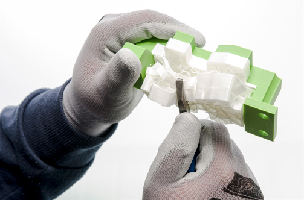

Basic Post-Processing
=====================

Support Removal
---------------

Support material removal is a basic form of post processing where, as the name suggests, you remove support material from your print.
This can typically be done easily with either just your fingers or a pair of pliers/flush cutters, however, sometimes removing
support from small features or holes can be difficult. This is why it's reccomended to design away from using supports, and if
you must use them, to set up your slicing settings properly in order to make them easy to remove.

|

Drilling Out Holes
------------------

Drilling out printed holes are typically used in order to widen screw holes to achieve a loose fit. This can be done with any
drill and properly sized drill bit, however take your time while drilling to ensure that the drill bit is lined up properly to
guaruntee that drilled holes are straight.

Brim Removal
------------

Brims are used to have more surface area for your print to contact the build plate. To remove them, you typically just use your
fingers, however, if your Z-Offset is too low, it may be easier to use a deburring tool to remove the inner layer lines of the brim.