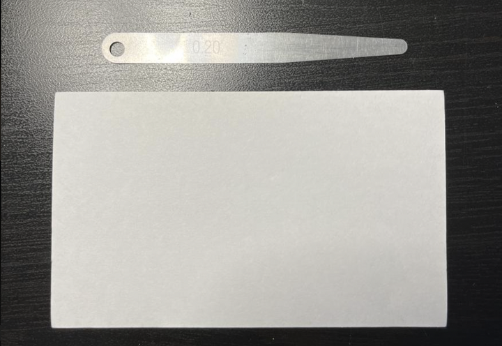
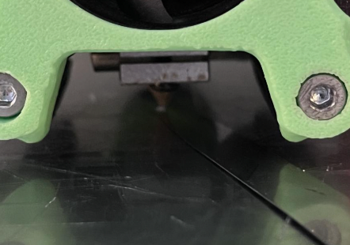
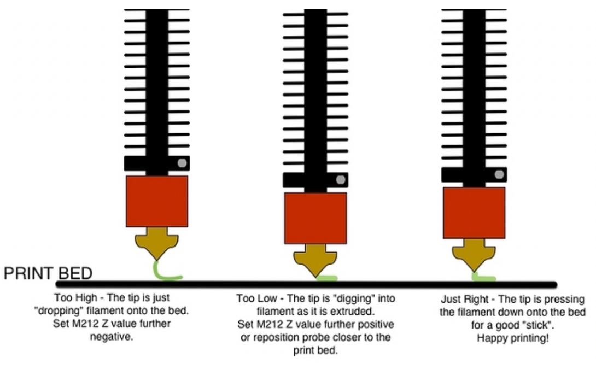
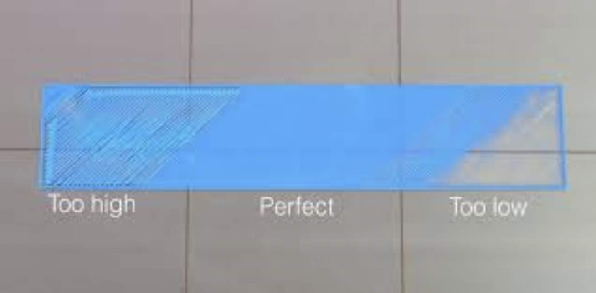

Bed Leveling
============

.. note:: This guide is primarily for older printers that don't have automatic leveling. If you have a newer printer, this process is likely not needed
          or there is a more advanced process to follow. Research what processes are available for your printer.

If you have a bed thats adjustable by screws, bed leveling is by far the biggest factor for how well your prints stick across the whole bed. The only tool 
you should need is a 0.2mm thick piece of metal, a piece of cardstock, or an index card.

|

Here's the steps you should follow to level your bed:

* Ensure that your nozzle is clean and has no extra filament beneath it that would interfere with bed leveling precision.
* Home the Z axis completely, and get it to Z coordinate 0 by using the printer's move commands
* Move the nozzle to just above one of the screws using the printer's move commands (This is done with move commands to make sure that it replicates the movement that the printer will perform when under it's own control)
* Adjust the screw up and down until the 0.2mm material can barely slide with slight friction underneath the nozzle.

* Repeat this process with the other screws available on the bed.
* Move the nozzle to the center of the bed and check bed height using your 0.2mm material. If you leveled all of the screws properly, it should be roughly the same amount of friction.

Z-Offset
--------

Once your printer is leveled between the screws, the bed is flat, but it's not always at exactly the right height. All printers should have a Z offset variable that lets
you adjust the height of the nozzle during or before printing. If at the start of your print the bed is either located too high or too low, but remaining consistent 
(provided you bed leveled), use your printers Z offset feature (also called baby-stepping) to adjust it live while it lays down the first layer. Reference the 
images below for some good visualizations on how to make sure you're at the proper height!

|

|