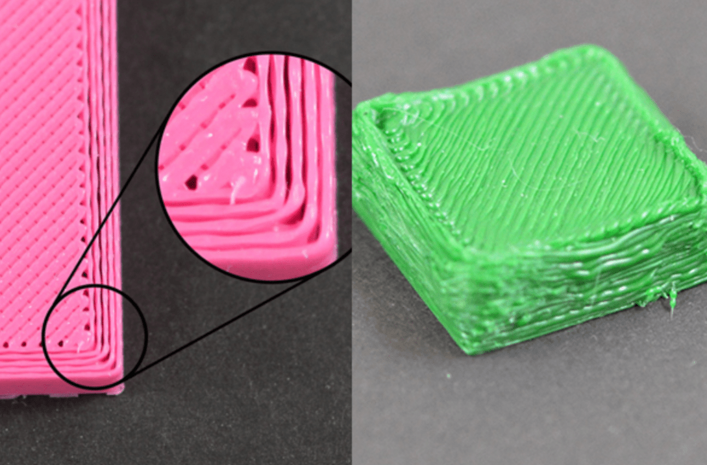

Temperature Tuning
==================

In order to have strong, good quality 3D printed parts, you need to get your temperatures and speeds right. Every filament that you buy will 
have a range of temperatures that it thinks are acceptable to print it at, but the one that works best for you depends on all sorts of conditions. 
Start in the middle of that range, and work from there.

Temperature Based Underextrusion and Overextrusion
--------------------------------------------------

This is the key to tuning filaments. There's a certain sweet temperature when printing that helps lay the perfect amount of plastic down to complete your part. 
Underextrusion looks like it's not quite able to get continuous plastic out (you need to raise your temperature), and Overextrusion looks like it's simply trying 
to melt too much (drooping around the sides, so you need to lower your temp).

  Underextrusion on the left, Overextrusion on the right.

|

.. note:: Extra about PLA: PLA is a really easy filament to work with, unless you're trying to print it fast, in which case it becomes the worst filament you've 
          ever encountered. PLA is a filament that requires a lot of cooling, otherwise it becomes really messy really quickly. Temperature issues can appear in 
          PLA due to either lack of cooling or improper temperatures, so consider both of these factors when tuning for PLA. Consider dropping your printing speed 
          to isolate issues to just temperature.
