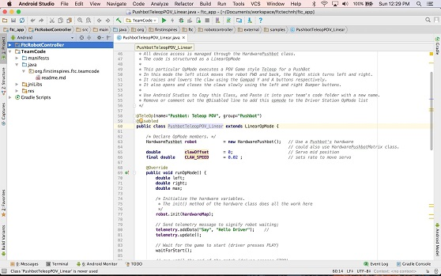

Android Studio Programming Tutorial
===================================

.. raw:: html

   <h3>Introduction</h3>

This tutorial will take you step-by-step through the process of
configuring, programming, and operating your Control System. This
tutorial uses Android Studio to help you get started programming your
robot.

Android Studio is an advanced integrated development environment for
creating Android apps. This tool is the same tool that professional
Android app developers use. Android Studio is only recommended for
**advanced users** who have **extensive Java programming experience**.

|

.. raw:: html

   <h3>Table of Contents</h3>

#. Introduction

   -  :doc:`The Control System <../shared/control_system_intro/The-FTC-Control-System>`
   -  :doc:`Required Materials <../shared/required_materials/Required-Materials>`
   -  :doc:`Using Your Android Device <../shared/using_android_device/Using-Your-Android-Device>`

#. Configuring Your Hardware

   -  :doc:`Configuring Your Android
      Devices <../shared/configuring_android/Configuring-Your-Android-Devices>`
   -  :doc:`Connecting Devices to a Control or Expansion Hub </hardware_and_software_configuration/connecting_devices/index>`
   -  :doc:`Configuring Your Hardware </hardware_and_software_configuration/connecting_devices/index>`

#. Installing Android Studio

   -  :doc:`Downloading and Installing Android Studio <../tutorial_specific/android_studio/installing_android_studio/Installing-Android-Studio>`
   -  :doc:`Downloading the Android Studio Project <../tutorial_specific/android_studio/downloading_as_project_folder/Downloading-the-Android-Studio-Project-Folder>`
   -  :bdg-warning:`Legacy` :doc:`Disabling Android Studio Instant Run <../tutorial_specific/android_studio/disable_instant_run/disable-instant-run>`

#. Managing an Android Studio Project

   -  :bdg-warning:`Legacy` :doc:`Downloading an FTC Android Studio Project <../tutorial_specific/android_studio/downloading_as_project_folder/Downloading-the-Android-Studio-Project-Folder>`
   -  :doc:`Forking/Cloning an FTC Android Studio Project from GitHub <../tutorial_specific/android_studio/fork_and_clone_github_repository/Fork-and-Clone-From-GitHub>`

#. Writing an Op Mode

   -  :doc:`Enabling Developer Options <../tutorial_specific/android_studio/enabling_developer_options/Enabling-Developer-Options>`
   -  :doc:`Creating & Running an Op Mode <../tutorial_specific/android_studio/creating_op_modes/Creating-and-Running-an-Op-Mode-(Android-Studio)>`
   -  :doc:`Controlling a Servo <../tutorial_specific/android_studio/controlling_a_servo/Controlling-a-Servo-(Android-Studio)>`
   -  :doc:`Using Sensors <../tutorial_specific/android_studio/using_sensors/Using-Sensors-(Android-Studio)>`

.. Only placing tutorial-specific items in the tutorial toc

.. toctree::
   :caption: Tutorials
   :maxdepth: 1
   :titlesonly:
   :hidden:

   ../tutorial_specific/android_studio/installing_android_studio/Installing-Android-Studio
   ../tutorial_specific/android_studio/disable_instant_run/disable-instant-run
   ../tutorial_specific/android_studio/downloading_as_project_folder/Downloading-the-Android-Studio-Project-Folder
   ../tutorial_specific/android_studio/fork_and_clone_github_repository/Fork-and-Clone-From-GitHub
   ../tutorial_specific/android_studio/enabling_developer_options/Enabling-Developer-Options
   ../tutorial_specific/android_studio/creating_op_modes/Creating-and-Running-an-Op-Mode-(Android-Studio)
   ../tutorial_specific/android_studio/controlling_a_servo/Controlling-a-Servo-(Android-Studio)
   ../tutorial_specific/android_studio/using_sensors/Using-Sensors-(Android-Studio)
   

