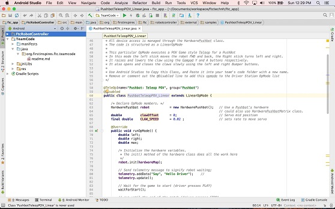

Android Studio Programming Tutorial
===================================

.. raw:: html

   <h3>Introduction</h3>

This tutorial is a complete getting-started path for a team programming in
Java with Android Studio. It takes you step-by-step through setting up and
configuring your Control System hardware, installing and managing the Android
Studio project, and writing, deploying, and running your first OpMode. You do
not need to have worked through the Blocks or OnBot Java tutorials first.

The tutorial is written for the officially supported setup: a REV Robotics
Control Hub as the ROBOT CONTROLLER and a REV Robotics Driver Hub as the
DRIVER STATION. Smartphones are legal to use in competition but are not
officially supported, and the pages this tutorial links to cover those setups
separately.

Android Studio is an advanced integrated development environment for
creating Android apps. This tool is the same tool that professional
Android app developers use. Android Studio is only recommended for
**advanced users** who have **extensive Java programming experience**.

|

.. note::
   :bdg-success:`AS` indicates that the content is specific to Android Studio Programming

Start with :doc:`Before You Start <before_you_start/before-you-start>`, which
lists the documentation a Java team needs alongside this tutorial and gives a
checklist to complete before writing code.

.. toctree::
   :maxdepth: 2

   before_you_start/before-you-start
   intro/intro
   config/config
   install/install
   manage/manage
   opmode/opmode
