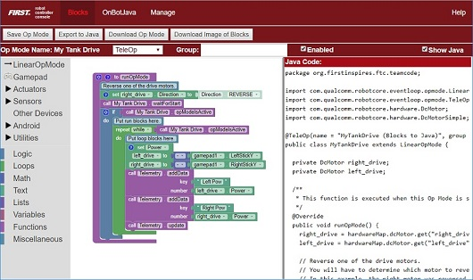

Blocks Programming Tutorial
===========================

.. Putting headers in html hides them from the table of contents.

.. raw:: html

   <h3>Introduction</h3>

This tutorial will take you step-by-step through the process of
configuring, programming, and operating your Control System. This
tutorial uses the *Blocks Programming Tool* to help you get started
quickly.

The FTC Blocks Programming Tool is a visual design tool that lets
programmers use a web browser to create, edit and save their *op modes*.

*FIRST* recommends getting starting with Blocks, even if you are an
experienced programmer. Using Blocks is the *easiest* and *fastest* way
to get acquainted with the FTC Control System!

|

.. raw:: html

   <h3>Table of Contents</h3>

1. Introduction
   
   -  :doc:`The FTC Control System <../shared/control_system_intro/The-FTC-Control-System>`
   -  :doc:`Required Materials <../shared/required_materials/Required-Materials>`
   -  :doc:`Using Your Android Device <../shared/using_android_device/Using-Your-Android-Device>`

2. Configuring Your Hardware

   -  :doc:`Configuring Your Android
      Devices <../shared/configuring_android/Configuring-Your-Android-Devices>`
   -  :doc:`Connecting Devices to a Control or Expansion Hub </hardware_and_software_configuration/connecting_devices/index>`
   -  :doc:`Configuring Your Hardware </hardware_and_software_configuration/configuring/index>`

3. Connecting to the Program & Manage Server

   -  :doc:`Installing a Javascript Enabled Browser <../shared/installing_javascript_browser/Installing-a-Javascript-Enabled-Browser>`
   -  :doc:`Connecting a Laptop to Program & Manage Wi-Fi Network <../shared/program_and_manage_network/Connecting-a-Laptop-to-the-Program-&-Manage-Network>`

4. Writing an Op Mode

   -  :doc:`Creating an Op Mode <../tutorial_specific/blocks/creating_op_modes/Writing-an-Op-Mode-with-FTC-Blocks>`
   -  :doc:`Running an Op Mode <../tutorial_specific/blocks/running_op_modes/Running-Your-Op-Mode>`
   -  :doc:`Managing Op Modes <../tutorial_specific/blocks/managing_opmodes/managing-opmodes>`
   -  :doc:`Controlling a Servo <../tutorial_specific/blocks/controlling_a_servo/Controlling-a-Servo-(Blocks)>`
   -  :doc:`Using Sensors <../tutorial_specific/blocks/using_sensors/Using-Sensors-(Blocks)>`

5. Reference Documents
   
   - :doc:`Blocks Reference Material <../tutorial_specific/blocks/blocks_reference/Blocks-Reference-Material>`

.. Only placing tutorial-specific items in the tutorial toc

.. toctree::
   :caption: Tutorials
   :maxdepth: 1
   :titlesonly:
   :hidden:

   ../tutorial_specific/blocks/creating_op_modes/Writing-an-Op-Mode-with-FTC-Blocks
   ../tutorial_specific/blocks/running_op_modes/Running-Your-Op-Mode
   ../tutorial_specific/blocks/controlling_a_servo/Controlling-a-Servo-(Blocks)
   ../tutorial_specific/blocks/using_sensors/Using-Sensors-(Blocks)
   ../tutorial_specific/blocks/managing_opmodes/managing-opmodes
   ../tutorial_specific/blocks/blocks_reference/Blocks-Reference-Material

