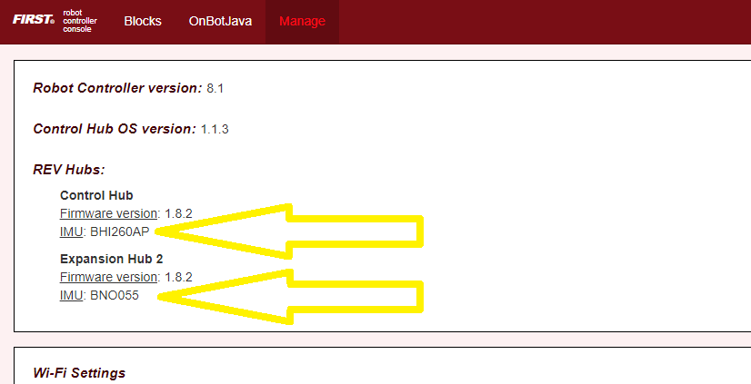
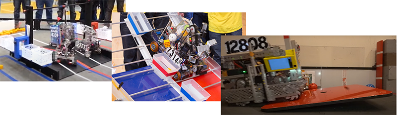
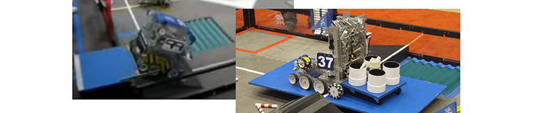
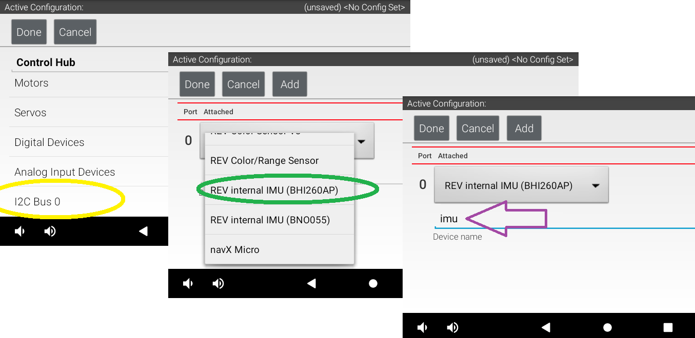
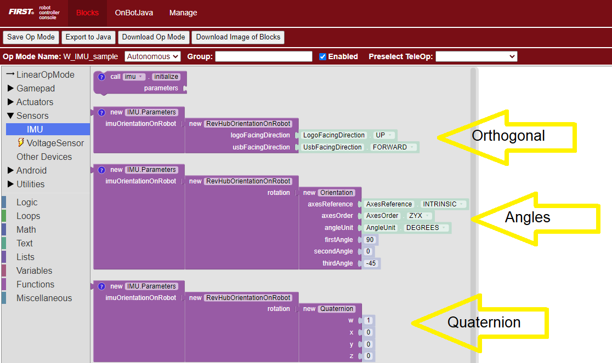
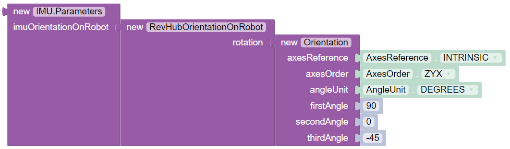

Universal IMU Interface
=======================

Introduction
------------

In September 2022, REV Robotics began shipping `Control Hubs
<https://www.revrobotics.com/rev-31-1595/>`__ with a different internal
Inertial Measurement Unit (IMU). The new IMU chip is designated `BHI260AP
<https://www.bosch-sensortec.com/products/smart-sensors/bhi260ap/>`__,
replacing the existing Hub’s IMU chip `BNO055
<https://www.bosch-sensortec.com/products/smart-sensors/bno055/>`__.  Both are
from Bosch Sensortec. An IMU can measure many aspects of device motion; this
explanatory document focuses primarily on **rotation**.

The new `Software SDK
<https://github.com/FIRST-Tech-Challenge/FtcRobotController/releases>`__
**version 8.1** provides a **universal interface** that supports both the
BHI260AP and BNO055 IMU. This basic tutorial introduces some new features: 

-  robot configuration allows selection of IMU type 
-  universal classes and methods supporting both IMU types 
-  three ways to specify Hub mounting orientation on the robot

Teams using the new Control Hub IMU must use the new SDK 8.1.  Updating to SDK
8.1 is **optional** for POWERPLAY, if you are not planning to use the new
Control Hub IMU.

However **all teams** are encouraged to begin using the universal IMU classes
and methods for **new** Blocks and Java code. And, migrating **existing code**
would allow you to switch easily (and perhaps urgently) to a new Control Hub
during the season.

Don’t know which IMU you have? Check the **Manage** page under ``Program &
Manage`` in any of these places: 

-  connected Driver Station (DS) app 
-  connected computer’s Chrome browser, at ``http://192.168.43.1:8080`` (Control Hub) or ``http://192.168.49.1:8080`` (RC phone) 
-  REV Hardware Client (when Hub LED is green)

Each Hub’s IMU type is listed there, as of SDK 8.0.

   Sample Control Hub and Expansion Hub display

.. note:: 
   *Reminder: REV Expansion Hubs purchased after December 2021 have no internal
   IMU.*

Do you have existing OpModes using the original IMU? Your code can run
unchanged, using Hubs with the BNO055. The new SDK 8.1 fully supports legacy
Blocks and Java code using classes and methods for the BNO055 IMU.

The SDK 8.1 README provides more technical background:

   | Unlike the old ``BNO055IMU`` interface, which only worked correctly when the
   | REV Hub was mounted flat on your robot, the ``IMU`` interface allows you to
   | specify the orientation of the REV Hub on your robot. It will account for
   | this, and give you your orientation in a Robot Coordinate System, instead of
   | a special coordinate system for the REV Hub. As a result, your pitch and yaw
   | will be 0 when your *robot* is level, instead of when the REV Hub is level,
   | which will result in much more reliable orientation angle values for most
   | mounting orientations.
   | ...
   | If you have calibrated your BNO055, you can provide that calibration data to
   | the new ``IMU`` interface by passing a ``BNO055IMUNew.Parameters`` instance
   | to ``IMU.initialize()``.
   | ...
   | Because of the new robot-centric coordinate system, the pitch and roll
   | angles returned by the ``IMU`` interface will be different from the ones
   | returned by the ``BNO055IMU`` interface. When you are migrating your code,
   | pay careful attention to the documentation.

Potential Usage
---------------

*FIRST* Tech Challenge robots drive mostly on a flat playing field, typically
using the IMU to monitor or control **Heading** (Yaw or Z-angle).

Heading is preserved between OpMode runs, unless the robot or Robot Controller
(RC) app are restarted. This can be useful between Autonomous and TeleOp.
Heading can be reset during an OpMode, as discussed below.

*Heading can drift slowly over time. An absolute reference is not available
from gravity or from a magnetometer, which can be affected by nearby motors.
This ‘Yaw drift’ is discussed below.*

The IMU can help with more than Heading! Some *FIRST* Tech Challenge games have
placed robots on **tilted surfaces**:

   Sample images from previous games utilizing tilted surfaces

   (Block Party!, *FIRST* RES-Q, Relic Recovery, Face Off!, Get Over It!)

Such fields, and special circumstances in **any** *FIRST* Tech Challenge game,
may cause teams to seek IMU readings for **Pitch** and **Roll** angles.

Examples might include: 

-  robot’s left wheels are raised, on an obstacle
-  robot is tilted forward on its front 4 wheels (of 6-wheel West Coast Drive) 
-  robot has tipped over (!) 
-  robot’s secondary Expansion Hub (with IMU) is mounted on a tilting mechanism

The Software SDK can also provide values for **angular velocity**, which is
the rate of change (degrees per second) for Roll, Pitch or Yaw.

Let’s get started!

Configure IMU
-------------

Robot configuration of the IMU is **automatic**, and shouldn’t need changes.
But here’s how to confirm or rename your configured IMU.

In a connected DS app, touch the 3-dots icon at top right, then touch
``Configure Robot``. For any new or existing Configuration, touch ``Control Hub
Portal``, then select the Hub with the IMU you want to use. Typically this will
be the Control Hub, whether old or new.

   REV IMU Robot Configuration Validation

-  **Yellow**: The internal IMU is (always) connected at I2C Bus 0, Port 0.  If
   you want another I2C device also on Bus 0, plug it into the Hub and use the
   ``Add`` button.

-  **Green**: The default IMU type shown will reflect the actual unit in this Hub;
   fix this only if it was incorrectly modified. Your IMU OpModes **require a
   correct choice here**.

-  **Purple**: The default device name is “imu”, used by all Sample OpModes for
   Blocks and Java. You may enter a custom name here, but you must then
   **update** all your OpModes that reference the IMU.

When done, **save** and **activate** this configuration.

*If a Blocks OpMode is open at the computer’s programming screen, close and
re-open that OpMode to capture this updated configuration. Blocks are provided
only for devices in the configuration that’s active*\  **upon opening**\  *an
OpMode.*

Axes Definition
---------------

Robot orientation is defined using the Robot Coordinate System, with 3
axes that are **orthogonal** (at 90 degrees to each other), with origin
inside the robot.

You must decide which face or direction is **“forward”** on your robot
(which could be round!).

.. tip::
   Placing a tape label “FRONT” at the **team-agreed front face** or front
   edge of the robot can avoid confusion later – really!

-  Heading, or Yaw, is the measure of rotation about the Z axis, which
   points **up** toward the ceiling.

-  Pitch is the measure of rotation about the X axis, which points **out
   the right side** of the robot.

-  Roll is the measure about the Y axis, which points **out the front**
   of the robot.

*These are Robot axes, different than (and not aligned with) the Hub
axes used by the legacy* ``BNO055IMU`` *driver.*

Rotation follows the traditional **right-hand rule**: with the thumb
pointing along the positive axis, the fingers curl in the direction of
**positive** rotation.

.. hint::
   *Fun fact: the IMU is located approximately under the word “PROUD”, near the
   lower right corner of the Hub.*

This tutorial will **not** discuss the *FIRST* Tech Challenge `Field Coordinate System
<https://github.com/FIRST-Tech-Challenge/FtcRobotController/blob/master/FtcRobotController/src/main/java/org/firstinspires/ftc/robotcontroller/external/samples/FTC_FieldCoordinateSystemDefinition.pdf>`__.
Your OpModes might relate robot orientation to the overall field or `‘global
coordinates’
<https://github.com/FIRST-Tech-Challenge/FtcRobotController/wiki/Vuforia-for-Blocks#vuforia-introduction>`__
for navigation, but that’s beyond the focus here on using the IMU.

Physical Hub Mounting
---------------------

Under SDK 8.1, you can specify the **physical orientation** of the Hub
on the robot. This allows you to receive IMU angle values expressed in
**robot axes**, useful for understanding and managing the robot’s
movement.

Before jumping into programming, let’s discuss your options for
physically mounting the Hub on the robot. In general, the Hub’s mounting
can be considered **Orthogonal** or **Non-Orthogonal**.

Orthogonal Mounting
^^^^^^^^^^^^^^^^^^^

Imagine a **cube** anywhere on your robot, parallel to the floor, with
one flat side facing exactly towards the designated “front” of your
robot. Place your Hub on one of these cube faces, with the Hub’s
straight edges **parallel** to the cube.

If that describes the orientation of your Hub, use the **Orthogonal**
method of specifying its orientation. See the IMU Programming section
below.

Here are some common examples:

.. grid:: 1 2 2 3
   :gutter: 2

   .. grid-item-card::
      :class-header: sd-bg-dark font-weight-bold sd-text-white
      :class-body: sd-text-left body

      Orthogonal #1

      ^^^

      .. figure:: images/orthogonal-1.png
         :align: center
         :alt: Logo UP, USB Forward
         :width: 100%

      +++

      Logo UP, USB FORWARD

   .. grid-item-card::
      :class-header: sd-bg-dark font-weight-bold sd-text-white
      :class-body: sd-text-left body

      Orthogonal #2

      ^^^

      .. figure:: images/orthogonal-2.png
         :align: center
         :alt: Logo LEFT, USB UP
         :width: 100%

      +++

      Logo LEFT, USB UP

   .. grid-item-card::
      :class-header: sd-bg-dark font-weight-bold sd-text-white
      :class-body: sd-text-left body

      Orthogonal #3

      ^^^

      .. figure:: images/orthogonal-3.png
         :align: center
         :alt: Logo RIGHT, USB UP
         :width: 100%

      +++

      Logo RIGHT, USB UP

   .. grid-item-card::
      :class-header: sd-bg-dark font-weight-bold sd-text-white
      :class-body: sd-text-left body

      Orthogonal #4

      ^^^

      .. figure:: images/orthogonal-4.png
         :align: center
         :alt: Logo FORWARD, USB UP
         :width: 100%

      +++

      Logo FORWARD, USB UP

   .. grid-item-card::
      :class-header: sd-bg-dark font-weight-bold sd-text-white
      :class-body: sd-text-left body

      Orthogonal #5

      ^^^

      .. figure:: images/orthogonal-5.png
         :align: center
         :alt: Logo BACKWARD, USB UP
         :width: 100%

      +++

      Logo BACKWARD, USB UP

   .. grid-item-card::
      :class-header: sd-bg-dark font-weight-bold sd-text-white
      :class-body: sd-text-left body

      Orthogonal #6

      ^^^

      .. figure:: images/orthogonal-6.png
         :align: center
         :alt: Logo DOWN, USB FORWARD
         :width: 100%

      +++

      Logo DOWN, USB FORWARD

   .. grid-item-card::
      :class-header: sd-bg-dark font-weight-bold sd-text-white
      :class-body: sd-text-left body

      Orthogonal #7

      ^^^

      .. figure:: images/orthogonal-7.png
         :align: center
         :alt: Logo FORWARD, USB LEFT
         :width: 100%

      +++

      Logo FORWARD, USB LEFT

   .. grid-item-card::
      :class-header: sd-bg-dark font-weight-bold sd-text-white
      :class-body: sd-text-left body

      Orthogonal #8

      ^^^

      .. figure:: images/orthogonal-8.png
         :align: center
         :alt: Logo FORWARD, USB RIGHT
         :width: 100%

      +++

      Logo FORWARD, USB RIGHT

   .. grid-item-card::
      :class-header: sd-bg-dark font-weight-bold sd-text-white
      :class-body: sd-text-left body

      Orthogonal #9

      ^^^

      .. figure:: images/orthogonal-9.png
         :align: center
         :alt: Logo UP, USB BACKWARD
         :width: 100%

      +++

      Logo UP, USB BACKWARD

With six cube faces, and four 90-degree positions on each face, there
are **24 possible Orthogonal orientations**.

Non-Orthogonal Mounting
^^^^^^^^^^^^^^^^^^^^^^^

Here are some scenarios, ranging from simple to complex:

-  Imagine the same front-aligned cube, with your Hub on any face. The
   Hub’s edges are **not parallel** to the cube. Namely, the Hub is
   rotated only **in-plane** (clockwise or counter-clockwise, looking at
   the REV logo).
-  The Hub is mounted/tilted at some oblique angle from a face on the
   imaginary cube. At that single tilted angle, the Hub is not rotated
   in-plane (clockwise or counter-clockwise, looking at the logo).
-  The Hub is tilted at multiple angles, with or without in-plane
   rotation.

For any Non-Orthogonal scenarios, SDK 8.1 provides **two ways** to
describe the Hub’s orientation. See below for the **Angles** method and
the **Quaternion** method.

IMU Programming
---------------

SDK 8.1 offers new classes and methods that apply **universally** to
both types of IMU. Once configured, the IMU type will not affect your
programming. The programming steps include:

-  set the IMU **parameters**, or use defaults
-  **initialize** the IMU
-  **read values** from the IMU, use as needed to control the robot
-  optional: **reset Heading** one or more times

The following sections cover these topics in order.

Parameters
^^^^^^^^^^

There are **three ways** to describe the Hub’s orientation, using IMU
parameters. One is for Orthogonal mounting, and two are for Non-Orthogonal
mounting. Choose the simplest method that applies to your robot.

As an example, in the *FIRST* Tech Challenge Blocks menu under ``Sensors`` and ``IMU``, you
can find these three methods for specifying parameters:

   Sample Blocks screenshot, demonstrating the three parameter methods
   
Parameters for Method 1, Orthogonal
"""""""""""""""""""""""""""""""""""

Method 1 consists of supplying a simple Orthogonal configuration. This requires
you to determine the direction that the REV logo is facing. To do this,
consider the Hub is mounted on an imaginary cube aligned to the “front” of the
robot.  Specify the Hub’s mounting face: “Forward” means robot forward (front
face), “Left” means robot left, etc.

Next, choose how the Hub is rotated on that face. Use the USB ports at
the “top” of the Hub to determine this direction; assume you are at the
rear of the robot, looking “forward”.

.. note:: 
   *Certain combinations are physically impossible. For example, if the REV
   logo is facing UP, the USB ports cannot also be facing UP. The OpMode will
   reject such combinations during IMU initialization.*

It’s optional to save the parameters to a new variable called, for
example, “myIMUparameters”. That variable can be used in the next step
(IMU initialization).

.. tab-set::

   .. tab-item:: Blocks
      :sync: blocks

      .. figure:: images/050-Blocks-parameters-1a.png
         :align: center
         :alt: specifying Logo Facing Direction
         :width: 80%

         Specifying Logo Facing Direction
           
      .. figure:: images/060-Blocks-parameters-1b.png
         :align: center
         :alt: specifying USB Facing Direction
         :width: 80%

         Specifying USB Facing Direction

      .. figure:: images/070-Blocks-myIMUparameters.png
         :align: center
         :alt: Setting parameters to variable
         :width: 80%

         Setting parameters to a Variable

   .. tab-item:: Java
      :sync: java

      .. code:: java

         IMU.Parameters myIMUparameters;

         myIMUparameters = new IMU.Parameters(
              new RevHubOrientationOnRobot(
                   RevHubOrientationOnRobot.LogoFacingDirection.UP, 
                   RevHubOrientationOnRobot.UsbFacingDirection.FORWARD
              )
         );

Hub Axes for Setting Parameters
"""""""""""""""""""""""""""""""

Only for the next two Parameters sections (Angles and Quaternion), we
must temporarily use **Hub axes** instead of Robot axes. Hub axes are
also at 90 degrees to each other, with origin inside the Hub.

**The assumed initial Hub position is REV logo facing UP (Robot +Z),
with USB ports FORWARD (Robot +Y).** For the Angles and Quaternion
methods, all rotations start here.

*Again, “forward” is based on your team’s agreed definition.*

In this starting orientation, the Hub axes are **aligned with** the
Robot Coordinate System:

-  Heading, or Yaw, is the measure of rotation about the Z axis, which
   points upwards through the Hub’s front plate or logo.
-  Pitch is the measure of rotation about the X axis, which points
   toward the right-side I2C sensor ports.
-  Roll is the measure about the Y axis, which points toward the
   top-edge USB port(s).

Hub rotations also follow the right-hand rule.

The legacy ``BNO055IMU`` driver uses **different Hub axes**: its X
axis pointed to the USB port, and Y axis pointed to the left-side motor
ports. The new SDK 8.1 universal IMU driver uses the above Hub axes for
BNO055 and BHI260AP.

Parameters for Method 2, Angles
"""""""""""""""""""""""""""""""

If your Hub is **not** mounted Orthogonally, you can specify the Hub’s
*rotation* about one or more **Hub axes** X, Y, Z. These are expressed in
*degrees*, and the **order** in which the rotations are applied (it
matters!).

The Blocks IMU palette contains a Block with default parameters for the
Angles method of describing the Hub’s orientation on the robot. Let’s
review this Blocks palette function now, as a good example. The Java 
API closely resembles the Blocks method.

   Sample Block demonstrating angles method
   
The second listed default is ZYX, meaning you will provide the Hub’s
rotations in that order. Thus the “first angle” is the Z axis, the
“second angle” is the Y axis, and the “third angle” is the X axis.

So the Hub will be rotated as follows: +90 degrees about **Z**, no
rotation about **Y**, then -45 degrees about **X** (in its new
direction).

For the Angles method, the assumed initial Hub position is REV Logo 
facing UP, with USB ports facing FORWARD. Additional rotations begin
at this orientation.

1. From logo-up/USB-forward, this example starts with a “first angle”
   rotation of **+90 degrees about the Z axis**. Namely, the Hub rotates
   counter-clockwise (CCW), ending with the USB ports pointing to the
   robot’s left side. Note the **X and Y axes have also rotated CCW**,
   since they are INTRINSIC (described below).

2. The “second angle” rotation is **0 degrees, no action**.

3. The “third angle” rotation is **-45 degrees about the Hub’s X axis**,
   which **now points in the robot’s forward direction** (after the
   first-angle Z rotation). So, the top edge of the Hub tilts downward,
   causing the USB ports to angle downward at 45 degrees, at the robot’s
   left side.

Here’s the full sequence:

.. grid:: 1 2 2 3
   :gutter: 2

   .. grid-item-card::
      :class-header: sd-bg-dark font-weight-bold sd-text-white
      :class-body: sd-text-left body

      Angles Rotation Step #1

      ^^^

      .. figure:: images/angle-1.png
         :align: center
         :alt: Starting Position
         :width: 100%

      +++

      Starting Position

   .. grid-item-card::
      :class-header: sd-bg-dark font-weight-bold sd-text-white
      :class-body: sd-text-left body

      Angles Rotation Step #2

      ^^^

      .. figure:: images/angle-2.png
         :align: center
         :alt: First Angle (Z axis +90)
         :width: 100%

      +++

      First Angle (Z axis +90)

   .. grid-item-card::
      :class-header: sd-bg-dark font-weight-bold sd-text-white
      :class-body: sd-text-left body

      Angles Rotation Step #3

      ^^^

      .. figure:: images/angle-3.png
         :align: center
         :alt: Third Angle (X axis -45)
         :width: 100%

      +++

      Third Angle (X axis -45)

The remaining default parameters don’t need attention or editing. The third
listed default is simply DEGREES, easy to work with. The first listed default
is INTRINSIC axes reference, which means that the Hub axes move with each
rotation of the Hub. (The other choice, rarely used, is EXTRINSIC for global
axes that **don’t move** with each Hub rotation.)

As with Orthogonal, it’s optional to save the parameters to a new variable
called, for example, “myIMUparameters”. That variable can be used in the next
step (IMU initialization).

.. tab-set::

   .. tab-item:: Blocks
      :sync: blocks

      .. figure:: images/100-Blocks-angles-variable.png
         :align: center
         :alt: setting angles in Blocks
         :width: 80%

         Setting Angles in Blocks
           
   .. tab-item:: Java
      :sync: java

      .. code:: java

         IMU.Parameters myIMUparameters;

         myIMUparameters = new IMU.Parameters(
              new RevHubOrientationOnRobot(
                   new Orientation(
                        AxesReference.INTRINSIC, 
                        AxesOrder.ZYX, 
                        AngleUnit.DEGREES, 
                        90, 
                        0, 
                        -45, 
                        0  // acquisitionTime, not used
                   )
              )
         );

Parameters for Method 3, Quaternion
"""""""""""""""""""""""""""""""""""

As an alternative to the Angles method, the Hub’s non-orthogonal
orientation can be described using a
`Quaternion <https://en.wikipedia.org/wiki/Quaternion>`__, an advanced
math technique for describing **any** combination of tilting and
rotating. 

The following default Quaternion (w=1, x=0, y=0, z=0) describes a Hub in the
assumed starting position: Logo facing UP, and USB ports FORWARD. Namely, no
rotations.

.. tab-set::

   .. tab-item:: Blocks
      :sync: blocks

      .. figure:: images/130-Blocks-quaternion.png
         :align: center
         :alt: default quaternion
         :width: 80%

         Default Quaternion (no rotation)
         
   .. tab-item:: Java
      :sync: java

      .. code:: java

         IMU.Parameters myIMUparameters;

         // Default Quaternion
         myIMUparameters = new IMU.Parameters(
              new RevHubOrientationOnRobot(
                   new Quaternion(
                        1.0f, // w
                        0.0f, // x
                        0.0f, // y
                        0.0f, // z
                        0     // acquisitionTime
                   )
              )
         );

         // Or, consider a single rotation of +30 degrees 
         // about the X axis. Namely, the Hub’s USB ports 
         // tilt 30 degrees upwards from the default starting
         // position. 
         myIMUparameters = new IMU.Parameters(
              new RevHubOrientationOnRobot(
                   new Quaternion(
                        0.9659258f, // w
                        0.258819f,  // x
                        0.0f,       // y
                        0.0f,       // z
                        0           // acquisitionTime
                   )
              )
         );

This basic tutorial does not cover the math behind Quaternions, an advanced
substitute for Euler Angles described above. The SDK 8.1 IMU interface supports
the use of Quaternions, for FTC teams and third party libraries familiar with
them.

Initialize IMU
^^^^^^^^^^^^^^

This prepares the IMU for operation, using the parameters you defined.

In FTC Blocks, use the first Block shown in the IMU palette, called
``imu.initialize``. Most teams do this during the INIT phase of their
OpMode, before ``waitForStart()``.

The IMU should be motionless during its initialization process. The
OpMode will continue when initialization is complete.

.. note::
   Fun fact: Under the legacy ``BNO055IMU`` interface, intialization takes
   about 900 milliseconds. Under the new universal IMU interface, the BNO055
   takes about 100 milliseconds, while the BHI260AP takes about 50
   milliseconds.

For **any of the three methods** (Orthogonal, Angles, Quaternion),
initialize with the IMU parameters from the ``new`` Block, or from your
optional Variable.

.. tab-set::

   .. tab-item:: Blocks
      :sync: blocks

      Two methods for Initializing the IMU:

      .. figure:: images/200-Blocks-initialize-IMU.png
         :align: center
         :alt: Initialize IMU directly
         :width: 80%

         Initializing the IMU directly
           
      .. figure:: images/200-Blocks-initialize-IMU-parameter.png
         :align: center
         :alt: Initialize IMU using Parameters
         :width: 80%

         Initializing the IMU using Parameters

   .. tab-item:: Java
      :sync: java

      .. code:: java

         // Two methods for Initializing the IMU:

         // Initialize IMU directly
         imu.initialize(
              new IMU.Parameters(
                   new RevHubOrientationOnRobot(
                        RevHubOrientationOnRobot.LogoFacingDirection.UP, 
                        RevHubOrientationOnRobot.UsbFacingDirection.FORWARD
                   )
              )
         );

         // Initialize IMU using Parameters
         imu.initialize(myIMUparameters);

Read IMU Angles - Basic
^^^^^^^^^^^^^^^^^^^^^^^

Now you can read the IMU values for **robot orientation**, expressed as
Heading (Yaw or Z-angle), Pitch (X-angle) and Roll (Y-angle). You have
no concern now about the Hub’s orientation or mounting – that has been
defined with parameters, and the SDK is ready to provide actual data
about the robot, using the robot’s axes.

.. note::
   *Reminder: Robot Z points upwards to the ceiling. Robot Y points forward –
   whatever you decide is “forward” on your robot (which could be round!).
   Robot X points to the right side of the robot. Robot rotations follow the
   right-hand rule.*

For all axes, IMU angles are provided in the range of **-180 to +180
degrees** (or from ``-Pi`` to ``+Pi`` radians). If you are working
with values that might cross the +/- 180-degree transition, handle this
with your programming. That’s beyond the scope of this IMU tutorial.

Here's an example of reading IMU Angles:

.. tab-set::

   .. tab-item:: Blocks
      :sync: blocks

      In FTC Blocks, create a new Variable to receive data from this green
      Block in the **IMU** palette:

      .. figure:: images/300-Blocks-get-robot-YPR-angles.png
         :align: center
         :alt: Get YPR Angles
         :width: 80%

         Get Yaw-Pitch-Roll Angles
 
      From the **YawPitchRollAngles** palette under **Utilities**, use the
      green Blocks to read each angle from the Variable you just created.

      .. figure:: images/305-Blocks-extract-angles.png
         :align: center
         :alt: Extract Angles
         :width: 80%

         Extract Angles

      These Blocks are used here in a Repeat Loop, to display the angles on
      the Driver Station:

      .. figure:: images/310-Blocks-YPR-telemetry.png
         :align: center
         :alt: Displaying YPR using Telemetry
         :width: 80%

         Displaying Yaw-Pitch-Roll using Telemetry

      These Blocks are shown in the Sample OpMode called ``SensorIMU``.

   .. tab-item:: Java
      :sync: java

      .. code:: java

         // Create an object to receive the IMU angles
         YawPitchRollAngles robotOrientation;
         robotOrientation = imu.getRobotYawPitchRollAngles();

         // Now use these simple methods to extract each angle 
         // (Java type double) from the object you just created:
         double Yaw   = robotOrientation.getYaw(AngleUnit.DEGREES);
         double Pitch = robotOrientation.getPitch(AngleUnit.DEGREES);
         double Roll  = robotOrientation.getRoll(AngleUnit.DEGREES);

Note that the robot’s orientation is described here **intrinsically**;
the axes move with each rotation. Here’s an example from the Javadocs:

   | As an example, if the yaw is 30 degrees, the pitch is 40 degrees, and
   | the roll is 10 degrees, that means that you would reach the described
   | orientation by first rotating a robot 30 degrees counter-clockwise from
   | the starting point, with all wheels continuing to touch the ground
   | (rotation around the Z axis). Then, you make your robot point 40 degrees
   | upward (rotate it 40 degrees around the X axis). Because the X axis
   | moved with the robot, the pitch is not affected by the yaw value. Then
   | from that position, the robot is tilted 10 degrees to the right, around
   | the newly positioned Y axis, to produce the actual position of the
   | robot.

*Again, the IMU*\  **output**\  *results are given in the*\  **Robot
Coordinate System**\ *, or Robot axes. Only for a non-Orthogonal
orientation,*\  **Hub axes**\  *were used temporarily
for*\  **input**\  *parameters, describing the Hub’s rotation to achieve
its mounted orientation.*

Read IMU Angles - Flexible
^^^^^^^^^^^^^^^^^^^^^^^^^^

As an alternative to the ``YawPitchRollAngles`` class, the FTC SDK also
provides a more flexible ``Orientation`` class. This allows you to
specify a **custom order** of axis rotations, and a choice of intrinsic
or extrinsic axes.

*Again, IMU angles are provided in the range of -180 to +180 degrees (or
from* ``-Pi`` *to* ``+Pi`` *radians).*

Here is an example use of these functions:

.. tab-set::

   .. tab-item:: Blocks
      :sync: blocks

      As before, first create an object (Blocks Variable) containing the array
      of orientation values (from the Blocks ``Sensors / IMU`` palette):

      .. figure:: images/322-blocks-getRobotOrientation.png
         :align: center
         :alt: Get Robot Orientation
         :width: 80%

         Get Robot Orientation
 
      Notice the **axes order of XYZ**, different than the ZXY order used by
      the ``YawPitchRollAngles`` class.

      Then extract the specific axis rotations you want, from the Blocks
      ``Utilities / Orientation`` palette:

      .. figure:: images/324-blocks-myRobotOrientation.png
         :align: center
         :alt: Extract Orientation Angles
         :width: 80%

         Extract Orientation Angles

   .. tab-item:: Java
      :sync: java

      .. code:: java

         // Create Orientation variable
         Orientation myRobotOrientation;

         // Get Robot Orientation
         myRobotOrientation = imu.getRobotOrientation(
              AxesReference.INTRINSIC, 
              AxesOrder.XYZ, 
              AngleUnit.DEGREES
         );

         // Then read or display the desired values (Java type float):
         float X_axis = myRobotOrientation.firstAngle;
         float Y_axis = myRobotOrientation.secondAngle;
         float Z_axis = myRobotOrientation.thirdAngle;

.. note::
   *Pay close attention to the selection of*\  **axes order**\ *, which
   greatly affects the IMU results. If you care mostly about Heading (Yaw),
   choose an axes order that starts with Z.*

Read Angular Velocity
^^^^^^^^^^^^^^^^^^^^^

The FTC SDK also provides values for **angular velocity**, the rate of
change (degrees or radians per second) for Roll, Pitch or Yaw.

Here is an example for reading Angular Velocity:

.. tab-set::

   .. tab-item:: Blocks
      :sync: blocks

      As before, first create an object (Blocks Variable) containing the array
      of angular velocity values (from the Blocks ``Sensors / IMU`` palette):

      .. figure:: images/332-blocks-getRobotAngularVelocity.png
         :align: center
         :alt: Get Robot Angular Velocity
         :width: 80%

         Get Robot Angular Velocity

      Then extract the specific axis rotations you want, from the Blocks
      ``Utilities / AngularVelocity`` palette:

      .. figure:: images/334-blocks-myRobotAngularVelocity.png
         :align: center
         :alt: Extract Rotation Rates
         :width: 80%

         Extract Rotation Rates

      These Blocks are shown in the Sample OpMode called ``SensorIMU``.

   .. tab-item:: Java
      :sync: java

      .. code:: java

         // Create angular velocity array variable
         AngularVelocity myRobotAngularVelocity;

         // Read Angular Velocities
         myRobotAngularVelocity = imu.getRobotAngularVelocity(AngleUnit.DEGREES);

         // Then read or display these values (Java type float) 
         // from the object you just created:
         float zRotationRate = myRobotAngularVelocity.zRotationRate;
         float xRotationRate = myRobotAngularVelocity.xRotationRate;
         float yRotationRate = myRobotAngularVelocity.yRotationRate;

      These are also shown in each of the Java **Sample OpModes** listed in a
      section below.

Reset Heading
^^^^^^^^^^^^^

It can be useful to reset the Heading (or Yaw or Z-angle) to zero, at
one or more places in your OpMode.

Here is an example for resetting the Yaw axis:

.. tab-set::

   .. tab-item:: Blocks
      :sync: blocks

      In FTC Blocks, this optional command is simple:

      .. figure:: images/210-Blocks-reset-Yaw.png
         :align: center
         :alt: Reset Yaw
         :width: 80%

         Reset Yaw

   .. tab-item:: Java
      :sync: java

      .. code:: java
   
         // Reset Yaw
         imu.resetYaw();

It’s safest to reset Yaw only when the robot has not significantly
deviated from a flat/horizontal orientation.

This command assumes the Hub’s actual orientation was **correctly
described** with Orthogonal, Angles or Quaternion parameters.

In other words, a non-Orthogonal Hub moved away from its
parameter-defined orientation, may not give reliable results for
Heading/Yaw or ``resetYaw()``, even after the robot has returned to its
original defined orientation.

*An exception, or loophole, is that “reset” Heading/Yaw values might
still be valid if the Hub is actually mounted in an incorrectly
described Orthogonal orientation, and the robot remains level. This may
benefit a rookie team that overlooked the IMU Parameters or moved the
Hub to a different Orthogonal position, still relying only on Heading.
This* ``resetYaw()`` *exception does*\  **not**\  *apply to angular velocity
for Yaw (Z-axis).*

Here’s the official FTC Javadocs description for ``resetYaw()``: 

   | Resets the robot’s yaw angle to 0. After calling this method, the reported
   | orientation will be relative to the robot’s position when this method is
   | called, as if the robot was perfectly level right now. That is to say, the
   | pitch and yaw will be ignored when this method is called.

*The Javadocs’ statement ‘resets to 0’ should be read in the context of
the previous discussion. In certain off-axis Hub orientations, a reset
Yaw value might not actually display as zero.*

If ``resetYaw()`` does not meet your needs, other code-based choices
(possibly less effective) include:

-  ‘Save & Subtract’ to establish the current Heading as a new “zero”
   baseline for further navigation
-  use the original Heading for the entire match, using only absolute
   (global) targets

.. important::
   *For all choices, be aware of “gyro drift”. Most electronic IMUs give
   slowly shifting Z-angle results over time, for various reasons. Although
   the Pitch and Roll axes can use*\  **gravity’s direction**\  *to correct
   for drift, Yaw (Heading or Z-angle) cannot.*

Sample OpModes
--------------

The SDK 8.1 contains Sample OpModes demonstrating the above. 

.. tab-set::

   .. tab-item:: Blocks
      :sync: blocks

      In FTC Blocks, a simple example is called ``SensorIMU``.

      .. figure:: images/350-Blocks-IMU-Sample.png
         :align: center
         :alt: Blocks IMU Sample
         :width: 80%

         Blocks IMU Sample

      Here’s an :download:`image <images/360-SensorIMU.png>` and the 
      :download:`Blocks file <opmodes/SensorIMU.blk>` of this Sample OpMode.

   .. tab-item:: Java
      :sync: java

      In Java, three Sample OpModes demonstrate the new universal IMU
      interface:

      .. dropdown:: ConceptExploringIMUOrientation.java

         Provides a tool to experiment with setting your Hub orientation on the robot

         :download:`ConceptExploringIMUOrientation.java <opmodes/ConceptExploringIMUOrientation.java>`

         .. literalinclude:: opmodes/ConceptExploringIMUOrientation.java
            :language: java

      .. dropdown:: SensorIMUOrthogonal.java

         Shows how to define your Hub orientation on the robot, for simple orthogonal (90 degree) mounting

         :download:`SensorIMUOrthogonal.java <opmodes/SensorIMUOrthogonal.java>`

         .. literalinclude:: opmodes/SensorIMUOrthogonal.java
            :language: java

      .. dropdown:: SensorIMUNonOrthogonal.java

         Shows how to define (with the Angles method) your Hub orientation on the robot for a non-orthogonal orientation

         :download:`SensorIMUNonOrthogonal.java <opmodes/SensorIMUNonOrthogonal.java>`

         .. literalinclude:: opmodes/SensorIMUNonOrthogonal.java
            :language: java

      These three Java samples include extensive comments describing the IMU
      interface, consistent with this tutorial. In particular,
      ``SensorIMUNonOrthogonal.java`` describes three helpful examples.

SDK Resources
-------------

Advanced programmers are invited to browse the FTC `Javadocs
documentation <https://javadoc.io/doc/org.firstinspires.ftc>`__ (API),
particularly in:

-  ``com.qualcomm.robotcore.hardware``
-  ``org.firstinspires.ftc.robotcore.external.navigation``

The new universal IMU classes for SDK 8.1 are:

-  ``IMU``
-  ``ImuOrientationOnRobot``
-  ``YawPitchRollAngles``
-  ``RevHubOrientationOnRobot``

The Javadocs describe other IMU methods and variables not covered in
this basic tutorial.

Summary
-------

The FTC SDK 8.1 provides a universal interface that supports both the
BHI260AP and BNO055 IMU. This basic tutorial introduced some new
features:

-  robot configuration allows selection of IMU type
-  three ways to specify Hub mounting orientation on the robot
-  new Blocks and Java methods to read data from both IMU types

Teams using the new Control Hub IMU must use the new SDK 8.1.

Updating to SDK 8.1 is **optional** for POWERPLAY, if you are not
planning to use the new Control Hub IMU.

However **all teams** are encouraged to begin using the universal IMU
classes and methods for **new** Blocks and Java code, and consider
migrating **existing** code.

Questions, comments and corrections to westsiderobotics@verizon.net

