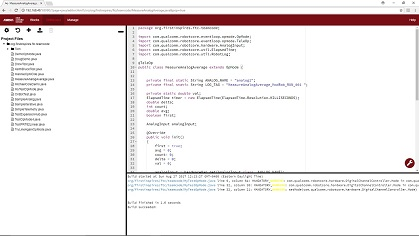

OnBot Java Programming Tutorial
===============================

.. raw:: html
   
   <h3>Introduction</h3>

This tutorial will take you step-by-step through the process of
configuring, programming, and operating your Control System. This
tutorial uses the OnBot Java Programming Tool to help you get started
programming your robot.

The OnBot Java Programming Tool is a text-based programming tool
that lets programmers use a web browser to create, edit and save their
Java op modes. This tool is recommended for programmers who have basic
to advanced Java skills and who would like to write text-based op modes.

|

.. raw:: html
   
   <h3>Table of Contents</h3>

1. Introduction

   -  :doc:`The Control System <../shared/control_system_intro/The-FTC-Control-System>`
   -  :doc:`Required Materials <../shared/required_materials/Required-Materials>`
   -  :doc:`Using Your Android Device <../shared/using_android_device/Using-Your-Android-Device>`

2. Configuring Your Hardware

   -  :doc:`Configuring Your Android
      Devices <../shared/configuring_android/Configuring-Your-Android-Devices>`
   -  :doc:`Connecting Devices to a Control or Expansion Hub </hardware_and_software_configuration/connecting_devices/index>`
   -  :doc:`Configuring Your Hardware </hardware_and_software_configuration/configuring/index>`

3. Connecting to the Program & Manage Server

   -  :doc:`Installing a Javascript Enabled Browser <../shared/installing_javascript_browser/Installing-a-Javascript-Enabled-Browser>`
   -  :doc:`Connecting a Laptop to Program & Manage Wi-Fi Network <../shared/program_and_manage_network/Connecting-a-Laptop-to-the-Program-&-Manage-Network>`

4. Writing an Op Mode

   -  :doc:`Creating & Running an Op Mode <../tutorial_specific/onbot_java/creating_op_modes/Creating-and-Running-an-Op-Mode-(OnBot-Java)>`
   -  :doc:`Controlling a Servo <../tutorial_specific/onbot_java/controlling_a_servo/Controlling-a-Servo-(OnBot-Java)>`
   -  :doc:`Using Sensors <../tutorial_specific/onbot_java/using_sensors/Using-Sensors-(OnBot-Java)>`

5. Reference Documentation

   -  :doc:`OnBot Java Reference Info <../tutorial_specific/onbot_java/onbot_java_reference/OnBot-Java-Reference-Info>`

.. Only placing tutorial-specific items in the tutorial toc

.. toctree::
   :caption: Tutorials
   :maxdepth: 1
   :titlesonly:
   :hidden:

   ../tutorial_specific/onbot_java/creating_op_modes/Creating-and-Running-an-Op-Mode-(OnBot-Java)
   ../tutorial_specific/onbot_java/controlling_a_servo/Controlling-a-Servo-(OnBot-Java)
   ../tutorial_specific/onbot_java/using_sensors/Using-Sensors-(OnBot-Java)
   ../tutorial_specific/onbot_java/onbot_java_reference/OnBot-Java-Reference-Info
