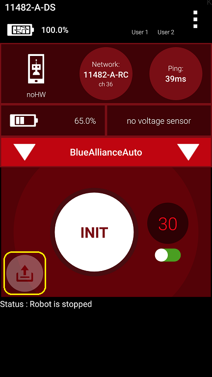
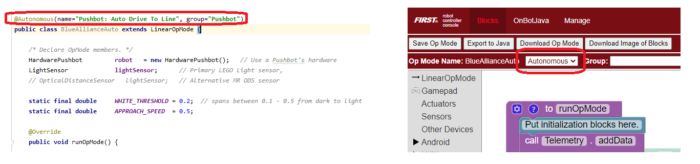
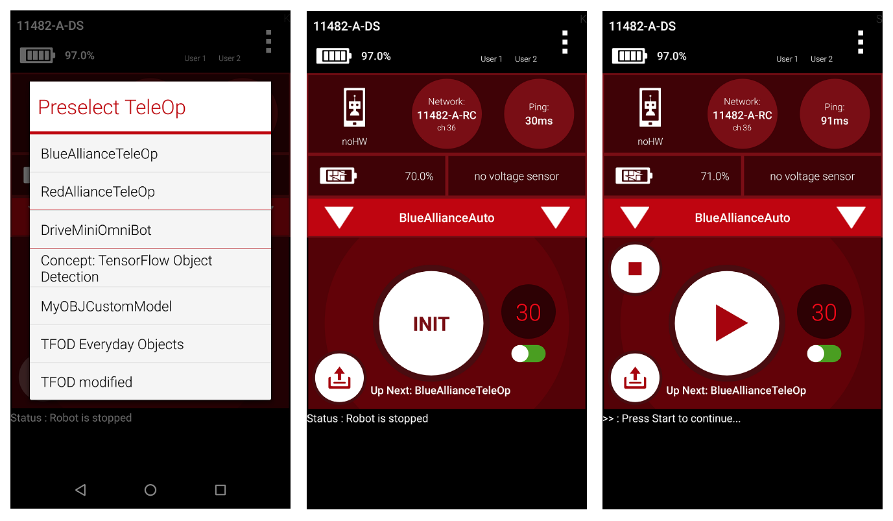
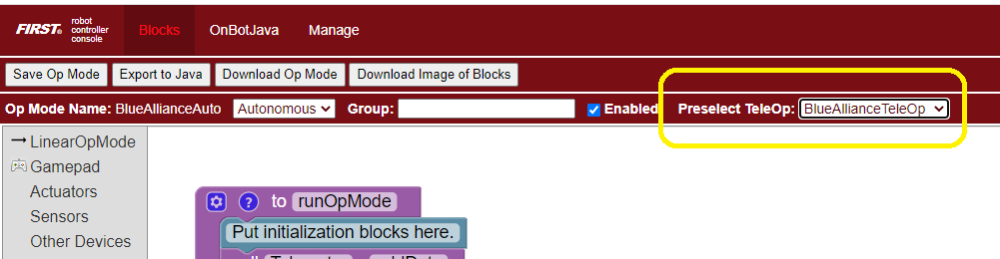
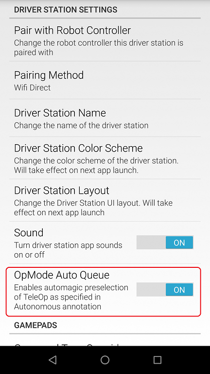

Automatically Loading a Driver Controlled Op Mode
==================================================

A FIRST Tech Challenge match consists of a 30 second autonomous period
followed by a 2 minute driver controlled (i.e., tele-operated or teleop)
period. Previously, teams had to manually select their teleop op mode
after the autonomous portion their match was over.

Teams can now preselect their teleop op mode, and have the Driver
Station automatically load this op mode as soon as their autonomous run
has completed. This feature can help a team avoid selecting the wrong op
mode during a match.

To use this feature, verify that you are using version 6.1 or greater of
the SDK software (Robot Controller and Driver Station).

Select an autonomous program to use during your match. The preselect
button will appear in the lower left corner of the screen. It will be
translucent and have no text adjacent to it, indicating the feature is
inactive.

   The preselect button will appear once an autonomous op mode has been selected.

Note that in order for the preselect button to be visible, the selected
op mode must be designated as an autonomous op mode either by using the
\_@Autonomous\_ annotation if it is written using Java or by selecting
the *Autonomous* option in the Blocks editor. If you do not see the
preselect button, verify that your currently selected op mode has been
designated as autonomous.

   The selected op mode must be designated as Autonomous in order for the preselect button to be visible.

To activate it, simply tap the (translucent) button and select an op
mode. The button will then become fully opaque and the name of the
preselected op mode will appear adjacent to the button. This indicates
the feature is active.

   The driver controlled op mode to be auto-loaded.

Should you then wish to disable it, simply long press the preselect
button. It will become translucent again and the text adjacent to it
will disappear.

After the Autonomous program ends, the Driver Station changes the queued
OpMode to the TeleOp program which was preselected before the start of
Autonomous. The auto-preselection will be aborted if the user presses
stop (either the main stop or init stop buttons). It will only
transition if the OpMode either self-exits, or is terminated by the 30s
timer. Drive Teams must still press Init and start the op mode manually,
for safety reasons.

Should you wish to not be required to manually enable and configure the
preselection feature each time you want to run your Autonomous program,
you can edit your OpMode annotation to include
``preselectTeleOp="My TeleOp Name"``. The Driver Station will then
automatically activate the preselection feature and configure it to
preselect the OpMode specified in the annotation.

.. code-block:: java
   :caption: Use the preselectTeleOp parameter to specify a preselected op mode.

   @Autonomous(name="Blue Alliance Auto", group="Pushbot", preselectTeleOp="BlueAllianceTeleOp")

Blocks users can make use of this feature as well, through a new
dropdown in the Blocks program editor.

   You can preselect a teleop op mode mode using the Blocks editor.

Note that there is an option in the Settings menu of the Driver
Station app called “OpMode Auto Queue”. If this option is enabled, then
the Driver Station will automatically load an autonomous op mode’s
preselected teleop op mode as designated by the ``preselectTeleOp``
parameter. If this option is disabled, then the Driver Station will not
automatically load the preselected teleop op mode. If the “Op Mode Auto
Queue” option is disabled, a team can still select a teleop op mode by
using the preselect button on the main Driver Station activity.

   If the OopMode Auto Queue option is enabled, the Driver Station will
   automatically load the preselectTeleOp op mode.

.. raw:: html

   

