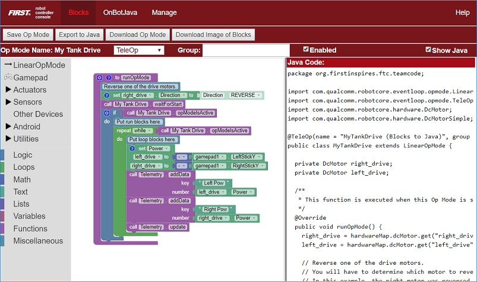
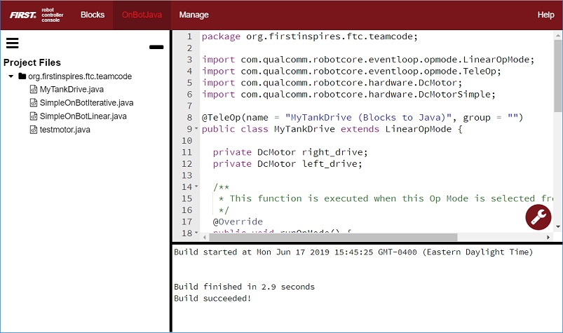
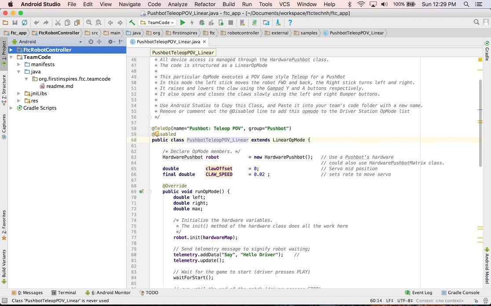
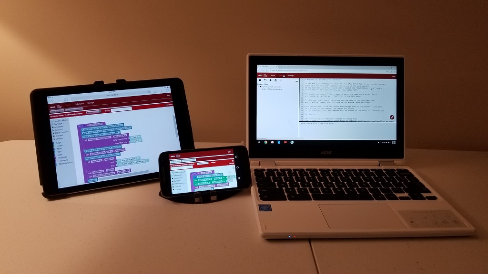

Choosing a Programming Tool
============================
You will need to select a programming tool to be able to write op modes
for your competition robot. FIRST strongly recommends that *all users*
begin by learning how to use the :ref:`Blocks programming
tool <programming_resources/blocks/blocks-tutorial:blocks programming tutorial>`.

There are currently three programming tools that are available for the
teams to use:

1. **The Blocks Programming Tool** - A visual, programming tool that
   lets programmers use a web browser to create, edit and save their op
   modes. This tool is recommended for novice programmers and for users
   who prefer to design their op modes visually, using a drag-and-drop
   interface.

2. **The OnBot Java Programming Tool** - A text-based programming
   tool that lets programmers use a web browser to create, edit and save
   their Java op modes. This tool is recommended for programmers who
   have basic to advanced Java skills and who would like to write
   text-based op modes.

3. **Android Studio** - An advanced integrated development environment
   for creating Android apps. This tool is the same tool that
   professional Android app developers use. Android Studio is only
   recommended for advanced users who have extensive Java programming
   experience.

Each tool has its own merits and weaknesses. For many users (especially
rookies and novice programmers), **the Blocks Programming Tool is
the best overall tool to use**. The Blocks Programming Tool is intuitive
and easy-to-learn. **It is the fastest way to get started programming
your robot.**

The OnBot Java Programming Tool is similar to the Blocks Programming
Tool. However, OnBot Java is a text-based tool and it requires that the
user have a sound understanding of the Java programming language.

It is important to note that with the Blocks Programming Tool and the
OnBot Java Programming Tool, a user only needs a web browser to create,
edit and build op modes for their robot. A user can even create, edit
and build op modes using an iPad, an Android phone, or a Chromebook.

Android Studio is a powerful development tool. However, it requires
extensive Java programming knowledge. It also needs a dedicated laptop
to run the Android Studio software. Android Studio offers enhanced
editing and debugging features that are not available on the OnBot Java
Programming Tool. However, it is a more complicated tool and is only
recommended for advanced users.

