Configuring Your Hardware
=========================

Before You Begin
~~~~~~~~~~~~~~~~

Before you can communicate with the motor, servo and sensors that are
connected to the Control Hub or Expansion Hub, you first must create a
configuration file on your Robot Controller, so that the Robot
Controller will know what hardware is available on the Control Hub's or
Expansion Hub's external ports.

Connecting an Android Smartphone to an Expansion Hub
^^^^^^^^^^^^^^^^^^^^^^^^^^^^^^^^^^^^^^^^^^^^^^^^^^^^

If you are using an Android smartphone as a Robot Controller, you must
physically connect the Robot Controller smartphone to the Expansion Hub
using a USB cable and an On-The-Go (OTG) adapter. Also, you should
verify that the Driver Station is currently paired to the Robot
Controller.

Connecting an Android Smartphone to an Expansion Hub Instructions
-----------------------------------------------------------------

1. Power on the Expansion Hub by turning on the power switch.         

.. image:: images/ConfiguringHardwareStep1.jpg
   :align: center

|

2. Plug the Type B Mini end of the USB cable into the USB mini port   
on the Expansion Hub.                                                 

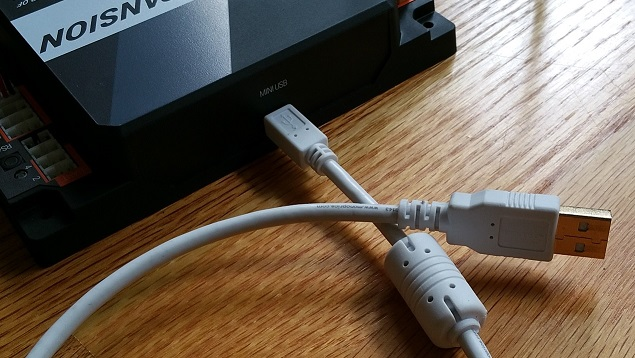

|

3. Plug the Type A end of the USB cable into the OTG adapter.         

.. image:: images/ConfiguringHardwareStep3.jpg
   :align: center

|

4. Verify that your Robot Controller smartphone is powered on and     
unlocked. Plug in the USB Micro OTG adapter into the OTG port of the  
Robot Controller phone.                                               

.. image:: images/ConfiguringHardwareStep4.jpg
   :align: center

|

Note that when the OTG adapter is plugged into the smartphone, the phone will detect the presence of the Expansion Hub and launch the Robot Controller app.

5. The first time you connect the Robot Controller smartphone to the  
Expansion Hub, the Android operating system should prompt you to ask  
if it is OK to associate the newly detected USB device (which is the  
Expansion Hub) with the FTC Robot Controller app.                     

.. image:: images/ConfiguringHardwareStep5.jpg
   :align: center

|

.. important:: You might be prompted multiple times to associate the USB hardware with the FTC Robot Controller.  Whenever you are prompted by your phone with this message, you should always select the "Use by default for this USB device" option and hit the "OK" button to associate the USB device with the FTC Robot Controller app. If you fail to make this association, then the Robot Controller app might not reliably connect to this Expansion Hub the next time you turn your system on.

Getting the Control Hub Ready
~~~~~~~~~~~~~~~~~~~~~~~~~~~~~

If you are using a Control Hub, you do not need to make any additional
connections. You simply need to make sure that the Control Hub is
powered on and paired to the Driver Station.

Creating a Configuration File Using the Driver Station
^^^^^^^^^^^^^^^^^^^^^^^^^^^^^^^^^^^^^^^^^^^^^^^^^^^^^^

Although the configuration file needs to reside on the Robot Controller,
for this tutorial we will use the Driver Station app to create the
configuration file remotely. The Driver Station can be used to create a
configuration file for a Control Hub or for an Android smartphone Robot
Controller.

Creating a Configuration File on the Robot Controller using the Driver Station Instructions
-------------------------------------------------------------------------------------------

1. Touch the three vertical dots in the upper right hand corner of    
the Driver Station app. This will launch a pop-up menu.               

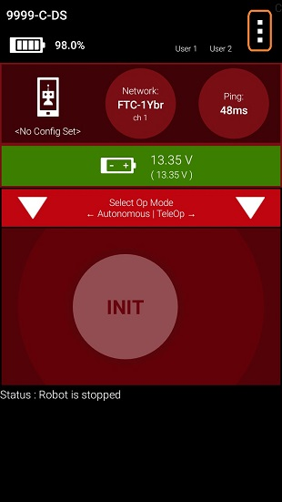

|

2. Select **Configure Robot** from the pop up menu to display the     
**Configuration** screen.                                             

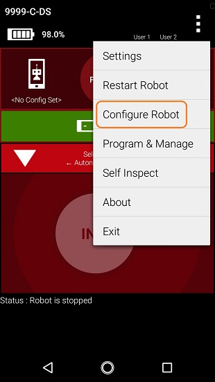

|

3. If your Robot Controller does not have any existing configuration  
files, the screen will display a message indicating that you need to  
create a file before proceeding.                                      

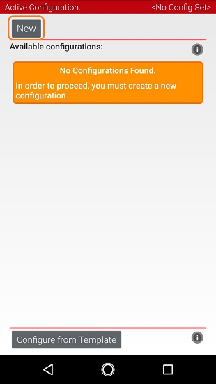

|

Hit the **New** button to create a new configuration file for your Robot Controller.

4. When the new configuration screen appears, the Robot Controller    
app will do a scan of the serial bus to see what devices are          
connected to the Robot Controller.                                    

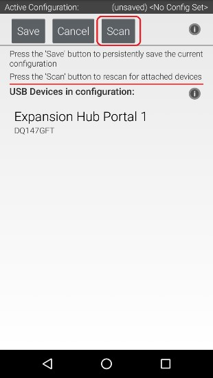

|

It will display the devices that it found in a list underneath the words "USB Devices in configuration." You should see an entry that says something like "Expansion Hub Portal 1" in the list.

Your Expansion Hub is listed as a Portal because it is directly connected to the Robot Controller phone through the USB cable or in the case of the Control Hub through the internal serial bus.

If you do not see your Expansion Hub Portal listed and you are using a smartphone as a Robot Controller, check the wired connections to make sure they are secure and then press the Scan button one or two times more to see if the smartphone detects the device on a re-scan of the USB bus.

5. Touch the Portal listing ("Expansion Hub Portal 1" in this         
example) to display what Expansion Hubs are connected through this    
Portal.                                                               

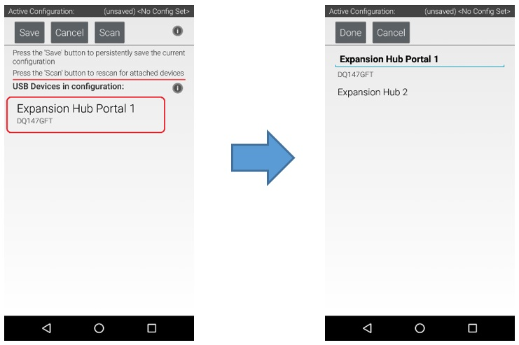

|

Since we only have a single Expansion Hub connected, we should only see a single Expansion Hub configured ("Expansion Hub 2" in this example).

6. Touch the Expansion Hub listing ("Expansion Hub 2" in this         
example) to display the Input/Output ports for that device.           

|

The screen should change and list all the motor, servo and sensor ports that are available on the selected Expansion Hub.

Configuring a DC Motor
^^^^^^^^^^^^^^^^^^^^^^

Now that you've created a file, you will need to add a DC Motor to the
configuration file.

.. important:: At this point, although you have created your configuration file, you have not yet saved its contents to the Robot Controller. You will save the configuration file later in the :ref:`Saving the Configuration Information <programming_resources/shared/configure_hardware/Configuring-Your-Hardware:Saving the Configuration Information>` step.

Configuring a DC Motor Instructions
-----------------------------------

1. Touch the word **Motors** on the screen to display the Motor       
Configuration screen.

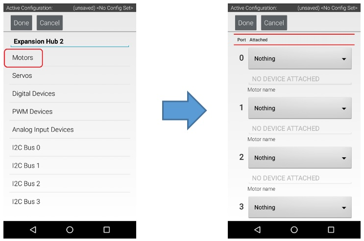

|

2. Since we installed our motor onto port #0 of the Expansion Hub,    
use the dropdown control for port 0 to select the motor type (Tetrix  
Motor for this example).

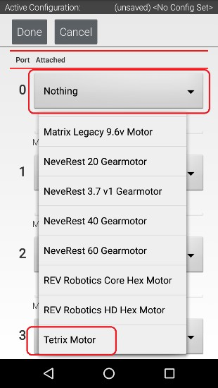

|

3. Use the touch screen keypad to specify a name for your motor       
("motorTest" in this example).

.. image:: images/ConfiguringHardwareMotorStep3.jpg
   :align: center

|

4. Press the **Done** button to complete the motor configuration. The 
app should return to the previous screen.

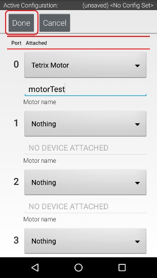

|

Configuring a Servo
^^^^^^^^^^^^^^^^^^^

You will also want to add a servo to the configuration file. In this
example, you are using a standard 180-degree servo.

Configuring a Servo Instructions
--------------------------------

1. Touch on the word **Servos** on the screen to display the **Servo  
Configuration** screen.                                               

.. image:: images/ConfiguringHardwareServoStep1.jpg
   :align: center

|

2. Use the dropdown control to select "Servo" as the servo type for   
port #0.                                                              

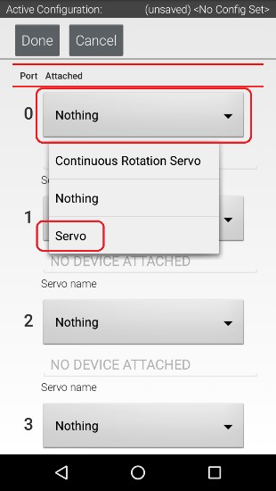

|

3. Use the touch pad to specify the name of the servo ("servoTest"    
for this example) for port #0.                                        

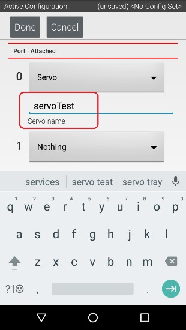

|

4. Press the **Done** button to complete the servo configuration. The 
app should return to the previous screen.                             

.. image:: images/ConfiguringHardwareServoStep4.jpg
   :align: center

|

Configuring a Color Distance Sensor
^^^^^^^^^^^^^^^^^^^^^^^^^^^^^^^^^^^

The REV Robotics Color Distance Sensor is an I2C sensor. It actually
combines two sensor functions into a single device. It is a color
sensor, that can determine the color of an object. It is also a distance
or range sensor, that can be used to measure short range distances. Note
that in this tutorial, the word "distance" is used interchangeably with
the word "range".

Configuring a Color Distance Sensor Instructions
------------------------------------------------

1. Touch the words **I2C Bus 0** on the screen to launch the I2C      
configuration screen for this I2C bus.                                

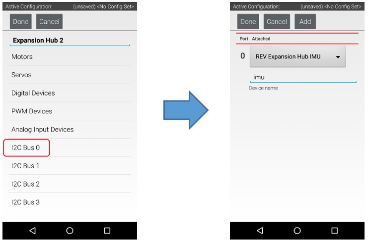

|

The Expansion Hub has four independent I2C buses, labeled "0" through "3".  In this example, since you connected the Color Sensor to the port labeled "0", it resides on I2C Bus 0.

2. Look at the **I2C Bus 0** screen. There should already be a sensor 
configured for this bus. The Expansion Hub has its own built-in       
inertial measurement unit (IMU) sensor. This sensor can be used to    
determine the orientation of a robot, as well as measure the          
accelerations on a robot.                                             

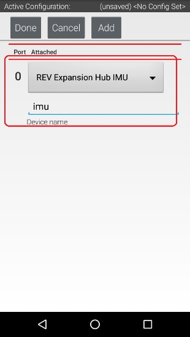

|

The built-in IMU is internally connected to I2C Bus 0 on each Expansion Hub.  Whenever you configure an Expansion Hub using the Robot Controller, the app automatically configures the IMU for I2C Bus 0. You will need to add another I2C device for this bus to be able to configure the color sensor.

3. Press the **Add** button to add another I2C device to this bus.    

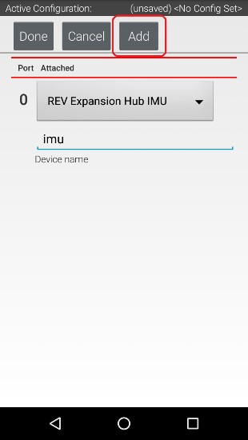

|

4. Select "REV Color/Range Sensor" from the dropdown selector for     
this new device. Use the touchscreen keyboard to name this device     
"sensorColorRange".                                                   

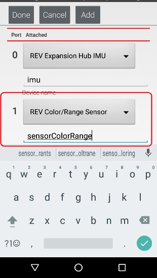

|

5. Press the **Done** button to complete the I2C sensor               
configuration. The app should return to the previous screen.          

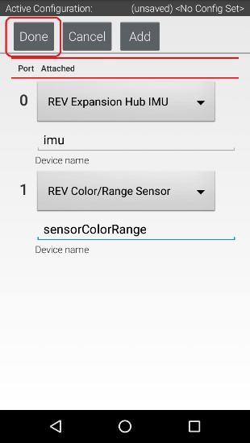

|

Configuring a Digital Touch Sensor
^^^^^^^^^^^^^^^^^^^^^^^^^^^^^^^^^^

The REV Robotics Touch Sensor is a digital sensor. An Op Mode can query
the Touch Sensor to see if its button is being pressed or not.

Configuring a Digital Touch Sensor Instructions
-----------------------------------------------

1. Touch the words **Digital Devices** on the screen to launch the    
Digital I/O configuration screen.                                     

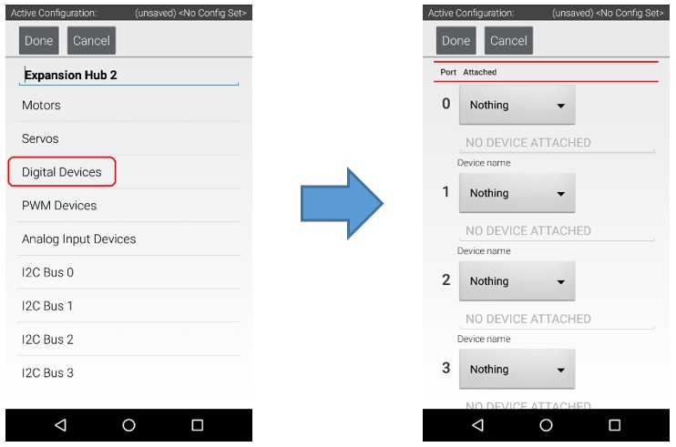

|

2. Use the touch screen to add a "REV Touch Sensor" for port #1 and   
name the device "testTouch".                                          

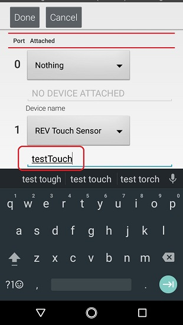

|

Notice that we are configuring the Touch Sensor on port #1 instead of port #0.  This is because when the REV Robotics Touch Sensor is connected to a digital port using a standard 4-wire JST sensor cable, it is the second digital pin that is connected. The first pin remains disconnected.

3. Press the **Done** button to return to the previous screen.        

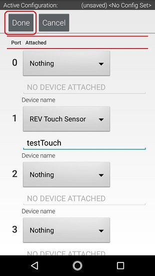

|

Saving the Configuration Information
^^^^^^^^^^^^^^^^^^^^^^^^^^^^^^^^^^^^

Once you have configured your hardware, you must save the information to
the configuration file. If you do not save this information, it will be
lost and the robot controller will be unable to communicate with your
hardware.

Saving the Configuration Information Instructions
-------------------------------------------------

1. Press the **Done** button to go up one level in the configuration  
screens.                                                              

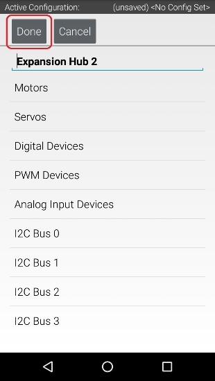

|

2. Press the **Done** button again to return to the highest level in  
the configuration screens.                                            

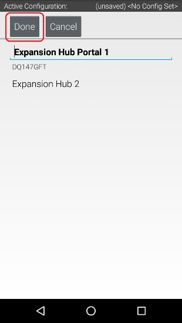

|

3. Press the **Save** button.                                         

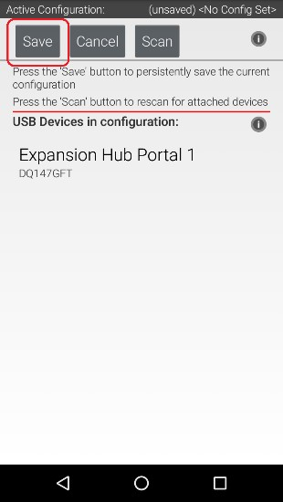

|

4. When prompted, specify a configuration file name using the         
touchscreen's keypad (use "TestConfig" for this example).             

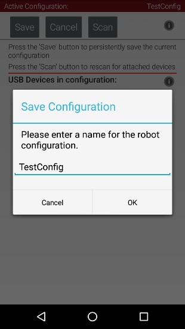

|

5. Press the **OK** button to save your configuration information     
using that file name.                                                 

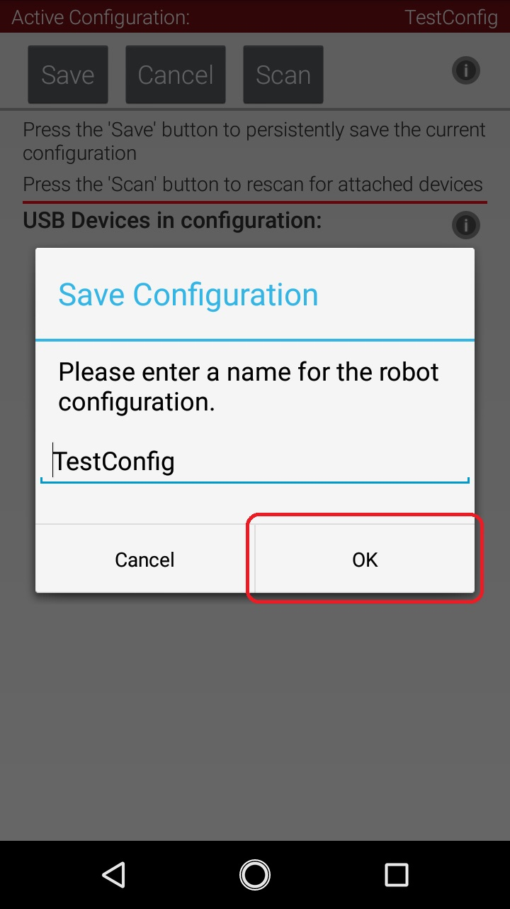

|

6. After the configuration file has been saved, touch the Android     
back-arrow button to return to the main screen of the app.            

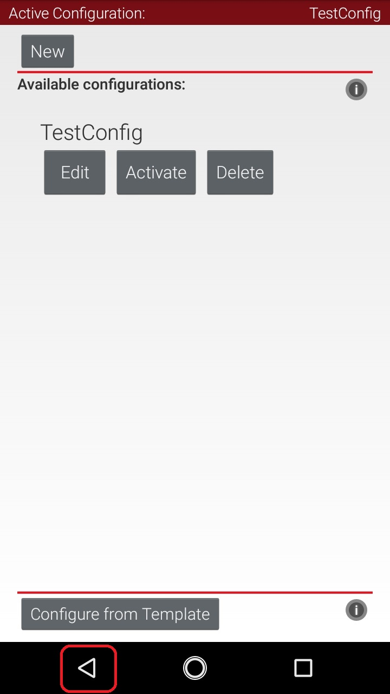

|

7. Verify that the configuration file is the active configuration     
file on the main Driver Station screen.                               

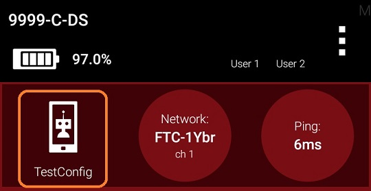

|

