Configuring your Android Devices
================================

What Needs to Be Configured for My Control System?
~~~~~~~~~~~~~~~~~~~~~~~~~~~~~~~~~~~~~~~~~~~~~~~~~~

Control Hub Configuration
^^^^^^^^^^^^^^^^^^^^^^^^^

.. note::
   References to the Driver Station smartphone may instead apply to the
   `REV Driver Hub <https://docs.revrobotics.com/duo-control/control-system-overview/driver-hub-specifications>`__,
   which is preloaded with the Driver Station (DS) app.

Teams who are using a Control Hub (which has an integrated Android Device)
will only need to configure a single smartphone for use as a Driver
Station. The process is as follows:

*  Rename the smartphone to "<TEAM NUMBER>-DS" (where <TEAM NUMBER> is replaced by your team number).
*  Install the Driver Station (DS) app onto the Driver Station phone. (The DS app is pre-installed on the REV Driver Hub.)
*  Put your phone into Airplane Mode (with the WiFi radio still on).
*  Pair (i.e., wirelessly connect) the Driver Station to the Control Hub.

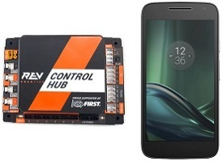

|

.. important:: Eventually the Control Hub will need be renamed so
   that its name complies with Game Manual rule <RS01>, but for now we will
   use the Control Hub with its default name. You can learn how to manage a
   Control Hub (and modify its name, password, etc.) in
   :doc:`this tutorial <../managing_control_hub/Managing-a-Control-Hub>`.

Two Android Smartphone Configuration
^^^^^^^^^^^^^^^^^^^^^^^^^^^^^^^^^^^^

Teams who have two smartphones and are not using a Control Hub will need
to configure one smartphone for use as a Robot Controller and a second
smartphone for use as a Driver Station. The process is as follows,

*  Rename one smartphone to "<TEAM NUMBER>-RC" (replace <TEAM NUMBER> with your team number).
*  Install the Robot Controller app onto the Robot Controller phone.
*  Rename a second smartphone to "<TEAM NUMBER>-DS" (where <TEAM NUMBER> is replaced by your team number).
*  Install the Driver Station app onto the Driver Station phone. (The DS app is pre-installed on the REV Driver Hub.)
*  Put your phones into Airplane Mode (with the WiFi radios still on).
*  Pair (i.e., wirelessly connect) the Driver Station to the Robot Controller.

.. image:: images/twoAndroidPhones.jpg
   :align: center

|

.. Do not change the name of the following Header title, as it's linked from elsewhere. Currently it is called "Renaming Your Smartphones".

Renaming Your Smartphones
~~~~~~~~~~~~~~~~~~~~~~~~~

The official rules of the FIRST Tech Challenge (see <RS01>) require that
you change the Wi-Fi name of your smartphones to include your team
number and "-RC" if the phone is a Robot Controller or "-DS" if it is a
Driver Station. A team can insert an additional dash and a letter ("A",
"B", "C", etc.) if the team has more than one set of Android phones.

If, for example, a team has a team number of 9999 and the team has
multiple sets of phones, the team might decide to name one phone
"9999-C-RC" for the Robot Controller and the other phone "9999-C-DS" for
the Driver Station. The "-C" indicates that these devices belong to the
third set of phones for this team.

The name of a Robot Controller phone can be changed in the RC app, using
instructions :ref:`found here <programming_resources/shared/managing_smartphone_rc/Managing-a-Smartphone-Robot-Controller:changing the name>`.
It can also be changed at the *Manage* page from the RC app, a paired DS
app, or a connected laptop; click ``Apply Wi-Fi Settings`` when done.

The name of a Driver Station phone can be changed in the DS app, using
instructions
:ref:`found here <programming_resources/shared/managing_smartphone_ds/Managing-a-Smartphone-Driver-Station:changing the name>`.

As an alternate, the device names can be changed at the Android system
level, as described below.

.. note:: It will take an estimated 5 minutes per phone to complete this
   task.

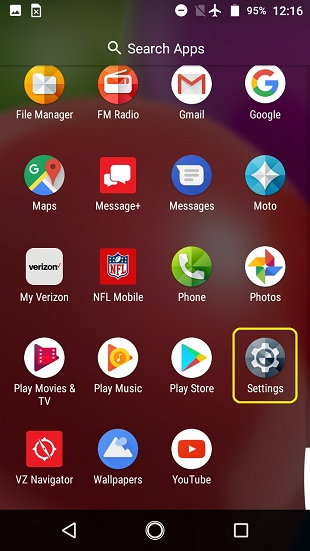
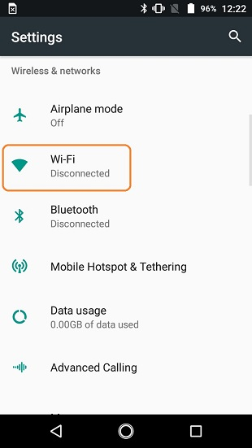
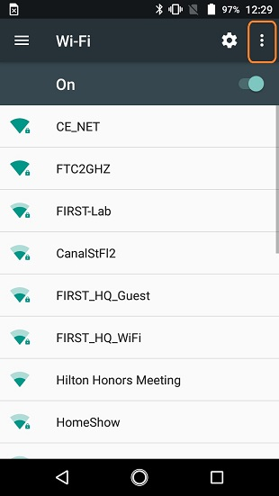
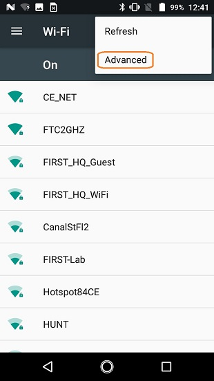
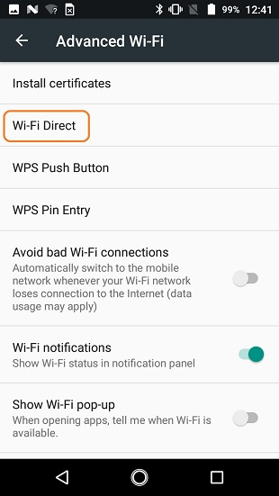
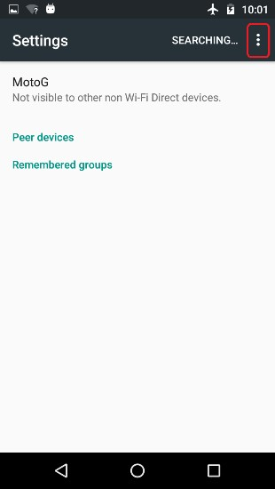
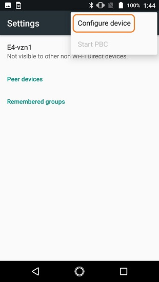
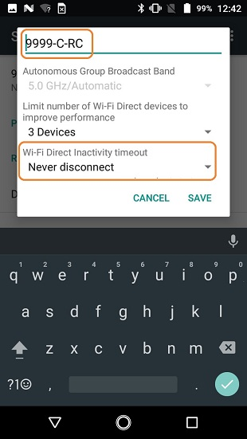

.. list-table::
   :widths: 50 50
   :header-rows: 0
   :class: longtable

   * - Step
     - Image

   * - 1. Browse the list of available apps on thesmartphone and locate the **Settings** icon.Click on **Settings** icon to display theSettings screen.
     - |rename1|

   * - 2. Click on **Wi-Fi** to launch the Wi-Fiscreen.
     - |rename2|

   * - 3. Touch the three vertical dots to display apop-up menu.
     - |rename3|

   * - 4. Select **Advanced** from the pop-up menu.
     - |rename4|

   * - 5. Select **Wi-Fi Direct** from the **AdvancedWi-Fi** screen.
     - |rename5|

   * - 6. Touch the three vertical dots to display apop-up menu.
     - |rename6|

   * - 7. Select **Configure Device** from the pop-upmenu.
     - |rename7|

   * - 8. Use touch pad to enter new name of device.If the device will be a Robot Controller,specify your team number and -RC. If thedevice will bea Driver Station, specify yourteam number and -DS. You can also set theWi-Fi Direct inactivity timeout to *Neverdisconnect* and then hit the\ **SAVE** buttonto save your changes. Note that in thescreenshot shown to the right, the team numberis 9999. The "-C" indicates that this is fromthe third pair of smartphones forthis team.The -RC indicates that this phonewill be aRobot Controller.
     - |rename8|

   * - 9. After renaming phone, power cycle thedevice.
     -

Installing the *FIRST* Tech Challenge Apps
~~~~~~~~~~~~~~~~~~~~~~~~~~~~~~~~~~~~~~~~~~

**As of 2021, the SDK apps (v 6.1 and higher) are no longer available on
Google Play.**

The `REV Hardware Client <https://docs.revrobotics.com/rev-hardware-client/>`__
software will allow you to download the apps to devices: REV Control
Hub, REV Expansion Hub, REV Driver Hub, and other approved Android
devices (*see section below, called Updating Apps on Android
Phones*). Here are some of the benefits:

*  Connect to a REV Control Hub via WiFi.
*  One Click update of all software on connected devices.
*  Pre-download software updates without a connected device.
*  Back up and restore user data from Control Hub.
*  Install and switch between DS and RC applications on Android Devices.
*  Access the Robot Control Console on the Control Hub.

The app releases are also available on the `FTCRobotController
Github
repository <https://github.com/FIRST-Tech-Challenge/FtcRobotController/releases>`__.
It is possible to "side-load" the apps onto the Robot Controller
(RC) and Driver Station (DS) phones. However, this section of the document
does **not** include such instructions; other document pages describe
side-loading the :ref:`RC app <programming_resources/shared/managing_smartphone_rc/Managing-a-Smartphone-Robot-Controller:Updating the Robot Controller App>`
and the :ref:`DS app <programming_resources/shared/managing_smartphone_ds/Managing-a-Smartphone-Driver-Station:Updating the Driver Station App>`.

Updating Apps and Firmware on REV Devices (REV Expansion Hub, REV Control Hub, REV Driver Hub)
^^^^^^^^^^^^^^^^^^^^^^^^^^^^^^^^^^^^^^^^^^^^^^^^^^^^^^^^^^^^^^^^^^^^^^^^^^^^^^^^^^^^^^^^^^^^^^

The `REV Hardware Client <https://docs.revrobotics.com/rev-hardware-client/>`__
software is used to install and update apps, firmware and/or
operating systems on devices from REV Robotics. Simply connect the
device via USB to your PC with the REV Hardware Client installed and
running, and the software will detect connected hardware. After
detection, the REV Hardware Client can then
`update the Robot Controller (RC) app on a REV Control Hub <https://docs.revrobotics.com/rev-hardware-client/control-hub/updating-control-hub>`__,
`update the Driver Station (DS) app on a REV Driver Hub <https://docs.revrobotics.com/rev-hardware-client/driver-hub/updating-a-driver-hub>`__,
or
`update firmware <https://docs.revrobotics.com/rev-hardware-client/expansion-hub/updating-expansion-hub>`__.

Updating Apps on Android Phones
^^^^^^^^^^^^^^^^^^^^^^^^^^^^^^^

The `REV Hardware Client <https://docs.revrobotics.com/rev-hardware-client/>`__
software is used to install, uninstall, and
`update apps on Android phones <https://docs.revrobotics.com/rev-hardware-client/android-device/installing-rc-ds-applications>`__.
However, the phones must have **Developer Options** enabled in order for
the phone to be properly recognized and updated by the REV Hardware
Client software. The process for enabling Developer Options is as
follows:

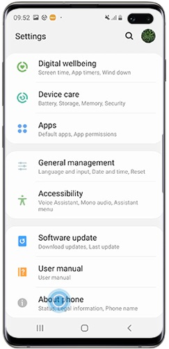
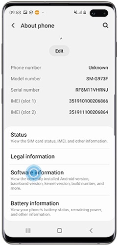
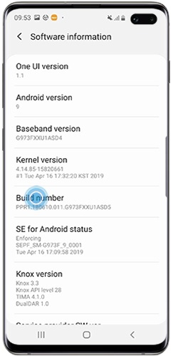
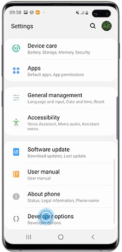
.. |devop5| image:: images/5-developer-options.*

.. list-table::
   :widths: 50 50
   :header-rows: 1
   :class: longtable

   * - Step
     - Image

   * - 1. Go to "Settings", then tap "About device"or "About phone".
     - |devop1|

   * - 2. Scroll down, then tap Build number seventimes.Depending on your device and operatingsystem, you may need to tap Softwareinformation, then tap Build number seventimes.
     - |devop2a|       |devop2b|

   * - 3. Enter your pattern, PIN or password toenable the Developer options menu.
     -

   * - 4. The "Developer options" menu will nowappear in your Settings menu. Depending onyour device, it may appear under Settings >General > Developer options.
     - |devop4|

   * - 5. To disable the Developer options at anytime, tap the switch.
     - |devop5|

Placing Phones into Airplane Mode with Wi-Fi On
~~~~~~~~~~~~~~~~~~~~~~~~~~~~~~~~~~~~~~~~~~~~~~~

For the FIRST Tech Challenge competitions, it is important that you
place your Robot Controller and Driver Station phones into Airplane mode
but keep their Wi-Fi radios turned on. This is important because you do
not want any of the cellular telephone functions to be enabled during a
match. The cellular telephone functions could disrupt the function of
the robot during a match.

.. note:: It will take an estimated 2.5 minutes per phone to complete this
   task. Also note that the screens displayed on your Android devices might
   differ slightly from the images contained in this document.

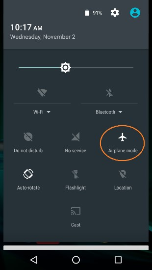
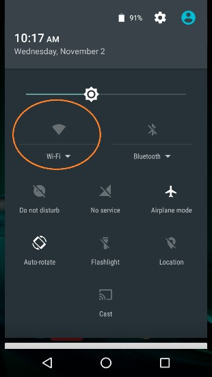

.. list-table::
   :widths: 50 50
   :header-rows: 1

   * - Step
     - Image

   * - 1. On the main Android screen of eachsmartphone, use your finger to slide from thetop of the screen down towards the bottom ofthe screen to display the quick configurationscreen.Note that for some smartphones youmight have to swipe down more than once todisplay the quick configuration screen,particularly if there are messages ornotifications displayed at the top of yourscreen.Look for the Airplane mode icon (whichis shaped like an airplane) and if the icon isnot activated, touch the icon to put the phoneinto airplane mode.
     - |airplane1|

   * - 2. Placing the phone into airplane mode willturn off the Wi-Fi radio. If the Wi-Fi iconhas a diagonal line through it (see Step 1above), then the Wi-Fi radio is disabled. Youwill need to touch the **Wi-Fi** icon on thequick configuration screen to turn the Wi-Firadio back on.
     - |airplane2|

Pairing the Driver Station to the Robot Controller
~~~~~~~~~~~~~~~~~~~~~~~~~~~~~~~~~~~~~~~~~~~~~~~~~~

.. _control-hub-users-1:

Control Hub Pairing
^^^^^^^^^^^^^^^^^^^

The REV Robotics Control Hub should come with the Robot Controller app
pre-installed. Once you have successfully installed the Driver
Station on an Android phone, you will want to establish a secure
wireless connection between the Control Hub and the Driver Station. This
connection will allow your Driver Station phone to select op modes on
your Robot Controller and send gamepad input to these programs.
Likewise, it will allow your op modes running on your Robot Controller
to send telemetry data to your Driver Station phone where it can be
displayed for your drivers. The process to connect the two devices is
known as "pairing."

.. note:: the Control Hub does not have its own internal battery. Before you
   can connect a Driver Station to the Control Hub, you must connect the
   Control Hub to a 12V battery.

Also note that it will take an estimated 10 minutes to complete this
task.

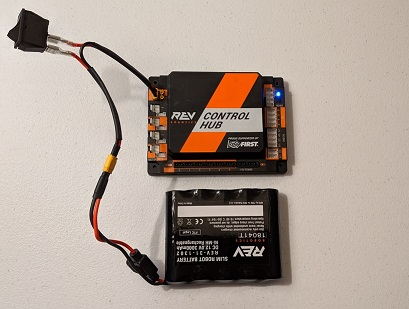
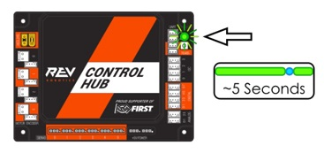

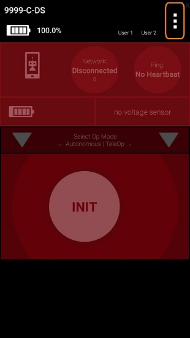

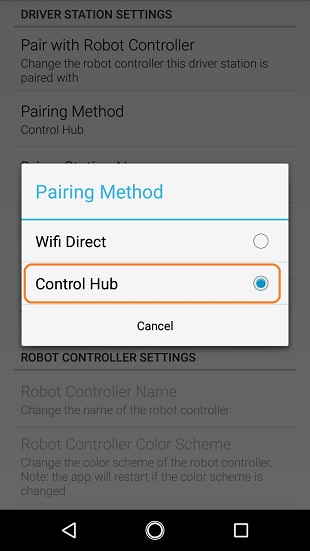
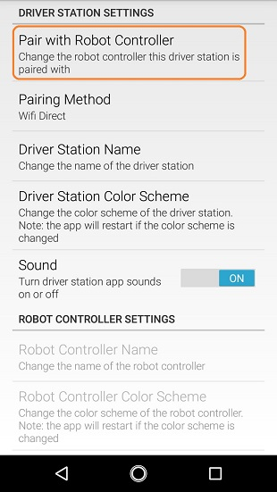
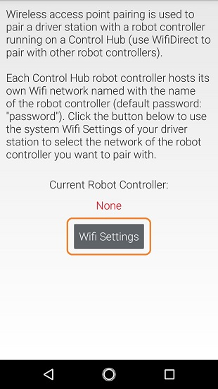
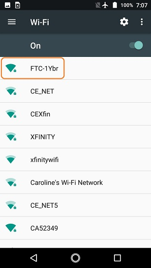
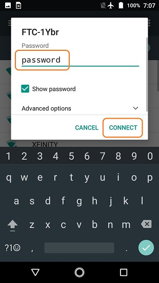
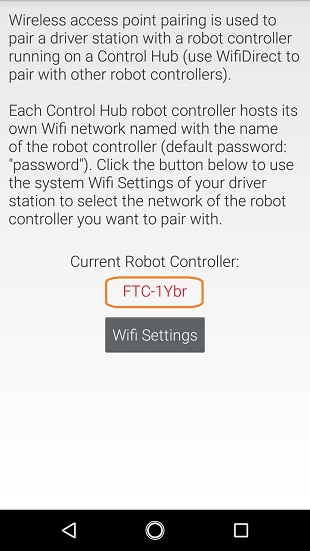
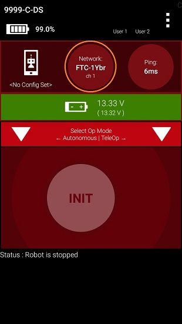

.. list-table::
   :widths: 50 50
   :header-rows: 1
   :class: longtable

   * - Step
     - Image

   * - 1. Connect an approved 12V battery to thepower switch (REV-31-1387) and make sure theswitch is in the off position. Connect theswitch to an XT30 port on the Control Hub andturn the switch on. The LED should initiallybe blue on the Control Hub.
     - |pairing1|

   * - 2. It takes approximately 18 seconds for theControl Hub to power on. The Control Hub isready to pair with the Driver Station when theLED turns green. Note: the light blinks blueevery ~5 seconds to indicate that the ControlHub is healthy.
     - |pairing2|

   * - 3. On the Driver Station device, browse theavailable apps and locate the **DriverStation** icon. Tap on the icon to launch theDriver Station app. Note that the first timeyou launch the app your Android device mightprompt you for permissions that the app willneed to run properly. Whenever prompted, press**Allow** to grant the requested permission.
     - |pairing3|

   * - 4. Touch the three vertical dots on the upperright hand corner of the main screen of theDriver Station app. This will launch apop-up menu.
     - |pairing4|

   * - 5. Select **Settings** from the pop-up menu.
     - |pairing5|

   * - 6. From the **Settings** screen, look for andselect \ **Pairing Method** to launch the**Pairing** \ **Method** screen.
     - |pairing6|

   * - 7. Touch the words **Control Hub** to indicatethat this Driver Station will be pairing witha Control Hub.
     - |pairing7|

   * - 8. From the **Settings** screen, look for andselect \ **Pair with Robot Controller** tolaunch the **Pair** \ **with RobotController** screen.
     - |pairing8|

   * - 9. From **Pair with Robot Controller** screen,look for and press the **Wifi Settings** button to launch the device's Android WifiSettings screen.
     - |pairing9|

   * - 10. Find the name of your Control Hub'swireless network from the list of availableWiFi networks. Click on the network name toselect the network. If this is the first timeyou are connecting to the Control Hub, thenthe default network name should begin with theprefix FTC- (FTC-1Ybr in this example).The default network name should be listed on asticker attached to the bottom side of theControl Hub.
     - |pairing10|

   * - 11. When prompted, specify the password forthe Control Hub's WiFi network and press\ **Connect** to connect to the Hub. Note thatthe default password for the Control Hubnetwork is password. Also note that when youconnect to the Control Hub's WiFi networksuccessfully, the Driver Station will not haveaccess to the Internet.
     - |pairing11|

   * - 12. After you successfully connected to theHub, use the back arrow to navigate to theprevious screen. You should see the name ofthe WiFi network listed under "Current RobotController:". Use the back-arrow key to returnto the Settings screen. Then press theback-arrow key one more time to return to themain Driver Station screen.
     - |pairing12|

   * - 13. Verify that the Driver Station screen haschanged and that it now indicates that it isconnected to the Control Hub.The name of theControl Hub's WiFi network (FTC-1Ybr in thisexample) should be displayed in the Networkfield on the Driver Station.
     - |pairing13|

.. _users-with-two-android-smartphones-1:

Two Android Smartphone Pairing
^^^^^^^^^^^^^^^^^^^^^^^^^^^^^^

.. important:: If your Driver Station was previously paired to a
   Control Hub, and you currently would like to connect to an Android
   smartphone Robot Controller, then before attempting to pair to the Robot
   Controller, you should forget the Wi-Fi network for the previous Control
   Hub (using the Android Wifi Settings screen on the Driver Station) and
   then power cycle the Driver Station phone. If the previous Control Hub
   is powered on and if you haven't forgotten this network, then the Driver
   Station might try and connect to the Control Hub and might be unable to
   connect to the Robot Controller smartphone.

Once you have successfully installed the apps onto your Android
phones, you will want to establish a secure wireless connection between
the two devices. This connection will allow your Driver Station phone to
select op modes on your Robot Controller phone and send gamepad input to
these programs. Likewise, it will allow your op modes running on your
Robot Controller phone to send telemetry data to your Driver Station
phone where it can be displayed for your drivers. The process to connect
the two phones is known as pairing.

Note that it will take an estimated 10 minutes to complete this task.

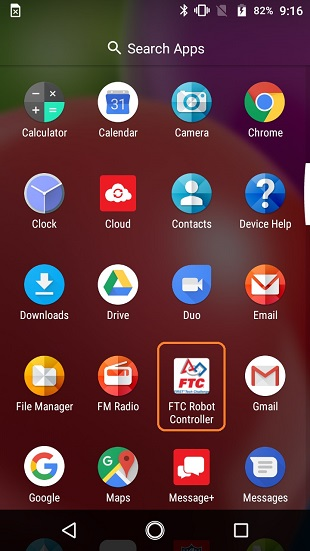
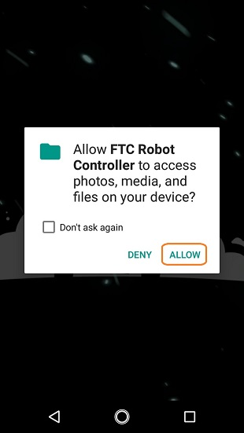

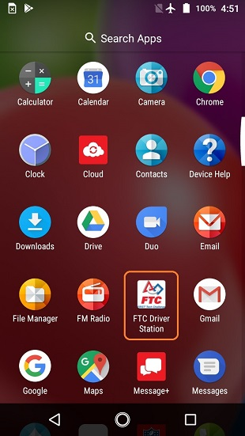
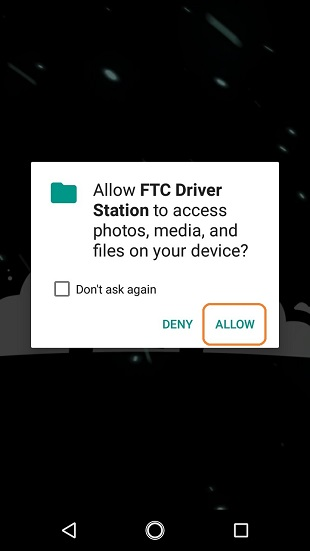
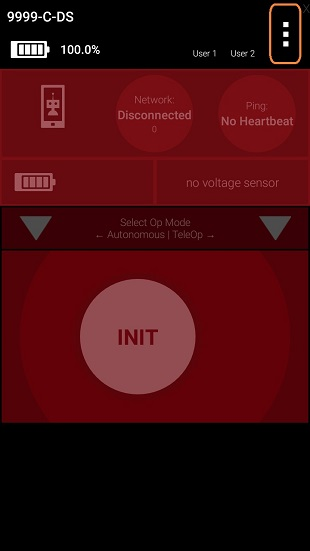
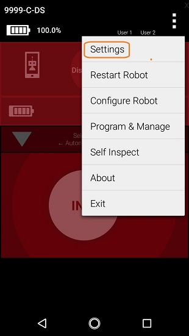
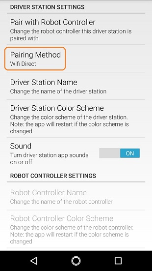
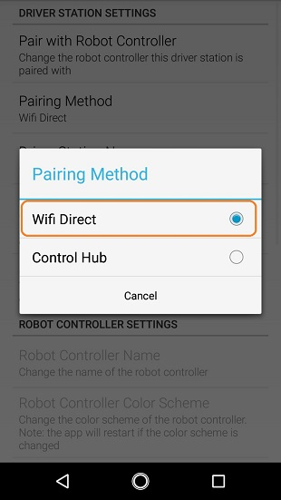
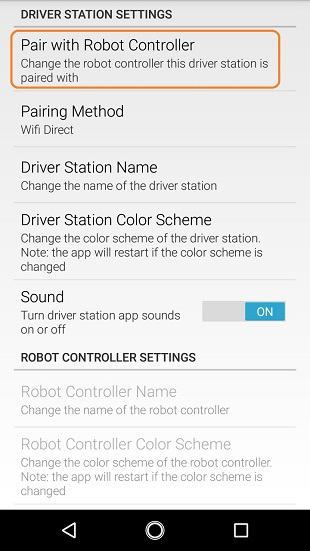
.. |pairingns9| image:: images/PairingNewStep9.jpg
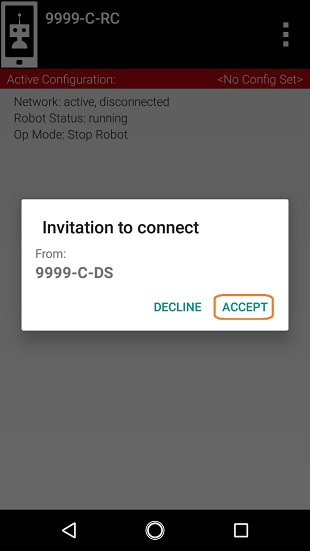
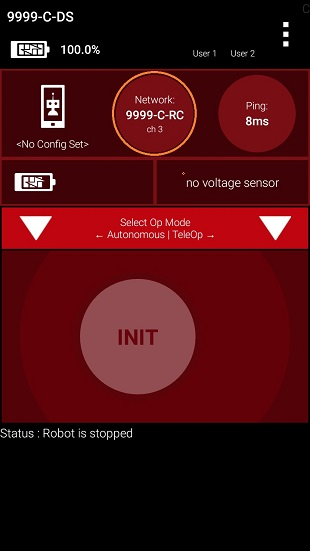
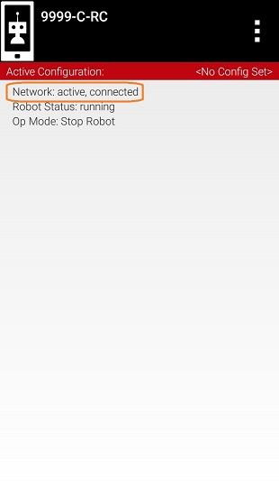

.. list-table::
   :widths: 50 50
   :class: longtable
   :header-rows: 1

   * - Step
     - Image

   * - 1. On the Robot Controller device, browse theavailable apps and locate the **RobotController** icon. Tap on the icon to launchthe Robot Controller app. Note that the firsttime you launch the app your Android devicemight prompt you for permissions that the appwill need to run properly. Whenever prompted,press **Allow** to grant the requestedpermission.
     - |pairingns1| |pairingns1b|

   * - 2. Verify that the Robot Controller app isrunning. The **Robot Status** field shouldread running if it is working properly.
     - |pairingns2|

   * - 3. On the Driver Station device, browse theavailable apps and locate the **DriverStation** icon. Tap on the icon to launch theDriver Station app. Note that the first timeyou launch the app your Android device mightprompt you for permissions that the app willneed to run properly. Whenever prompted, press**Allow** to grant the requested permission.
     - |pairingns3| |pairingns3b|

   * - 4. Touch the three vertical dots on the upperright hand corner of the main screen of theDriver Station app. This will launch apop-up menu.
     - |pairingns4|

   * - 5. Select **Settings** from the pop-up menu.
     - |pairingns5|

   * - 6. From the **Settings** screen, look for andselect \ **Pairing Method** to launch the**Pairing** \ **Method** screen.
     - |pairingns6|

   * - 7. Verify that the **Wifi Direct** mode isselected, which means that this Driver Stationwill be pairing with another Android device.
     - |pairingns7|

   * - 8. From the **Settings** screen, look for andselect \ **Pair with Robot Controller** tolaunch the **Pair**\ \ **with RobotController** screen.
     - |pairingns8|

   * - 9. Find the name of your Robot Controller fromthe list and select it.After you have madeyour selection, use the back-arrow key toreturn to the Settings screen.Then press theback-arrow key one more time to return to themain Driver Station screen.
     - |pairingns9|

   * - 10. When the Driver Station returns to itsmain screen, the first time you attempt toconnect to the Robot Controller a promptshould appear on the Robot Controllerscreen.Click on the **ACCEPT** button toaccept the connection request from the DriverStation.
     - |pairingns10|

   * - 11. Verify that the Driver Station screen haschanged and that it now indicates that it isconnected to the Robot Controller.The name ofthe Robot Controller's remote network(9999-C-RC in this example) should bedisplayed in the Network field on the DriverStation.
     - |pairingns11|

   * - 12. Verify that the Robot Controller screenhas changed and that it now indicates that itis connected to the Driver Station.The Networkstatus should read active, connected on theRobot Controller's main screen.
     - |pairingns12|