Connecting Devices To a Control or Expansion Hub
================================================

This section explains how to connect a motor, a servo, and some sensors
to your REV Robotics Control Hub or REV Robotics Expansion Hub. While
the Control Hub differs from the Expansion Hub because of its built in
Android device, the layout of the external motor, servo, and sensor
ports are identical for the Control Hub and Expansion Hub.

The images in this section use an Expansion Hub to demonstrate how to
connect the devices. The process, however, is identical for a Control
Hub.

When the instructions in this section use the word "Hub", they are
referring to a Control Hub or Expansion Hub.

Connecting 12V Power to the Hub
~~~~~~~~~~~~~~~~~~~~~~~~~~~~~~~

The Hub draws power from a 12V rechargeable battery. For safety reasons,
the battery has a 20A fuse built in. A mechanical switch is used to turn
on/turn off the power.

Note that it will take an estimated 5 minutes to complete this task.

Connecting 12V Power to the Hub Instructions
--------------------------------------------

1. If your 12V battery has a Tamiya style connector, connect the      
Tamiya to XT30 adapter cable to the matching end of the switch cable. 

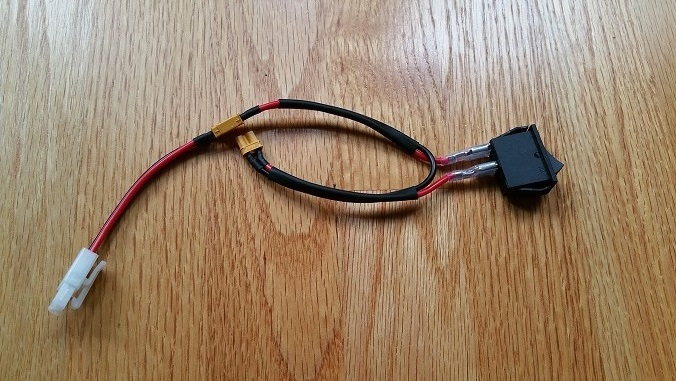

|

.. note:: Do not connect the 12V battery to the Tamiya adapter yet.  We will connect the battery during a later step.

2. Connect the other end of the switch cable to a matching XT30 port  
on the Hub.                                                           

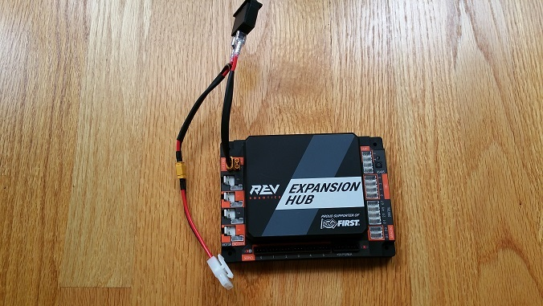

|

3. Verify that the switch is in the OFF position.     

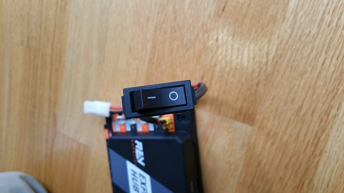

|   

4. Connect the 12V battery to the Tamiya to XT30 cable.

.. image:: images/Connecting12VStep4.jpg
   :align: center

|

5. Turn on the switch and verify that the Hub is drawing power from   
the battery. Note that the Hub's LED should be illuminated (notice    
the blue LED in upper right-hand corner of the Hub in the image       
below).                             

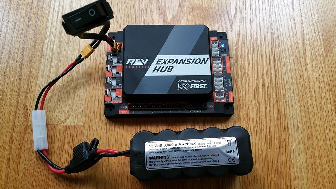

|

6. Turn off the switch and verify that the Hub is off. Note that the  
Hub's LED should not be illuminated.

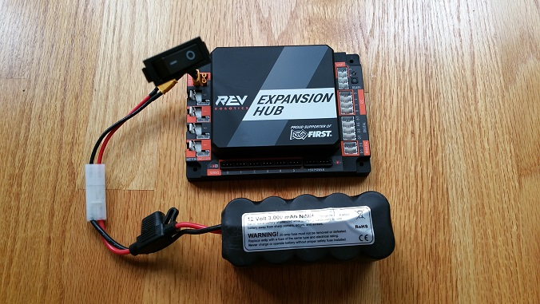

|

Connecting a Motor to the Hub
~~~~~~~~~~~~~~~~~~~~~~~~~~~~~

The Hub can drive up to four (4) 12V DC motors per Hub. The Hub uses a
type of electrical connector known as a 2-pin JST VH connector. Many of
the FIRST-approved 12V DC motors are equipped with Anderson Powerpole
connectors. An adapter cable can be used to connect the Anderson
Powerpole connectors to the Hub motor port (see `FIRST Tech Challenge
Robot Wiring
Guide <https://www.firstinspires.org/sites/default/files/uploads/resource_library/ftc/robot-wiring-guide.pdf>`__
for more information).

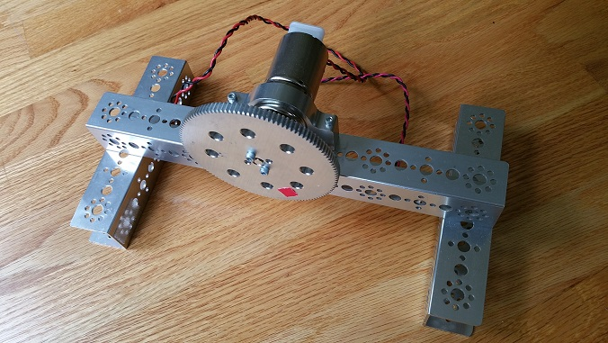

|

For the examples in this wiki, FIRST recommends that the user build a
simple rig to secure the motor in place and prevent it from moving about
during the test runs. The image above shows a Tetrix motor installed in
a rig built with a Tetrix motor mount and some Tetrix C-channels. A gear
was mounted on the motor shaft to make it easier for the user to see the
rotation of the shaft.

Note that it will take an estimated 2.5 minutes to complete this task.

Connecting a 12V Motor to the Hub Instructions
----------------------------------------------

1. Connect the Anderson Powerpole end of the motor's power cable to   
the Powerpole end of the Anderson to JST VH adapter cable.            

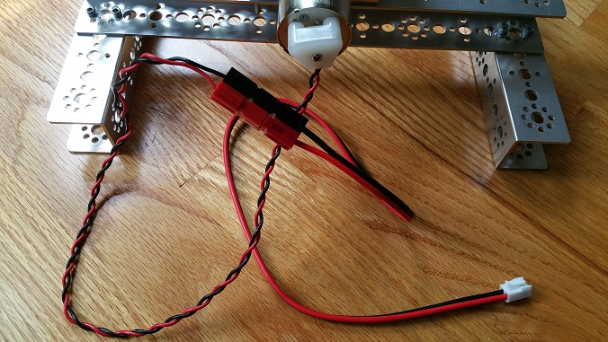

|

2. Connect the other end of the Anderson to JST VH adapter cable into 
the motor port labeled "0" on the Hub.                                

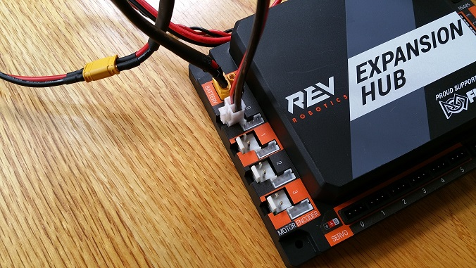

|

Connecting a Servo to the Hub
~~~~~~~~~~~~~~~~~~~~~~~~~~~~~

The Hub has 6 built-in servo ports. The servo ports accept the standard
3-wire header style connectors commonly found on servos. Note that
ground pin is on the left side of the servo port.

Note that it will take an estimated 2.5 minutes to complete this task.

Connecting a Servo to the Hub Instructions
------------------------------------------

1. Connect the servo cable to the servo port labeled "0" on the Hub.  
Note that the ground pin is on the left side of the servo port.       

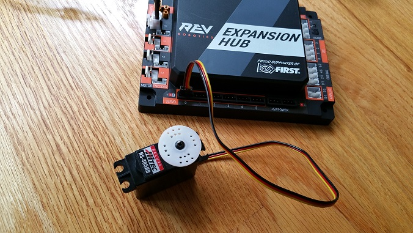

|

2. Verify that the black ground wire of the servo cable matches the   
ground pin of the servo port (which is aligned on the left side of    
the port).                                                            

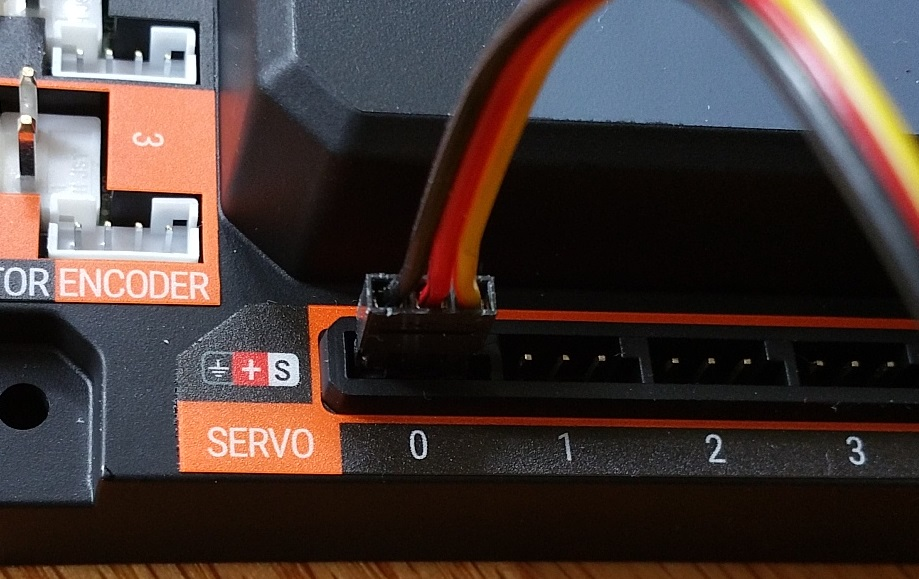

|

Connecting a Color-Distance Sensor to the Hub
~~~~~~~~~~~~~~~~~~~~~~~~~~~~~~~~~~~~~~~~~~~~~

The Hub has 4 independent I2C buses. Each bus has its own port on the
Hub. We will connect a REV Robotics Color-Distance sensor to the I2C bus
#0 on the Hub.

Note that it will take an estimated 2.5 minutes to complete this task.

Connecting a Color-Distance Sensor to the Hub Instructions
----------------------------------------------------------

1. Connect the one end of the 4-pin JST PH cable to the REV Robotics  
Color-Distance sensor.                                                

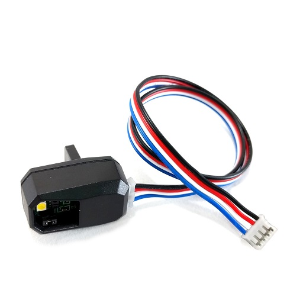

|

2. Plug the other end of the 4-pin JST PH cable to the I2C port       
labeled "0" on the Hub.                                               

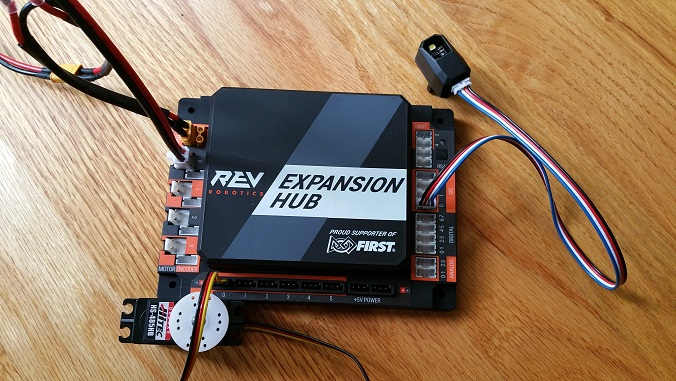

|

Connecting a Touch Sensor to the Hub
~~~~~~~~~~~~~~~~~~~~~~~~~~~~~~~~~~~~

The Hub has 4 independent digital input/output (I/O) ports. Each port
has two digital I/O pins for a total of 8 digital I/O pins on a Hub. You
will connect a REV Robotics Touch sensor to one of the digital I/O
ports.

Note that in the case of the REV Robotics Touch Sensor, the device has a
connector port for a 4-pin sensor cable. However, the device only needs
to connect to one of the two available digital I/O pins. For the REV
Robotics Touch Sensor, the second digital I/O pin in the port is the one
that gets connected when a standard REV Robotics 4-pin JST PH cable is
used. For the "0-1" port, it is the pin labeled "1" that gets connected
through the 4-pin cable. Similarly, for the "2-3" port, it is the pin
labeled "3" that gets connected through the 4-pin cable.

Note that it will take an estimated 2.5 minutes to complete this task.

Connecting a Touch Sensor to the Hub Instructions
-------------------------------------------------

1. Connect the one end of the 4-pin JST PH cable to the REV Robotics  
Touch sensor.

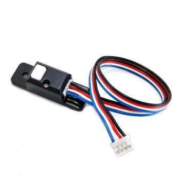

|

2. Plug the other end of the 4-pin JST PH cable to digital I/O port   
labeled "0" on the Hub.

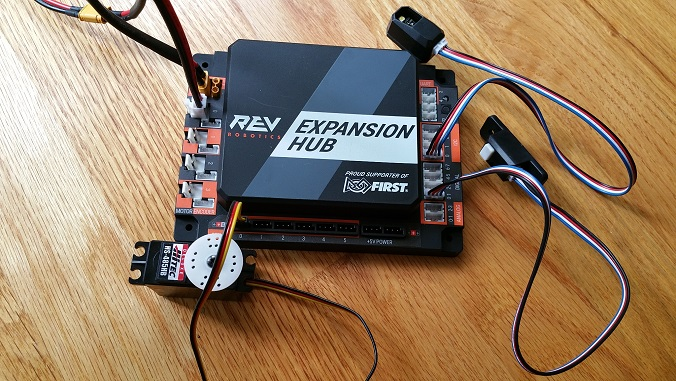

|

