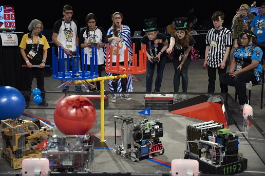
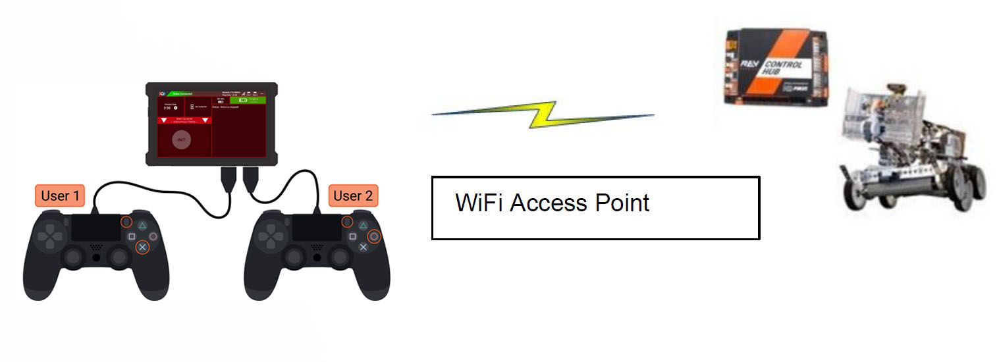
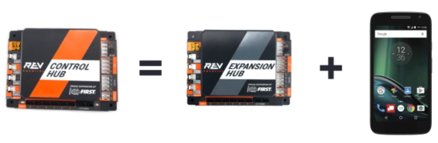
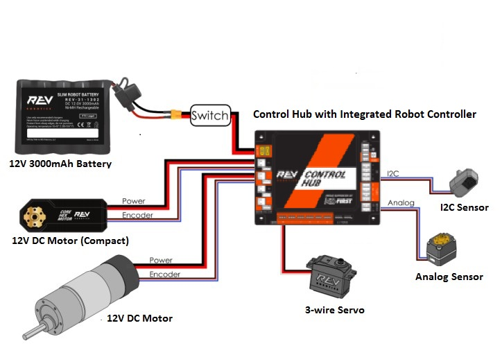

Control System Introduction
===========================

About *FIRST* Tech Challenge
~~~~~~~~~~~~~~~~~~~~~~~~~~~~~~~~

*FIRST* Tech Challenge seeks to inspire youth to become the next
generation of STEM leaders and innovators through participation in
mentor-guided robotics competition. Teams who participate in *FIRST*
Tech Challenge must build a robot that performs a variety of tasks. The
tasks vary from season to season, and are based on a set of game rules
that are published at the start of each season. The more tasks that a
robot can complete, the more points a team will earn.

.. rst-class:: center

(Photo courtesy of Dan Donovan, ©2017 Dan Donovan / www.dandonovan.com)

Autonomous vs. Driver-Controlled
~~~~~~~~~~~~~~~~~~~~~~~~~~~~~~~~

A *FIRST* Tech Challenge match has an *autonomous* phase and a
*driver-controlled* or *“tele-operated”* phase. In the autonomous phase
of a match the robot operates without any human input or control. In the
driver-controlled phase, the robot can receive input from up to two
human drivers.

Point-to-Point Control System
~~~~~~~~~~~~~~~~~~~~~~~~~~~~~

*FIRST* Tech Challenge uses Android devices to control its robots.
During a competition, each team has two Android devices.

|

One Android device is mounted onto the robot and is called the *Robot
Controller*. The Robot Controller acts as the “brains” of the robot. It
does all of the thinking for the robot and tells the robot what to do.
It consists of an Android device running an Robot Controller app.
There are two hardware options currently being used: REV Robotics
Expansion Hub or the REV Robotics Control Hub.

A second Android device sits with the team drivers and has one or two
gamepads connected. This second device is known as the *Driver Station*.
The Driver Station is sort of like a remote control that you might use
to control your television. The Driver Station allows a team to
communicate remotely (using a secure, wireless connection) to the Robot
Controller and to issue commands to the Robot Controller. The Driver
Station consists of an Android device running an Driver Station app.

REV Robotics Expansion Hub
~~~~~~~~~~~~~~~~~~~~~~~~~~

The REV Robotics Expansion Hub is the electronic input/output (or “I/O”)
module that lets the Robot Controller talk to the robot’s motors,
servos, and sensors. The Robot Controller communicates with the
Expansion Hub through a serial connection. For the situation where an
Android smartphone is used as the Robot Controller, a USB cable is used
to establish the serial connection. For the situation where a REV
Robotics Control Hub is used, an internal serial connection exists
between the built-in Android device and the Expansion Hub.

The Expansion Hub is also connected to a 12V battery which is used to
power the Expansion Hub, the motors, the servos and sensors. If an
Android smartphone is used as the Robot Controller, then the smartphone
will have its own independent battery. If a REV Robotics Control Hub is
used as the Robot Controller, then the Control Hub will use the main 12V
battery to power its internal Android device.

.. image:: images/REVExpansionHubLayout.jpg
   :align: center

|

REV Robotics Control Hub
~~~~~~~~~~~~~~~~~~~~~~~~

The REV Robotics Control Hub is an integrated version of the Robot Controller.
It combines an Android device built into the same case as a REV Robotics
Expansion Hub.

|

The Control Hub, which has its built-in Android device connected
directly to the Expansion Hub using an internal serial bus, eliminates
the need for an external USB connection between the Android Robot
Controller and the I/O module.

|

What’s an Op Mode?
~~~~~~~~~~~~~~~~~~

During a typical FIRST Tech Challenge match, a team’s robot has to
perform a variety of tasks in an effort to score points. For example, a
team might want their robot to follow a white line on the competition
floor and then score a game element (such as a ball) into a goal
autonomously during a match. Teams write “op modes” (which stand for
“operational modes”) to specify the behavior for their robot.

*Op modes* are computer programs that are used to customize the behavior
of a competition robot. The Robot Controller can *execute* a selected op
mode to perform certain tasks during a match.

Teams who are participating in *FIRST* Tech Challenge have a variety
of programming tools that they can use to create their own op modes.
Teams can use a visual (“drag and drop”) programming tool called the
*Blocks Programming Tool* to create their op modes. Teams can also
use a text-based Java tool known as the *OnBot Java Programming
Tool* or Google’s *Android Studio* integrated development environment
(also known as an “IDE”) to create their op modes.
