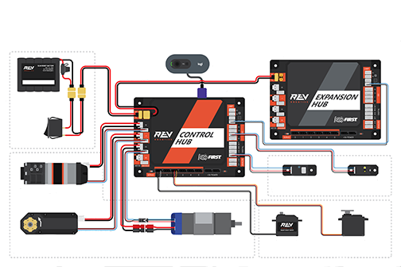

Control System Introduction
===========================

About *FIRST* Tech Challenge
~~~~~~~~~~~~~~~~~~~~~~~~~~~~~~~~

*FIRST* Tech Challenge seeks to inspire youth to become the next
generation of STEM leaders and innovators through participation in
mentor-guided robotics competition. Teams who participate in *FIRST*
Tech Challenge must build a robot that performs a variety of tasks. The
tasks vary from season to season, and are based on a set of game rules
that are published at the start of each season. The more tasks that a
robot can complete, the more points a team will earn.

.. image:: images/HoustonMatchPlay.jpg
   :align: center

.. rst-class:: center

(Photo courtesy of Dan Donovan, ©2017 Dan Donovan / www.dandonovan.com)

AUTO vs. TELEOP
~~~~~~~~~~~~~~~

A *FIRST* Tech Challenge match has an AUTO phase and a
TELEOP phase. In the AUTO phase
of a match the robot operates without any human input or control. In the
TELEOP phase, the robot can receive input from up to two
human drivers.

Point-to-Point Control System
~~~~~~~~~~~~~~~~~~~~~~~~~~~~~

*FIRST* Tech Challenge uses Android devices to control its robots.
During a competition, each team has two Android devices.

.. image:: images/PointToPointControl.jpg
   :align: center

|

One Android device is mounted onto the robot and is called the *Robot
Controller*. In most cases, the ROBOT CONTROLLER is integrated into the
REV Robotics Control Hub. The Robot Controller acts as the “brains” of the
robot. It does all of the thinking for the robot and tells the robot what
to do. It consists of an Android device running a Robot Controller app. Many
Teams will also connect a REV Robotics Expansion Hub for additional ports to
connect motors, servos and sensors to the ROBOT.

A second Android device sits with the team drivers and has one or two
gamepads connected. This second device is known as the DRIVER STATION.
The DRIVER STATION is like a remote control that you might use
to control your television. The DRIVER STATION allows a team to
communicate remotely (using a secure, wireless connection) to the Robot
Controller and to issue commands to the Robot Controller. The DRIVER STATION
consists of an Android device running an Driver Station app. Most teams use
a REV Robotics Driver Hub, but select Android smartphones are also supported.

REV Robotics Control Hub and Expansion Hub
~~~~~~~~~~~~~~~~~~~~~~~~~~~~~~~~~~~~~~~~~~

The REV Robotics Control Hub or Expansion Hub is the electronic input/output (or “I/O”)
module that lets the Robot Controller talk to the robot’s motors,
servos, and sensors. The Robot Controller is integrated into the Control Hub, and communicates with the
Expansion Hub through a serial connection. For the situation where an
Android smartphone is used as the Robot Controller, a USB cable is used
to establish the serial connection.

The Control Hub and Expansion Hub are also connected to a 12V battery which is used to
power the Control Hub, the Expansion Hub, the motors, the servos and sensors. If an
Android smartphone is used as the Robot Controller, then the smartphone
will have its own independent battery.

|

Android Smartphones
~~~~~~~~~~~~~~~~~~~

Teams may opt to use an Android smartphone as their
DRIVER STATION, ROBOT CONTROLLER or both. DRIVER STATION phones should have the FTC Driver
Station app installed, and will need an OTG adaptor USB hub to connect gamepads.

.. image:: images/ControlHubEquals.jpg
   :align: center

|

Teams who use an Android smartphone as their ROBOT CONTROLLER will want an additional
REV Robotics Expansion Hub to connect motors, servos and sensors. The smartphone is
connected to the Expansion Hub via a USB-A to USB-Mini cable and an OTG adaptor.

.. image:: images/REVExpansionHubLayout.jpg
   :align: center

|

What’s an OpMode?
~~~~~~~~~~~~~~~~~

During a typical *FIRST* Tech Challenge match, a team’s robot has to
perform a variety of tasks in an effort to score points. For example, a
team might want their robot to follow a white line on the competition
floor and then score a game element (such as a ball) into a goal
autonomously during a match. Teams write “OpModes” (which stand for
“operational modes”) to specify the behavior for their robot.

An *OpMode* is a computer program that is used to customize the behavior
of a competition robot. The Robot Controller can *execute* a selected OpMode
to perform certain tasks during a match.

Teams who are participating in *FIRST* Tech Challenge have a variety
of programming tools that they can use to create their own OpMode.
Teams can use a visual (“drag and drop”) programming tool called the
*Blocks Programming Tool* to create their op modes. Teams can also
use a text-based Java tool known as the *OnBot Java Programming
Tool* or Google’s *Android Studio* integrated development environment
(also known as an “IDE”) to create their OpModes.
