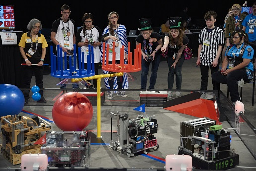
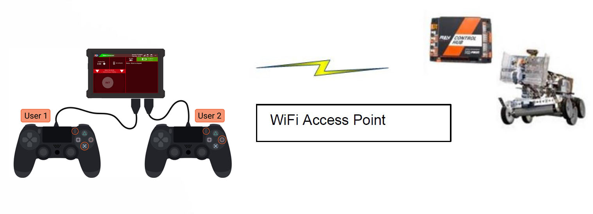
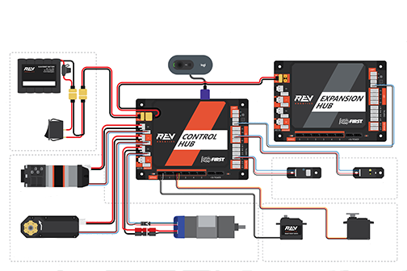
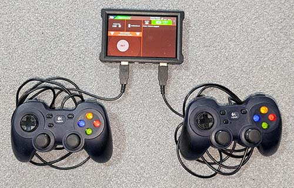
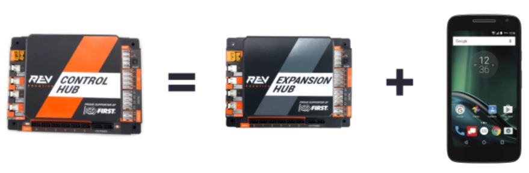
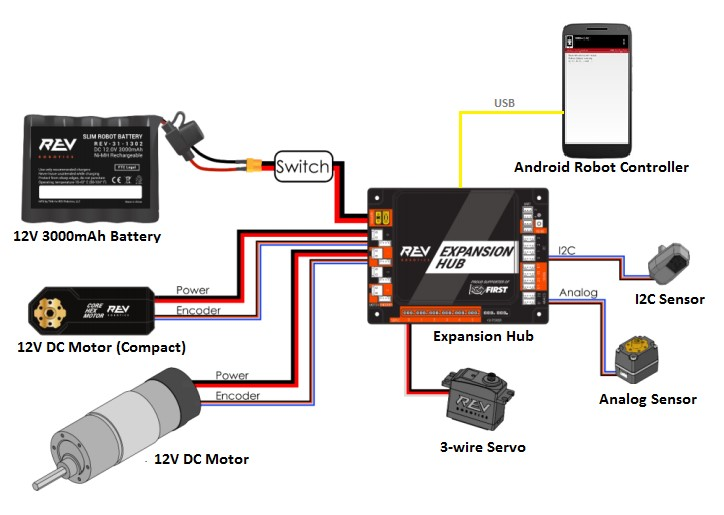

Control System Introduction
===========================

*FIRST* Tech Challenge Robots
~~~~~~~~~~~~~~~~~~~~~~~~~~~~~

*FIRST* Tech Challenge robots must play a challenging game that changes every year.
In the VELOCITY VORTEX game robots could shoot softball size wiffle balls
into the blue or red center goals. During the end of the match they
could lift and place a blue or red yoga ball onto the center goal structure.

.. rst-class:: center

(Photo courtesy of Dan Donovan, ©2017 Dan Donovan / www.dandonovan.com)

Point-to-Point Control System
~~~~~~~~~~~~~~~~~~~~~~~~~~~~~

*FIRST* Tech Challenge uses Android devices to control its robots.
During a competition, each team has two Android devices.
Android devices can communicate with each other over a wireless connection.

|

One Android device is mounted onto the robot and is called the *Robot
Controller*. In most cases, the ROBOT CONTROLLER is the
REV Robotics Control Hub. The Robot Controller acts as the “brains” of the
robot. It does all of the thinking for the robot and tells the robot what
to do. It consists of an Android device running the Robot Controller app. Many
Teams will also connect a REV Robotics Expansion Hub for additional ports to
connect motors, servos and sensors to the ROBOT.

A second Android device sits with the team drivers and has one or two
gamepads connected. This second device is known as the DRIVER STATION.
The DRIVER STATION is like a remote control that you might use
to control your television. The DRIVER STATION allows a team to
communicate remotely (using a secure, wireless connection) to the Robot
Controller and to issue commands to the Robot Controller. The DRIVER STATION
is usually a REV Robotics Driver Hub running the Driver Station app. 

.. important:: Only the REV Control Hub and the REV Driver Hub are officially
   supported. An Android smartphone is legal to use in competition, but it is
   not supported. Teams who use one are responsible for all of their own
   testing and troubleshooting.

REV Robotics Control Hub and Expansion Hub
~~~~~~~~~~~~~~~~~~~~~~~~~~~~~~~~~~~~~~~~~~

The REV Robotics Control Hub and the Expansion Hub are the electronic
modules that lets the Robot Controller talk to the robot’s motors,
servos, and sensors. The Robot Controller is integrated into the Control Hub, and communicates with the
Expansion Hub through a serial connection. 

The Control Hub and Expansion Hub are also connected to a 12V battery which is used to
power the Control Hub, the Expansion Hub, the motors, the servos and sensors. 

|

REV Robotics Driver Hub
~~~~~~~~~~~~~~~~~~~~~~~

The REV Robotics Driver Hub is the electronic module that the team uses to 
control the ROBOT. Teams can use the Driver Station app to select and run
various programs. One or more gamepads are connected to the Driver Hub and are
used by the team to move the robot around the field and operate its various mechanisms.

   
   REV Driver hub with two Logitech gamepads attached

|

AUTO vs. TELEOP
~~~~~~~~~~~~~~~

A *FIRST* Tech Challenge match has an Autonomous (AUTO) phase and a
Teleoperated (TELEOP) phase. Teleoperated is a fancy word for remote controlled.

In the AUTO phase of a match the robot operates without any human input or control.
In the TELEOP phase, the robot can receive input from up to two human drivers.
Typically one driver is focused on moving the robot around the field
and one driver operates the various mechanisms of the robot such as 
a ball launcher.

What’s an OpMode?
~~~~~~~~~~~~~~~~~

During a typical *FIRST* Tech Challenge match, a team’s robot has to
perform a variety of tasks in an effort to score points. For example, a
team might want their robot to follow a white line on the competition
floor and then score a game element (such as a ball) into a goal
autonomously during a match. Teams will create an “OpMode” (which stands for
“operational mode”) to specify the behavior for their robot.

An *OpMode* is a computer program that is used to customize the behavior
of a competition robot. The Robot Controller can *execute* a selected OpMode
to perform certain tasks during a match.

Typically one OpMode is run during the AUTO phase of the match and
a second OpMode is run during the TELEOP phase.
Teams might have multiple AUTO OpModes that do different things 
depending on where on the field the robot will start the match.

Teams who are participating in *FIRST* Tech Challenge have several
of programming tools that they can use to create their own OpMode.
Teams can use a visual (“drag and drop”) programming tool called the
*Blocks Programming Tool* to create their OpModes. Teams can also
use the Java programming language via the *OnBot Java Programming
Tool* or Google’s *Android Studio* to create their OpModes.

See 
:doc:`Choosing a Programming Tool </programming_resources/shared/choosing_program_lang/choosing-program-lang>`
for more information.

Android Smartphones
~~~~~~~~~~~~~~~~~~~

The REV Driver Hub and REV Control Hub are the only officially supported control system devices.

Teams may opt to use an Android smartphone as their DRIVER STATION, ROBOT CONTROLLER or both.
Due to unpredictable variations in Android software across different manufacturers and updates, 
the REV Robotics Control Hub and Driver Hub are the only officially supported devices for the control system.

.. caution::
   Teams choosing to use an Android phone bear the sole 
   responsibility for testing and verifying its compatibility, functionality, and performance.

It is known that some phones do not support manually changing the Wi-Fi channel.
Some events including *FIRST* Championship assign each robot to a Wi-Fi channel to spread teams 
among the available channels and to avoid Wi-Fi channels in use by the event or the public.

Android 10 or newer is important for ensuring that 802.11w protected frames (a network security feature) is supported.
Android phones that used to be legal may not be able to be upgraded to Android 10.

Ensure your phone supports 
`USB On-The-Go <https://en.wikipedia.org/wiki/USB_On-The-Go>`__ (or OTG).

Flagship Samsung phones seem to be well supported, as well as the Samsung A10. 

For a DRIVER STATION phone ensure the FTC Driver Station App is cleanly installed.
See :doc:`Updating the Driver Station App </ftc_sdk/updating/ds_app/Updating-the-DS-App>`.
You will need an OTG adapter and a USB hub to connect gamepads.

For a ROBOT CONTROLLER phone ensure the Robot Controller App is cleanly installed.
See :doc:`Updating the Robot Controller App </ftc_sdk/updating/rc_app/Updating-the-RC-App>`.
You will need an OTG adapter and a USB A to USB Mini cable to connect to a REV Expansion Hub.

   
   A Control Hub can be replaced by an Expansion Hub and an Android phone

|

Teams who use an Android smartphone as their ROBOT CONTROLLER will need a
REV Robotics Expansion Hub to connect motors, servos and sensors. The smartphone is
connected to the Expansion Hub via a USB-A to USB-Mini cable and an OTG adapter.

|

