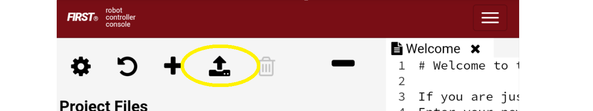
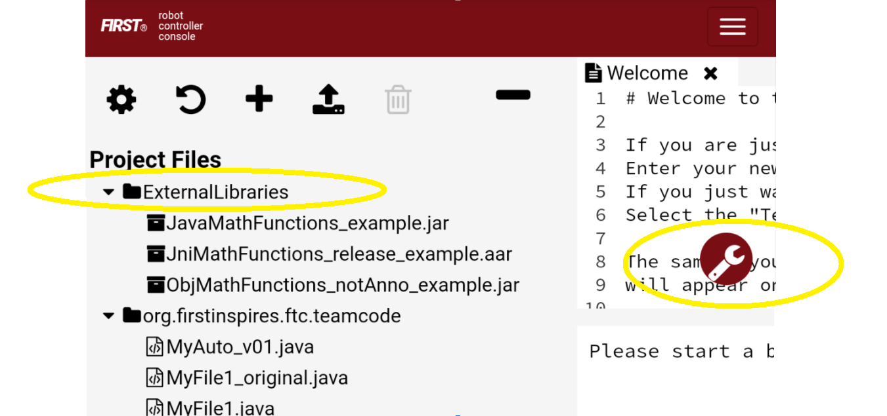
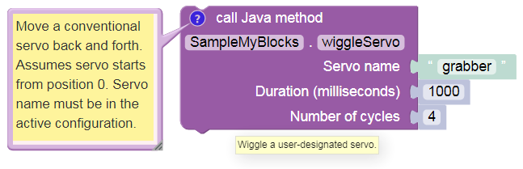
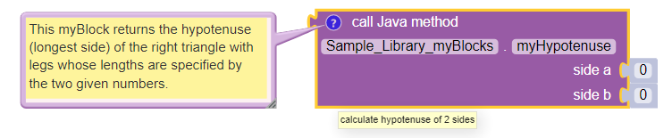
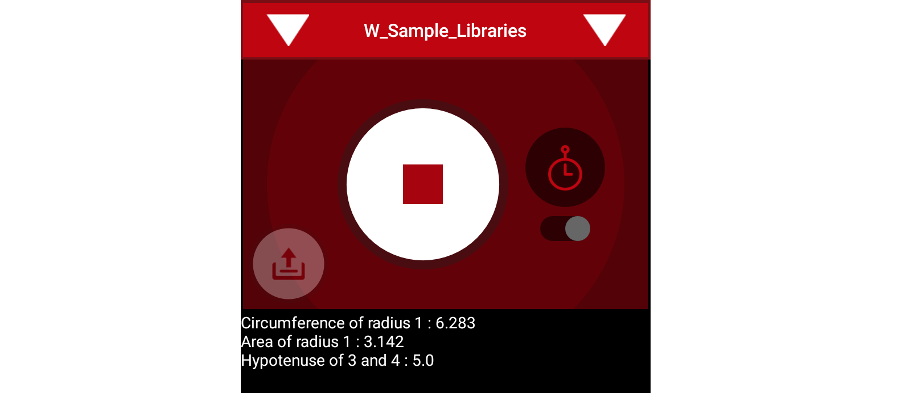
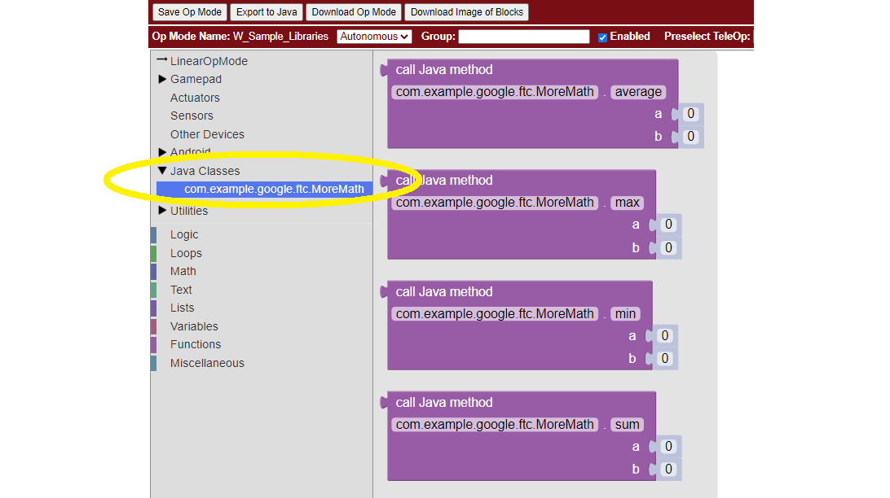

External Libraries in OnBot Java and Blocks
===========================================

Introduction
------------

Blocks and OnBot Java programmers can use external libraries,
starting with SDK 7.0 released for the Freight Frenzy season. This
capability previously existed for programmers using Android Studio.

An external library is a collection of specialized software ready for
public use, and typically available from a website or repository, called
a ‘repo’. You don’t need to know its inner workings, just what it does
and how to use it.

This beginner-level tutorial shows how to incorporate a library’s
features into your Op Modes, and provides simple examples. It does
not teach Java.

Many thanks to `Liz Looney <https://github.com/lizlooney>`__ who
developed this capability, along with myBlocks and many other useful
features of the software.

*Note: This new capability exists for a Robot Controller (RC)
running Android 7 & and higher. Moto G 2nd Gen and Moto G 3rd Gen RC
phones cannot use this feature.*

Overview
--------

It’s a simple process with three basic steps.

**Step 1**, find a library with features you want to use, and get its
.jar or .aar file.

**Step 2**, upload that file in OnBot Java.

Step 3 has three variations, depending on your planned use of the
library.

**Step 3A** assumes you want to use a library function, or *method*, in
OnBot Java only. Namely you are **not** planning to make that method
available for Blocks users.

**Step 3B** assumes that you **do** want to provide the library method
to a Blocks user, by creating a special Block called a myBlock. MyBlocks
are not new with 7.0, but now you can use library code in that myBlock.
You can create your myBlock to have the exactly same inputs and outputs
as the library method, or slightly different inputs and outputs.

**Step 3C** is a different scenario, where the library method is made
available directly to the Blocks user, **without creating a myBlock**.
This can be done, if the library is specially annotated by its author.

Step 1 - Select library, get archive file
-----------------------------------------

There are hundreds of code libraries available on the internet. In Step
1, you find a library with specialized functions (methods) that you want
to use. Start with a web search, or get suggestions from other 
teams.

It’s best to choose a repo with a well documented interface. Review its
documentation or API, learn what the methods can do, and learn about
inputs required and output provided.

If that’s something you want to use, then try to find the .jar or .aar
file. The ``.jar`` suffix means Java Archive and ``.aar`` means a
similar format called Android Archive. This is a compressed file
containing the entire collection of code that you want, in a single
file. It’s similar to a *zip file* that you may have used for general
web downloads.

If you’re having trouble locating that .jar file, or if you’re not sure
how to use that library, you are encouraged to contact the repo owner or
developer. They often enjoy hearing how programmers plan to use their
code, and would be happy to help you get started. Don’t be intimidated,
they are often willing to help.

Then just download that .jar or .aar file to local storage such as your
laptop or to a team Google drive.

Step 2 - Upload archive file
----------------------------

Copy the .jar or .aar file to your programming laptop, if the file is
not stored there already.

Connect your laptop via Wi-Fi to a Robot Controller device that’s
running the RC app, version 7.0 or higher (see instructions at
``Program and Manage``, on the RC phone or its paired Driver Station
device). In the Chrome browser, open OnBot Java.

In OnBot Java (OBJ) click the **upload icon**, normally used to upload a
regular Java file to the ``teamcode`` folder.

 
    Upload icon in OnBot Java

Instead of a Java file, select the .jar or .aar library file to upload
from the laptop.

OnBot Java will recognize that it’s an archive file, and will
automatically create a folder called ``ExternalLibraries``. This folder
will appear above the ``teamcode`` folder.

 
    ExternalLibraries folder and Build Everything icon

Step 3 - Programming
--------------------

The programming step has several variations depending on how you’re
planning to use the External Library code.

**Step 3A** assumes you want to use the library method only in your Java
program or OpMode, and **not** provide it to Blocks users. Or perhaps
your team doesn’t work with Blocks at all.

So, you can just start programming!

First import the class. You know the **class name** because you read
about it in the library documentation. And you know the **method names**
and how they work, including the inputs and outputs (and their Java
types). This tutorial does not offer Java programming instruction.

Remember, when all your programming is finished, click the
``Build Everything`` icon (see image above).

In **Step 3B** you create a myBlock, which can modify the library
method, or not. It depends on the functionality you want to provide to
your Blocks programmer.

**Unmodified** means that your myBlock simply calls the library method,
using exactly the same inputs and outputs. This might be called a
*wrapper method*.

Or, you can use the library method as a **utility function**, performing
a specific task in or for your larger myBlock method. In other words,
your myBlock **supplements** what the library method can do.

Alternatively, the library method might have **more** parameters than
your Blocks user needs, so you want a **simpler** interface. Your OBJ
code can satisfy extra parameters without exposing them to the user of
your myBlock.

As a reminder, creating a myBlock requires only these two items:

-  Extend your existing OpMode class with ``BlocksOpModeCompanion``.
-  Place the annotation ``@ExportToBlocks`` immediately before each
   myBlock method.

For more info, see the separate myBlock tutorial
:ref:`here <programming_resources/shared/myblocks/index:custom blocks (myblocks)>`.

**Step 3C** assumes the library methods should be provided **directly**
to the Blocks user, without even creating a myBlock. This scenario
doesn’t need to be enabled with your Java code at all.

Instead you must ask the **library developer** to add two 
annotations, then provide you a fresh .jar or .aar file. The changes
are:

-  Place the annotation
   ``@org.firstinspires.ftc.robotcore.external.ExportClassToBlocks``
   directly before the library class declaration.

-  Place the annotation
   ``@org.firstinspires.ftc.robotcore.external.ExportToBlocks`` directly
   before each library method to be exposed (shared or passed through to
   Blocks).

When you have that archive file with its annotations, upload it in OnBot
Java, and click ``Build Everything``. That’s it!

It doesn’t matter which Java file (if any) is currently open in OBJ; no
such file is needed for this feature. Those library-annotated
“pass-through” methods will automatically appear in the Blocks toolbox
(menu), with the method’s actual inputs and outputs.

See further below for examples of these 3 scenarios.

User Training & Documentation
-----------------------------

For Step 3B or Step 3C, your **Blocks users** must be taught how to use
the new myBlocks or the new pass-through Blocks. That’s **your job**, as
the Java developer who implemented this feature.

Start with good documentation. For myBlocks, use the existing tools to
make helpful labels (for input parameters), clear tooltips and detailed
comments. The comments appear in a text box that expands after clicking
the blue question-mark icon on that Block. Tell your users it’s there.

 
    myBlock documented using comment, tooltip and input labels

Meet with your team’s Blocks programmer(s) to explain the new features.
Consider writing a short description, for their future reference.
Encourage users to give you feedback, to improve your code.
Congratulations, you are now a Java developer!

Benefits
--------

Obviously this External Libraries feature provides advanced functions
previously available only to Android Studio teams.

Secondly, more of your team members can continue programming the robot
in Blocks. Meanwhile other students (like you), if they want to, can
advance their Java skills and still contribute to the team’s actual
robot programming.

Often, teams have one student who has moved far ahead with their
Java skills, and becomes the team programmer – the **only** programmer.
Then nobody else has the chance to learn and contribute basic
programming.

This feature can allow a new arrangement: “nobody is left out, and
nobody is held back”.

As a third benefit, judges love to hear about Outreach. For example
your team could develop useful Blocks for beginner teams. Or, you share
ideas and tips with other advanced teams who are doing the same kind of
development. And, you are encouraged to communicate with library
developers. This is a good opportunity for real-world interaction with
specialists: sharing your needs, and receiving expert guidance.
Scientists, engineers, doctors, entrepreneurs – nobody needs to reinvent
the wheel. Professional life is built on these interactions.

Example 1 - non-annotated library
---------------------------------

The first example uses a very basic “homemade” library called Geometry
For OBJ. To get your own copy, click :download:`here <opmodes/GeometryForObj.jar>`.

As with any current real-world library, this one is **not annotated**
for use. You can use it in OnBot Java only (Step 3A), **or** you can
create a myBlock (Step 3B) to share its capabilities with Blocks
programmers. Lacking annotations, this library does not provide direct
“pass-through” methods (Step 3C) to Blocks.

This library contains a class called
``com.example.google.ftc.Geometry``, with three methods: -
``circleCircumference()`` accepts radius, returns circumference -
``circleArea()`` accepts radius, returns area - ``hypot()`` accepts 2
lengths, returns hypotenuse of right triangle

Under **Step 3A**, you would use, for example, the ``hypot()`` method
for your own OnBot Java programming, not providing it to Blocks.

Add this to your list of import statements:

.. code:: java

   import com.example.google.ftc.Geometry;

Then simply use the method in your Java code:

.. code:: java

   double A = 3.0;
   double B = 4.0;
   double myHypotenuse = Geometry.hypot(A, B);

Under **Step 3B**, let’s create your own custom Block called
“myHypotenuse”. *This is just an exercise; regular Blocks could
easily calculate this value.*

You will still need the ``import`` statement, same as above in Step 3A.

Then, extend the main class:

.. code:: java

   public class librariesExample extends BlocksOpModeCompanion {

The myBlock method might read:

.. code:: java

   @ExportToBlocks (
       comment = "This myBlock returns the hypotenuse (longest side) of the right triangle" +
                 " with legs whose lengths are specified by the two given numbers.",
       tooltip = "calculate hypotenuse of 2 sides",
       parameterLabels = {"side a", "side b"}
   )
   public static double myHypotenuse(double a, double b) {
       return Geometry.hypot(a, b);
   }

This myBlock contains only the library method and uses the same inputs
and output, an example of a ‘wrapper method’.

Note that myHypotenuse() is a ``static`` method, required for all
myBlock methods. Also note that parameter labels are allowed to be
different than the actual method parameters. Learn more about myBlocks
:ref:`here <programming_resources/shared/myblocks/index:custom blocks (myblocks)>`.

Here is the myBlock that will appear in the Blocks toolbox (menu):

 
    myBlock using library method ``Geometry.hypot()``

On your own, you can try this with the two remaining methods. Use
myBlocks to show telemetry output of various input values.

 
    Telemetry of myBlocks using Geometry library

Example 2 - *FIRST* Tech Challenge-annotated library
----------------------------------------------------

Now let’s try another “homemade” library that **does** already contain
the annotations. This one is called Arithmetic For Blocks; click
:download:`here <opmodes/ArithmeticForBlocks.aar>`.

This library contains a class name ``com.example.google.ftc.MoreMath``,
with public methods ``sum``, ``min``, ``max`` and ``average``. Each
accepts two numbers and provides a numeric result.

This library **is annotated** specifically for team use, as described
above. After you upload the .aar file and ``Build Everything``, its 4
“pass-through” methods will automatically appear as Blocks:

 
    Pass-through methods from class MoreMath in annotated library
    Arithmetic For Blocks

You **could** also use these methods in OnBot Java, including to create
a myBlock. For example, perhaps you want to also provide a custom
version of a pass-through method. But you **don’t need** an OnBot Java
file to support this library or its methods; that’s done automatically
by OnBot Java when it processes the library at upload.

What if you have an annotated library, and don’t want **any** of its
methods to appear as a Blocks pass-through? Just ``Build Everything``,
then delete the .jar or .aar file.

Here are two other “homemade” libraries, both **annotated**. Feel free
to experiment with these.

-  :download:`JniExample.aar <opmodes/JniExample.aar>`
   contains a class named ``com.example.google.ftc.IntegerMath``, with
   methods for simple arithmetic operations, implemented in native C++
   code. Its public methods are ``add``, ``subtract``, ``multiply``, and
   ``divide``. Each accepts two integers and provides an integer result.

-  :download:`RevPotentiometer.aar <opmodes/RevPotentiometer.aar>`
   contains a class named ``com.example.google.ftc.RevPotentiometer``,
   which is a hardware device class for the `REV
   Potentiometer <https://www.revrobotics.com/rev-31-1155/>`__. It uses
   ``AnalogSensorType`` and ``DeviceProperties`` annotations to make
   this sensor appear in the “Configure Robot” menu of the RC app or
   paired DS app. After the .aar file has been uploaded (and
   ``Build Everything``), configure your robot’s Analog Input Devices
   and choose ``REV Potentiometer``. It has a public method
   ``getRotation`` with parameter of type AngleUnit.

Real-world libraries
--------------------

External Libraries have unique content and structure. Each may pose special
challenges as you try to use it in robot code. Communication with the library
developer will be very helpful, perhaps essential.

Ideally, the library’s .jar or .aar file encompasses all the classes
you’ll need, without external dependencies. A good example is
**EasyOpenCV**, designed and ready for use. See the simple
instructions
`here <https://github.com/OpenFTC/EasyOpenCV>`__.

General external libraries might involve a longer journey. For example,
`Apache Commons <https://commons.apache.org/>`__ is a vast public repo,
basically a library of libraries, focused on the Java programming
language. Complications can arise even when choosing a simple math-only
library.

Apache libraries are organized into Modules, typically each with one or
more .jar files. It may not be sufficient to upload only the .jar file
that seems to contain the class and methods you want to use.

If the library code refers to a class **not contained** in that .jar
file, OnBot Java’s auto-complete feature may eventually throw a ‘class
not found’ exception, causing your RC app to crash. The exception
triggered by this ‘hidden dependency’ may occur within minutes or hours,
whenever OBJ encounters the ‘missing’ class – even if your OpMode does
not directly or indirectly use that class. After that point, your RC app
will not operate. It can operate again only by manually deleting the
.jar file and its associated folder, directly on the RC device.

Starting over, you can find and upload the .jar file containing the
‘missing’ class. But that may expose further dependencies, requiring
more .jar files.

Also, be aware that the SDK already contains some common Apache
classes. OnBot Java may detect this duplication, preventing upload of
your .jar file. On the bright side, your desired methods should already
be available!

So, be prepared for these and other challenges that may arise. Again,
it’s helpful to communicate with the library developer where possible.

Advanced
--------

Here are some technical details that might apply to very advanced use of
the External Libraries feature. These are not covered in this basic
tutorial.

-  .aar files with assets are not supported
-  External libraries can include .so files for native code
-  External libraries can add new hardware devices with these
   annotations:

.. code:: java

   com.qualcomm.robotcore.hardware.configuration.annotations.AnalogSensorType
   com.qualcomm.robotcore.hardware.configuration.annotations.DeviceProperties
   com.qualcomm.robotcore.hardware.configuration.annotations.DigitalIoDeviceType
   com.qualcomm.robotcore.hardware.configuration.annotations.I2cDeviceType
   com.qualcomm.robotcore.hardware.configuration.annotations.MotorType
   com.qualcomm.robotcore.hardware.configuration.annotations.ServoType

-  External libraries can add new functionality to the Robot Controller
   with these annotations:

.. code:: java

   org.firstinspires.ftc.ftccommon.external.OnCreate
   org.firstinspires.ftc.ftccommon.external.OnCreateEventLoop
   org.firstinspires.ftc.ftccommon.external.OnCreateMenu
   org.firstinspires.ftc.ftccommon.external.OnDestroy
   org.firstinspires.ftc.ftccommon.external.WebHandlerRegistrar

Summary
-------

Blocks and OnBot Java programmers can benefit and learn from this
new capability with external libraries.

You are encouraged to submit other examples and suggestions that worked
for you.

=============

Questions, comments and corrections to westsiderobotics@verizon.net
