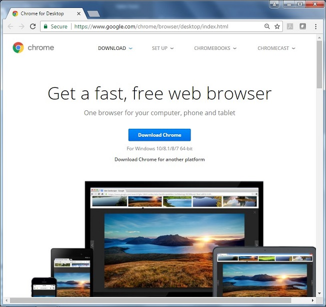
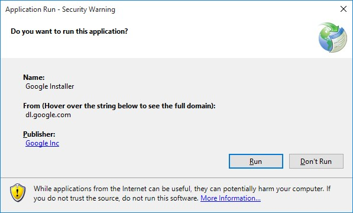

Installing a Javascript Enabled Browser
=======================================

In order to be able to program your Robot Controller using the Blocks
Programming Tool or the OnBot Java Programming tool, your laptop will
need a Javascript-enabled browser. Both tools are Javascript
applications that are served up by the Program and Manage server of the
Robot Controller.

The Blocks Programming Tool and the OnBot Java Programming Tool should
work with most modern web browsers. However, *FIRST* strongly recommends
the use of Google Chrome with these tools. If you would like to use
Google Chrome as your browser, you can download it for free from the
Google Chrome website.

Note that it will take an estimated 15 minutes (depending on the speed
of your Internet connection) to download and install the
Javascript-enabled browser.

Installing a Javascript-Enabled Browser Instructions
----------------------------------------------------

1. Visit the `Google Chrome Browser website <https://www.google.com/chrome`__ (using your computer's existing browser) and follow onscreen instructions to download and install Chrome.

.. rst-class:: center

`Chrome Browser Website Link <https://www.google.com/chrome`__

2. Note that your computer might prompt you with a security warning   
during the installation process. If you are prompted with this        
warning, click on the "Run" button to continue with the installation. 

|

