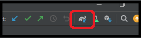

Using the Kotlin Programming Language
=====================================

What Is Kotlin?
---------------

The Kotlin programming language is a a modern alternative to the Java programing language
that compiles and runs on the Java Virtual Machine (JVM) and can be used to develop Android
applications. It was developed by JetBrains, the same company that developed the IntelliJ IDE
(the basis for Android Studio).

* https://kotlinlang.org/

Being based on Java, Kotlin shares many of the same features and syntax. However, it also adds
many new features and syntax that can make it easier to write code and less prone to errors. Some of
the features of Kotlin include:

* Full interoperability with Java; you can use Java classes and libraries from Kotlin and vice versa.
* Dynamic typing; Kotlin allows you to use dynamic typing when needed, that is, you don't need
  to specify the type of a variable when it can be inferred from the context
  (``var myString = "Hi!"``).
* No semicolons; Kotlin does not require semicolons to end statements.
* Data classes; Kotlin has a concise syntax for creating classes that are used to store data.
* Extension functions; Kotlin allows you to add functions to existing classes without having to
  modify the original class.
* Null safety; Kotlin has a type system that helps eliminate null pointer exceptions.
* Operator overloading; Kotlin allows you to define how operators such as ``+`` and ``*`` work
  with your own classes.
* Many more!

In addition, if you don't want to learn how to code in Kotlin from scratch, the Android Studio
IDE has a tool to convert sections of code or an entire Java file to a Kotlin file. This is extremely
useful to learn how certain Java code is written in Kotlin.

Because Kotlin is fully interoperable, you can also use all your existing Java code in a
Kotlin project without having to convert it.

Using Kotlin in *FIRST* Tech Challenge
--------------------------------------

While there is no rule (as of the writing of this document) prohibiting Kotlin as a programming 
option in *FIRST* Tech Challenge, it is not one of the recommended tools as listed in **<RS02>** 
"Recommended Programming Tools" portion of the *FIRST* Tech Challenge `Game Manual Part 1 
<https://www.firstinspires.org/sites/default/files/uploads/resource_library/ftc/game-manual-part-1-traditional-events.pdf>`__. 
Teams that use Kotlin do so at their own risk and should expect that there will not be technical
help/support available at events in the case of software issues.

Installing Kotlin In Your Project
---------------------------------

To use Kotlin in your Android project, you need to add the Kotlin plugin to your project. This is
done by adding the following lines to the root ``build.gradle`` file in the ``buildscript`` section:

.. code-block:: groovy

    buildscript {

        ext.kotlin_version = '1.8.20' <----- ADD THIS LINE, UPDATE VERSION TO LATEST IF NEEDED

        repositories {
            mavenCentral()
            google()
        }

        dependencies {
            classpath 'com.android.tools.build:gradle:7.2.0'
            classpath "org.jetbrains.kotlin:kotlin-gradle-plugin:$kotlin_version" <----- ADD THIS LINE
        }
    }

.. note:: This file is located in the base folder of your project, not the one in the TeamCode module nor
            the one in the FtcRobotController module.

.. note:: The exact kotlin version can be changed/updated if desired per new releases. The latest version as
        of this writing is 1.8.20 but you should check the Kotlin website to see if a newer version (one that is
        compatible with the current Gradle version) is available
        (see table `here <https://kotlinlang.org/docs/gradle-configure-project.html#apply-the-plugin>`__).

Next you need to add the Kotlin plugin to the ``build.gradle`` file in the TeamCode module. Open the file
and find the following section near the top of the file. Change it to look like this:

.. code-block:: groovy

    // Include common definitions from above.
    apply from: '../build.common.gradle'
    apply from: '../build.dependencies.gradle'
    apply plugin: 'kotlin-android' <----- ADD THIS LINE

Finally, you need to run a Gradle sync to download the Kotlin plugin and any other dependencies. This is
done by clicking on the ``Sync Now`` link in the upper right corner of the Android Studio window.

|

Make sure you are on a reliable internet connection when you do this!

.. note:: If you get an error that says "Kotlin not configured" when you try to run a Gradle sync, you may need
        to install the Kotlin plugin. To do this, go to ``File -> Settings -> Plugins`` and search for "Kotlin".
        Click on the ``Install`` button to install the plugin.

