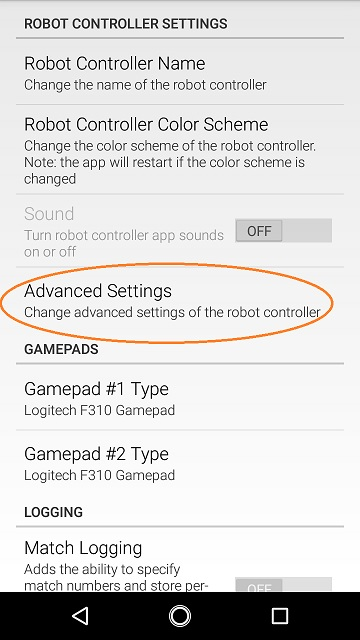

Managing a Control Hub
======================

Changing the Name
~~~~~~~~~~~~~~~~~

By default, the Control Hub has a name that begins with the phrase
"FTC-" and ends with four characters that are assigned at the factory.
In order to comply with game manual rule <RS01>, the name should be
changed.

The name of a Control Hub (or Robot Controller phone) can be changed
from a paired DS app, as shown in :ref:`Changing the Name<programming_resources/shared/managing_smartphone_rc/Managing-a-Smartphone-Robot-Controller:changing the name>`.

As an alternate, you can change the name of a Control Hub at the
*Manage* page from a connected Driver Station or laptop, as described
below. Click ``Apply Wi-Fi Settings`` when done.

.. important:: Changing the name of a Control Hub changes the name
   of the Hub's wireless network. Once the name is changed, you will have
   to connect your devices (Driver Station and programming laptop) to the
   new network.

Changing the Name of a Control Hub
----------------------------------

1. Verify that your laptop or Chromebook is connected to the Program & Manage wireless network of the Control Hub. If you are connected to the network, you should be able to see the *Robot Controller Connection Info* page when you navigate to address "192.168.43.1:8080":

.. image:: images/RCConnectionInfoPage.jpg
   :align: center

|

   If your laptop or Chromebook is not connected and you are unable to access the *Robot Controller Connection Info* page, then read the instructions in the following tutorial to learn how to connect to the Program & Manage network.

   :doc:`Connecting a laptop to the Program & Manage Network <../program_and_manage_network/Connecting-a-Laptop-to-the-Program-&-Manage-Network>`

2. Click on the *Manage* link towards the top of the *Robot Controller Connection Info* page to navigate to the Manage page.

|

3. Change the name in the *Robot Controller Name* field and click on the *Change Name* button to change the Control Hub's name.            

|

4. After you press the *Change Name* button, a dialog box will appear, indicating that the name has been changed and that you will need to connect to the new wireless network and refresh the current page.

|

Changing the Password
~~~~~~~~~~~~~~~~~~~~~

By default, the Control Hub has its password set to password at the
factory. It is a good idea to change the password from its default value
before you begin using your Control Hub.

You can change the password of a Control Hub using a laptop or
Chromebook that is connected to the Hub's Program & Management page.

.. warning:: Commit your new password to memory or store it in a
   secure location so you will not forget it. You will need this password
   to manage and operate your Control Hub. Also note, once the password has
   been changed, you will have to reconnect your devices (Driver Station
   and programming laptop/Chromebook) to the network using the new
   password.

Changing the Password of a Control Hub
--------------------------------------

1. On the *Manage* page of the Control Hub user interface, find specify your new password and then confirm this new password in the *Access Point Password* section of the page. Press the *Change Password* to change the password.

|

2. After you press the *Change Password* button, a dialog box will appear, indicating that the password has been changed and that you will need to reconnect to the wireless network using the new password.

|

Resetting a Control Hub
~~~~~~~~~~~~~~~~~~~~~~~

If you forget the network name or password for a Control Hub, you can
reset the Hub's name and password back to their factory default values.

.. important:: Resetting a Control Hub will restore its default
   network name and password. However, existing configuration files and op
   modes should not be affected by the reset. This includes op modes that
   were created using the Blocks, OnBot Java and Android Studio tools.

Resetting Instructions
-----------------------

1. Turn off the power to your Control Hub for 5 seconds.
2. Press and hold the button on the Control Hub (see image below).

.. image:: images/controlHubButton.jpg
   :align: center

|

3. Power on the Control Hub while continuing to hold the button. Monitor the LED while the Control Hub is rebooting. Eventually, the LED will switch from being solid blue, to a multi-color blink pattern.

   When the reset has started, the LED should blink purple, yellow, blue, and then red. This pattern should occur five times in rapid succession. 
   
   Once the multi-colored blink pattern is complete, you can release the button. The Control Hub's network name and password should be restored to their factory values. Note that the reboot and reset process should take approximately 30 seconds to complete.

Changing the WiFi Channel
~~~~~~~~~~~~~~~~~~~~~~~~~

The Control Hub acts as a wireless access point for the Driver Station
and for the programming laptop or Chromebook. By default the Control Hub
automatically picks an operating WiFi channel. However, it is sometimes
necessary to specify the operating channel for the Hub.

For example, at a large competition an FTA might ask that you switch to
a designated channel to avoid wireless interference that is present in
the venue. Similarly, an FTA might ask you to switch to a specific
channel because the FTA is monitoring that designated channel for
interference or other wireless disruptions.

You can select the operating channel for the Control Hub from the
*Manage* page.

Changing the WiFi Channel Instructions
--------------------------------------

1. On the *Manage* page of the Control Hub user interface, use the drop down selector to select the desired operating channel. Note that the Control Hub supports both the 2.4 GHz and 5 GHz bands.

|

2. Press the *Change Channel* button to change to the new channel. Note that when the channel change occurs, the Driver Station might momentarily disconnect from the Control Hub. It should eventually, however, reconnect to Control Hub's wireless network.

3. Verify on the Driver Station that the Control Hub is operating on 
the desired WiFi channel. The operating channel should be displayed
under the network name in the *Network* section of the main Driver
Station screen.

.. image:: images/dsOperatingChannel.jpg
   :align: center

|

Downloading the Log File
~~~~~~~~~~~~~~~~~~~~~~~~

It's often helpful when troubleshooting problems with the Control System
to download the log file from the Control Hub. This can be done from the
*Manage* page. Note that the log file name is *robotControllerLog.txt*
by default.

Downloading the Log File Instructions
-------------------------------------

1. On the *Manage* page of the Control Hub user interface, press the *Download Logs* button to download the Robot Controller log file.

.. image:: images/downloadLogs.jpg
   :align: center

|

2. Verify that the Robot Controller log file was downloaded to the Downloads directory of your computer.

3. Use a text editor such as `Notepad++ <https://notepad-plus-plus.org/>`__ or Microsoft's WordPad to open and view the contents of the log file. Note that the Windows app, Notepad, will not properly display the contents of the log file.

.. image:: images/notepadplusplus.jpg
   :align: center

|

Updating the Expansion Hub Firmware
~~~~~~~~~~~~~~~~~~~~~~~~~~~~~~~~~~~

The Control Hub has its own built-in REV Robotics Expansion Hub. The
purpose of the Expansion Hub board is to facilitate communication
between the Control Hub's Android controller and the motors, servos, and
sensors of the robot. Periodically, REV Robotics will release new
versions of the firmware which contains fixes and improvements for the
Expansion Hub. The firmware releases are in the form of a binary
(.bin) file.

The `REV Hardware Client <https://docs.revrobotics.com/rev-hardware-client/>`__
software can update the firmware for the Control Hub's embedded
Expansion Hub.

As an alternate, you can use the *Manage* interface from a connected
laptop or Driver Station (DS) app to upload a Control Hub's firmware, or
to update it using the included or uploaded version. New firmware images
can be obtained from the `REV Robotics website <https://www.revrobotics.com/software/>`__.

Also, included or uploaded Control Hub firmware can be updated in Robot
Controller Advanced Settings, from a paired Driver Station (DS) app as
shown below.

These three methods do not apply to updating the firmware of an
Expansion Hub connected to a Control Hub via RS485 data wire. Standalone
Expansion Hubs must be updated by direct USB plug-in to a laptop running
the REV Hardware Client or to a Robot Controller phone.

Uploading and Updating the Expansion Hub Firmware
-------------------------------------------------

1. On the *Manage* page of the Control Hub user interface, press the *Select Firmware* button to to select the firmware file that you would like to upload.

.. image:: images/notepadplusplus.jpg
   :align: center

|

   An *Upload* button should appear after you successfully selected a file.

2. Press the *Upload* button to upload the firmware file from your computer to the Control Hub.

|

   The words "Firmware upload complete" should appear once the file has been uploaded successfully.

3. On the Driver Station, touch the three dots in the upper right hand corner to display a pop-up menu.

.. image:: images/touchThreeDots.jpg
   :align: center

|

4. Select *Settings* from the pop-up menu to display the Settings activity.

.. image:: images/touchSettings.jpg
   :align: center

|

5. On the Driver Station, scroll down and select the *Advanced Settings* item (under the *ROBOT CONTROLLER SETTINGS* category).

|

6. Select the *Expansion Hub Firmware Update* item on the *ADVANCED ROBOT CONTROLLER SETTINGS* activity.

.. image:: images/selectExpansionHubFirmwareUpdate.jpg
   :align: center

|

7. If a firmware file that is different from the version currently installed on the Expansion Hub was successfully uploaded, the Driver Station should display some information about the current firmware version and the new firmware version. Press the *Update Expansion Hub Firmware* button to start the update process.

.. image:: images/pressUpdateExpansionHubFirmwareButton.jpg
   :align: center

|

8. A progress bar will display while the firmware is being updated. Do not power off the Control Hub/Expansion Hub during this process. The Driver Station will display a message when the update process is complete.

.. image:: images/dsUpdateComplete.jpg
   :align: center

|

Updating the Robot Controller App
~~~~~~~~~~~~~~~~~~~~~~~~~~~~~~~~~

It is important to know how to update the Robot Controller app that is
installed on a Control Hub. FIRST periodically releases new versions of
this app, which contain improvements and fixes, as well as
season-specific data and features.

Note that you can see the Robot Controller app version number through
the Driver Station user interface. Select the *About* menu option on the
Driver Station and note the App Version number under the *ABOUT ROBOT
CONTROLLER* section.

|

The `REV Hardware Client <https://docs.revrobotics.com/rev-hardware-client/>`__
software can update the Robot Controller (RC) app on the Control Hub.

As an alternate, Control Hub users can download the RC app from the
FIRST Tech Challenge `Github repository <https://github.com/FIRST-Tech-Challenge/FtcRobotController/releases>`__
and use the *Manage* page to complete the update.

Note that if you are an Android Studio user, then by updating to the
newest version of the Android Studio project folder you will update the
Robot Controller app when you build the project and install it on your
Control Hub.

.. tip:: If you update your Robot Controller, then you should
   also update your Driver Station software to the same version number.

Updating the Robot Controller App Instructions
----------------------------------------------

1. Go to the `GitHub repository <https://github.com/FIRST-Tech-Challenge/FtcRobotController/releases>`__. 

2. Locate the *FtcRobotController-release.apk* file.

.. image:: images/apkFolderOnRepo.jpg
   :align: center

|

3. Click on the filename (or *Download* button) to download the Robot Controller app as an APK file to your computer.

|

4. On the *Manage* page, click on the *Select App* button to select the Robot Controller app that you would like to upload to the Control Hub.

|
  
   An *Update* button should appear if an APK file was successfully selected.

5. Click on the *Update* button to begin the update process.

|

6. During the update process, if the Control Hub detects that the digital signature of the APK that is being installed is different from the digital signature of the APK that is already installed, the Hub might prompt you to ask if it is OK to uninstall the current app and replace it with the new one.
   
   This difference in digital signatures can occur, for example, if the previous version of the app was built and installed using Android Studio, but the newer app was downloaded from the GitHub repository. 
   
   Press *OK* to uninstall the old app and continue with the update process.

.. image:: images/uploadRobotControllerWarning.jpg
   :align: center

|

7. If the update process had to uninstall the previous version of the Robot Controller app, the network name and password for the Control Hub will be reset back to their factory values. If this happens, then you will need to reconnect your computer to the Control Hub using the factory default values.

.. image:: images/uploadRobotControllerUninstalling.jpg
   :align: center

|

8. When the update process is complete and you have successfully reconnected your computer to the Control Hub's network, you should see an *installed successfully* message on the *Manage* web page.

.. image:: images/uploadRobotControllerInstalledSuccessfully.jpg
   :align: center

|

Uploading a Custom Webcam Calibration File
~~~~~~~~~~~~~~~~~~~~~~~~~~~~~~~~~~~~~~~~~~

The Robot Controller app has built-in calibration information for a
variety of commonly available webcams. Users can also create their own
custom calibration files and then upload these files to a Control Hub.

A commented example of what the contents of a calibration file should
look like can be found in a file called *teamwebcamcalibrations.xml*,
which is included with the Android Studio project folder. 
This example calibration file can be found
`here <https://github.com/FIRST-Tech-Challenge/FtcRobotController/blob/master/TeamCode/src/main/res/xml/teamwebcamcalibrations.xml>`__.

Uploading a Custom Webcam Calibration File Instructions
-------------------------------------------------------

1. On the *Manage* page, click on the *Select Webcam Calibration File* button to select the calibration file.

.. image:: images/selectWebcamCalibrationFile.jpg
   :align: center

|

   An *Upload* button should appear if a file was successfully selected.

2. Click on the *Upload* button to upload the selected file. If the upload was successful, then the *Manage* page will display a message indicating that the upload has completed.

.. image:: images/uploadWebcamCalibrationFileComplete.jpg
   :align: center

|

Updating the Control Hub OS
~~~~~~~~~~~~~~~~~~~~~~~~~~~

REV Robotics periodically releases new versions of the Control Hub
operating system (OS). These new versions incorporate fixes,
improvements, and new features.

Note that you can see the Control Hub OS version number through the
Driver Station user interface. Select the *About* menu option on the
Driver Station and note the Operating System Version number under the
*ABOUT ROBOT CONTROLLER* section.

|

The `REV Hardware Client <https://docs.revrobotics.com/rev-hardware-client/>`__
software can update the Control Hub operating system.

As an alternate, Control Hub users can download a new Control Hub OS
file from the REV Robotics website and use the *Manage* page to complete
the update of the OS.

Updating the Control Hub OS Instructions
----------------------------------------

1. Download the new Control Hub OS update file from the `REV Robotics website <https://www.revrobotics.com/software/>`__.

2. On the *Manage* page, click on the *Select Update File* button to select the OS update file that you would like to upload.

|

   An *Update & Reboot* button should appear if an update file was successfully selected.

3. Click on the *Update & Reboot* button to start the update process.
Please wait while the OS file gets uploaded to the Control Hub. Note
that since the file is relatively large, it might take several
minutes before the upload is complete. Do not turn off the Control
Hub while the process is underway.

.. image:: images/osUpdatePleaseWait.jpg
   :align: center

|

4. If the upload was successful, the *Manage* page will display a
message indicating that the device is being rebooted and the update
is being installed.

.. image:: images/osUpdateVerificationSucceeded.jpg
   :align: center

|

5. When the OS update has completed, the Control Hub LED should
switch from blue, back to its normal blink pattern (green, then it
will blink blue once to indicate the Hub's serial address number,
then the pattern repeats itself). Reconnect your computer to the
Control Hub network and verify that the update was a success.

.. image:: images/osUpdateSuccess.jpg
   :align: center

|

   Note that you can also check in the About page (through the Driver Station app) to verify the updated version number of the Control Hub OS.

.. image:: images/aboutRobotControllerNewOSVersion.jpg
   :align: center

|

Connecting to the Control Hub Using Wireless ADB
~~~~~~~~~~~~~~~~~~~~~~~~~~~~~~~~~~~~~~~~~~~~~~~~

Advanced users who use Android Studio to build and install the Robot
Controller app onto their Control Hub should be familiar with the
Android Debug Bridge (adb) utility. adb is included with the Android
development platform tools. It can be used to communicate with an
Android device such as the Control Hub.

Traditionally, programmers use a hard-wired USB connection to
communicate using adb to their Android device. adb also supports a mode
where commands are sent back and forth through a wireless connection.

The Control Hub is configured so that it automatically will support an
adb wireless connection request on port 5555.

Connecting to the Control Hub Using Wireless ADB Instructions
-------------------------------------------------------------

1. Verify that your laptop is connected to the Program & Manage
wireless network of the Control Hub. If you are connected to the
network, you should be able to see the *Robot Controller Connection
Info* page when you navigate to address "192.168.43.1:8080":

.. image:: images/aboutRobotControllerNewOSVersion.jpg
   :align: center

|

   If your laptop is not connected and you are unable to access the *Robot Controller Connection Info* page, then read the instructions in the following tutorial (Connecting-a-Laptop-to-the-Program-&-Manage-Network) to learn how to connect to the Program & Manage network.

   :doc:`Connecting a laptop to the Program & Manage Network <../program_and_manage_network/Connecting-a-Laptop-to-the-Program-&-Manage-Network>`

2. Verify that the PATH environment variable for your Windows
computer includes the path to the adb.exe executable file. The
`Android Developer website <https://developer.android.com/studio/command-line/adb>`__
tells you where in your Android SDK installation you can find the
adb.exe file. This
`post <https://helpdeskgeek.com/windows-10/add-windows-path-environment-variable/>`__
from
`HelpDeskGeek.com <https://helpdeskgeek.com/windows-10/add-windows-path-environment-variable/>`__
shows how to add a directory to your Windows PATH environment
variable.

3. Open a Windows Command Prompt and type in "adb.exe connect 192.168.43.1:5555". This should connect your adb server to the Control Hub over the wireless connection.

