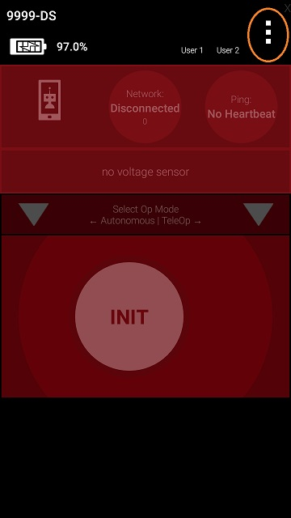
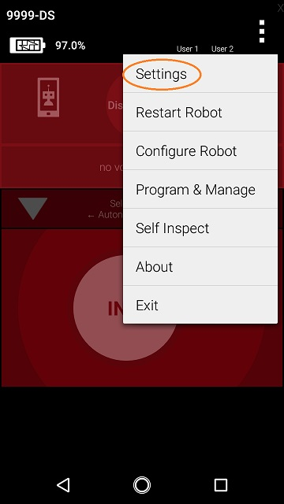
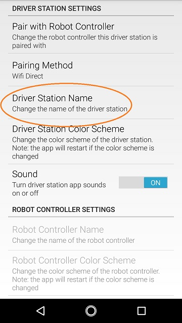
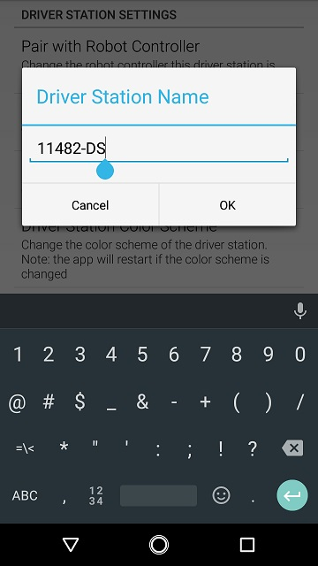
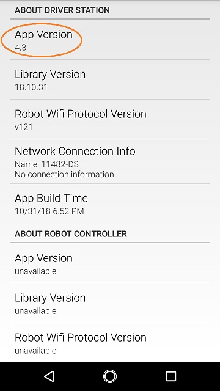

Managing a Smartphone Driver Station
====================================

REV Driver Hub
~~~~~~~~~~~~~~

The `REV Driver Hub <https://docs.revrobotics.com/duo-control/control-system-overview/driver-hub-specifications>`__
is preloaded with the Driver Station (DS) app. The procedures
described below for a DS phone, also apply to a REV Driver Hub.

Changing the Name
~~~~~~~~~~~~~~~~~

In order to comply with game manual rule <RS01>, the name of the Driver
Station (DS) smartphone should be changed.

This can be done in the DS app, as described below.

As an alternate, :ref:`found here <programming_resources/shared/configuring_android/Configuring-Your-Android-Devices:Renaming Your Smartphones>`
show how to rename a smartphone using the Android Settings activity of
the phone.

Changing the Name of a Driver Station Instructions
--------------------------------------------------

1. On the Driver Station phone, touch the three dots in the upper     
right hand corner to display a pop-up menu.                           

|

2. Select the *Settings* menu item from the pop-up menu. 

|   

3. Click on *Driver Station Name* on the *DRIVER STATION SETTINGS*    
page.                                                                 

|

4. Specify the new Driver Station Name and press *OK* to accept the   
changes.                                                              

|

Updating the Driver Station App
~~~~~~~~~~~~~~~~~~~~~~~~~~~~~~~

It is important to know how to update the Driver Station app that is
installed on your smartphone. FIRST periodically releases new versions
of this app, which contain improvements and fixes, as well as
season-specific data and features.

Note that you can see the Driver Station app version number through the
Driver Station user interface. Select the *About* menu option on the
Driver Station and note the App Version number under the *ABOUT DRIVER
STATION* section.

|

As of 2021, all apps (v 6.1 and higher) are no longer available on Google
Play.

The `REV Hardware Client software <https://docs.revrobotics.com/rev-hardware-client/>`__
will allow you to download the apps to approved devices: REV Control Hub, REV
Expansion Hub, REV Driver Hub, and approved Android devices. Here
are some of the benefits: 

-  Connect a REV Control Hub via WiFi. 
-  One Click update of all software on connected devices. 
-  Pre-download software updates without a connected device. 
-  Back up and restore user data from Control Hub. 
-  Install and switch between DS and RC applications on Android Devices. 
-  Access the Robot Control Console on the Control Hub.

All teams using Blocks, OnBot Java or Android Studio can use the REV
Hardware Client to update the Driver Station (DS) app on a DS phone.

NOTE: it will take an estimated 7.5 minutes per device to complete this
task.

As an alternate, the app releases are available on the
`FTCRobotController Github <https://github.com/FIRST-Tech-Challenge/FtcRobotController/releases>`__.
Download the Driver Station APK file to a computer, transfer it to the
DS phone's Downloads folder, then open that file to install the DS app.
This process is called "side-loading".

.. important:: If you update the Driver Station (DS) app, you should also update the Robot Controller (RC) app to the same version number. That process is different for Android Studio teams; updating RC phones is described :ref:`found here <programming_resources/shared/managing_smartphone_rc/Managing-a-Smartphone-Robot-Controller:Updating the Robot Controller App>` 

