Managing a Smartphone Robot Controller
======================================

Changing the Name
~~~~~~~~~~~~~~~~~

In order to comply with game manual rule <RS01>, the name of the Robot
Controller (RC) smartphone should be changed.

This can be done in the RC app or in a paired DS app, as described
below. (These steps also work for changing the name of a Control Hub,
from a paired DS app.)

As an alternate, :ref:`Renaming Devices<programming_resources/shared/configuring_android/Configuring-Your-Android-Devices:renaming your smartphones>` show how to rename a smartphone using the Android Settings activity of the phone.

.. important:: Once the name of your Robot Controller is changed,
   you might need to reconnect your devices (Driver Station and programming
   laptop) to the newly changed network.

Changing the Name of a Robot Controller
---------------------------------------

1. On the Robot Controller phone or paired Driver Station phone,
touch the three dots in the upper right hand corner to display a
pop-up menu.

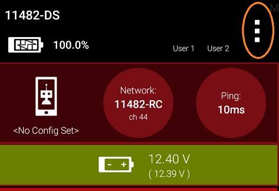

|

2. Select the *Settings* menu item from the pop-up menu.

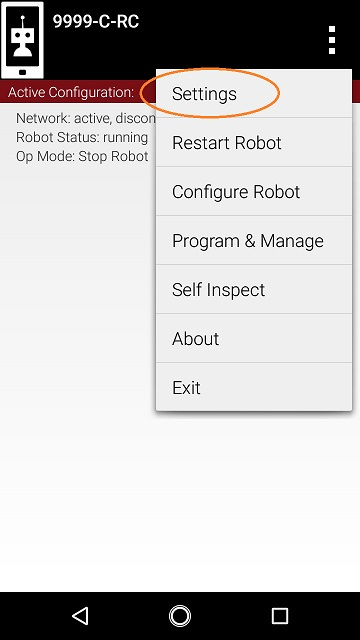

|

3. Click on *Robot Controller Name* on the *ROBOT CONTROLLER SETTINGS* page.

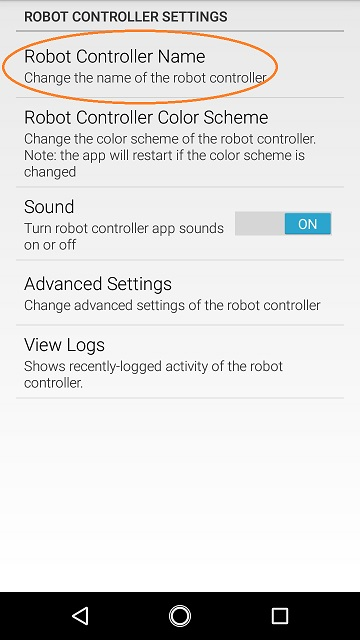

|

4.Specify the new Robot Controller Name and press *OK* to accept the changes.

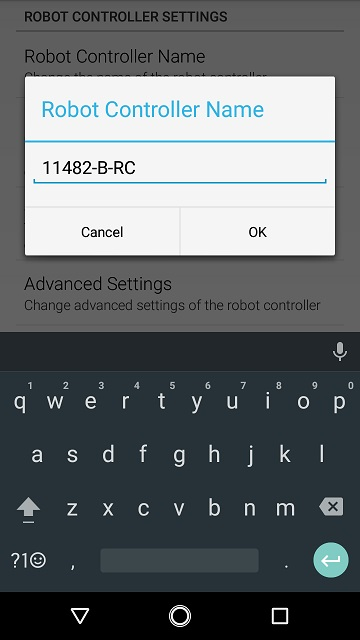

|

Changing the WiFi Channel
~~~~~~~~~~~~~~~~~~~~~~~~~

By default the smartphone Robot Controller automatically picks its own
operating WiFi channel. However, it is sometimes necessary to specify
the operating channel for the device.

For example, at a large competition an FTA might ask that you switch to
a designated channel to avoid wireless interference that is present in
the venue. Similarly, an FTA might ask you to switch to a specific
channel because the FTA is monitoring that designated channel for
interference or other wireless disruptions.

You can change the operating channel using the Advanced Settings menu on
the Robot Controller or Driver Station.

.. warning:: Not every Android phone supports channel changing
   through the software. Refer to rule <RE06> in the game manual for a
   list of *FIRST*-approved phones that support channel changing through
   the software.

Changing the WiFi Channel Instructions
--------------------------------------

1. Verify that the Driver Station is connected to your Robot
Controller.

2. Tap the three dots in the upper right hand corner of the Driver
Station's main screen to display the pop-up menu and select
*Settings* from the menu.

3. Scroll down to the *ROBOT CONTROLLER SETTINGS* section of the
*Settings* screen and click on the words *Advanced Settings* to
display the *ADVANCED ROBOT CONTROLLER SETTINGS* activity.

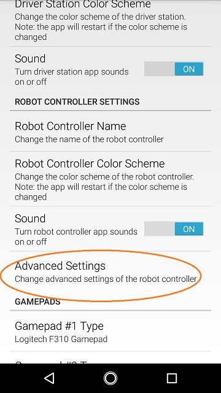

|

4. Click on the *Change Wifi Channel* link to display a list of
available channels.

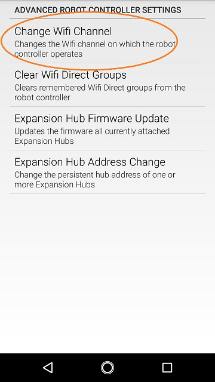

|

5. Select the desired operating channel. The phone should display a
toast message if the channel change was successful.

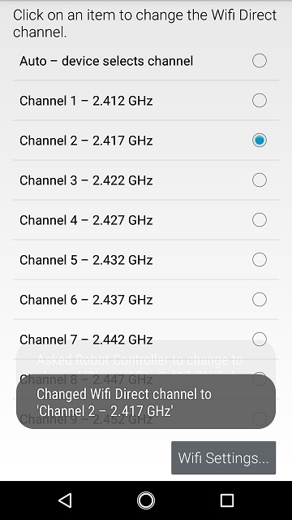

|

6. Use the Android back arrow to return to the main Driver Station
screen. The new operating channel should be displayed in the
Network: section under the Robot Controller's name

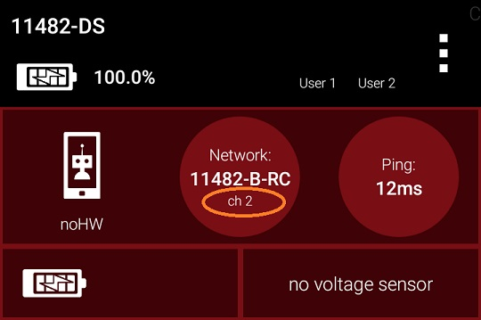

|

Downloading the Log File
~~~~~~~~~~~~~~~~~~~~~~~~

It's often helpful when troubleshooting problems with the Control System
to download the log file from the Robot Controller. This can be done
from the *Manage* page. Note that the log file name is
*robotControllerLog.txt* by default.

Downloading the Log File Instructions
-------------------------------------

1. Verify that your laptop or Chromebook is connected to the Program
& Manage wireless network of the smartphone Robot Controller. If you
are connected to the network, you should be able to see the *Robot
Controller Connection Info* page when you navigate to address
"192.168.49.1:8080":

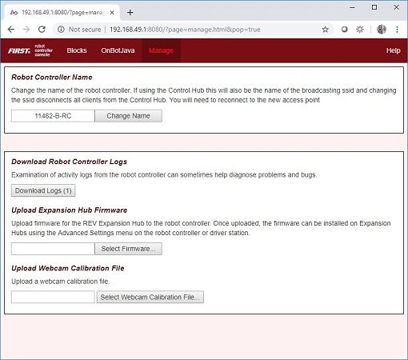

|

   If your laptop or Chromebook is not connected and you are unable to access the *Robot Controller Connection Info* page, then read the instructions in the following tutorial to learn how to connect to the Program & Manage network.

   :doc:`Connecting a laptop to the Program & Manage Network <../program_and_manage_network/Connecting-a-Laptop-to-the-Program-&-Manage-Network>`

2. Click on the *Manage* link towards the top of the *Robot 
Controller Connection Info* page to navigate to the Manage page.

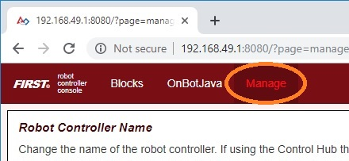

|

3. Click the *Download Logs* button to download the Robot Controller
log file.

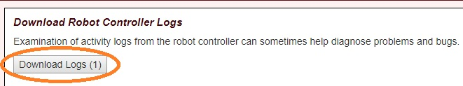

|

4. Verify that the Robot Controller log file was downloaded to the
Downloads directory of your computer.

5. Use a text editor such as
`Notepad++ <https://notepad-plus-plus.org/>`__ or Microsoft's WordPad
to open and view the contents of the log file. Note that the Windows
app, Notepad, will not properly display the contents of the log file.

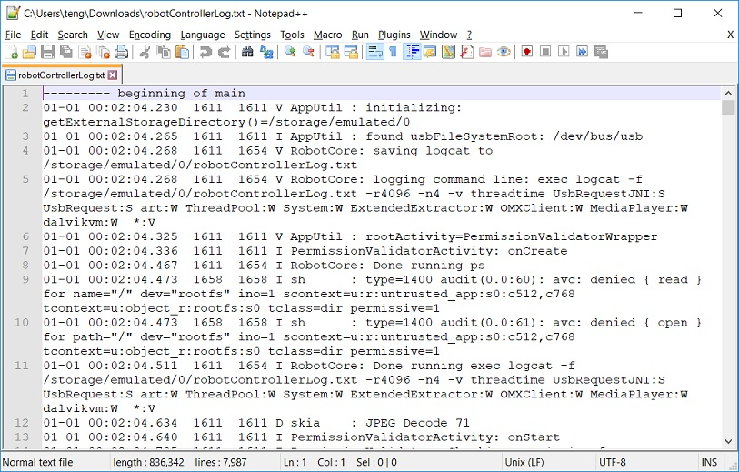

|

Updating the Expansion Hub Firmware
~~~~~~~~~~~~~~~~~~~~~~~~~~~~~~~~~~~

A Robot Controller phone connects to a standalone REV Robotics Expansion
Hub using a USB connection. The purpose of the Expansion Hub is to
facilitate communication between the Robot Controller and the motors,
servos, and sensors of the robot. Periodically, REV Robotics may release
new versions of the firmware which contains fixes and improvements for
the Expansion Hub. The firmware releases are in the form of a binary
(".bin") file.

The `REV Hardware Client <https://docs.revrobotics.com/rev-hardware-client/>`__
software can update the firmware of an Expansion Hub plugged directly
into the computer via USB cable.

As an alternate, you can use the *Manage* interface from a laptop or
Driver Station (DS) connected to a Robot Controller phone with Expansion
Hub plugged in via USB. The Manage page allows you to upload an
Expansion Hub's firmware, or to update it using the included or uploaded
version. New firmware images can be obtained from the 
`REV Robotics website <https://www.revrobotics.com/software/>`__.

Also, included or uploaded Expansion Hub firmware can be updated in
Robot Controller Advanced Settings, from a paired Driver Station (DS)
app as shown below.

These three update methods do not apply to an Expansion Hub connected
via RS485 data wire. Standalone Expansion Hubs must be updated by direct
USB plug-in.

Updating the Expansion Hub Firmware Instructions
------------------------------------------------

1. On the *Manage* page of the Robot Controller user interface, press 
the *Select Firmware* button to to select the firmware file that you  
would like to upload.                                                 

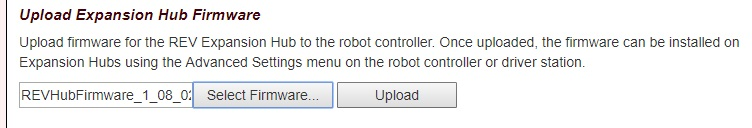

|

   An _Upload_ button should appear after you successfully selected a file.

2. Press the *Upload* button to upload the firmware file from your    
computer to the Robot Controller.                                     

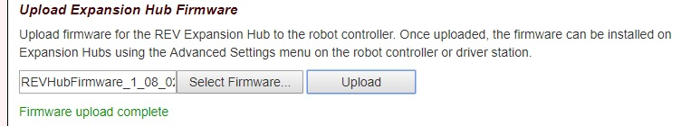

|

   The words "Firmware upload complete" should appear once the file has been uploaded successfully.

3. Make sure that your Expansion Hub is turned on and powered by a    
freshly charged 12V battery and that the Robot Controller phone is    
connected to the Expansion Hub through a USB connection. Note that    
the Robot Controller does **not** need to have the Expansion Hub      
included in an active configuration file in order for the update to   
work.                                                                 

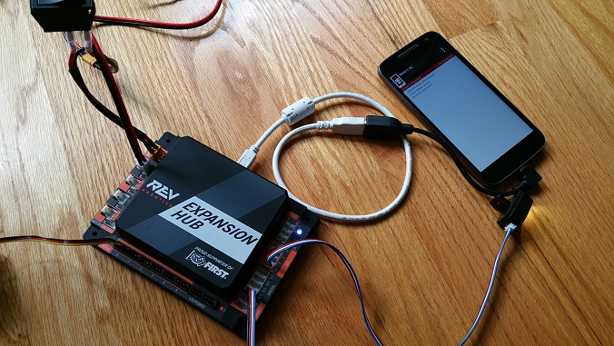

|

4. On the Driver Station, touch the three dots in the upper right     
hand corner to display a pop-up menu.                                 

|

5. Select *Settings* from the pop-up menu to display the Settings     
activity.                                                             

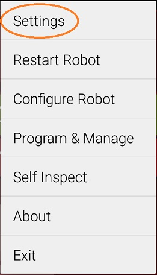

|

6. On the Driver Station, scroll down and select the *Advanced        
Settings* item (under the *ROBOT CONTROLLER SETTINGS* category).      

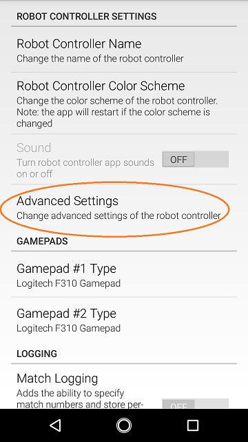

|

7. Select the *Expansion Hub Firmware Update* item on the *ADVANCED   
ROBOT CONTROLLER SETTINGS* activity.                                  

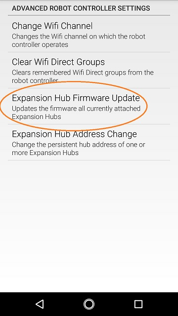

|

8. If a firmware file that is different from the version currently    
installed on the Expansion Hub was successfully uploaded, the Driver  
Station should display some information about the current firmware    
version and the new firmware version. Press the *Update Expansion Hub 
Firmware* button to start the update process.                         

.. image:: images/pressUpdateExpansionHubFirmwareButton.jpg
   :align: center

|

9. A progress bar will display while the firmware is being updated.   
Do not power off the Robot Controller/Expansion Hub during this       
process. The Driver Station will display a message when the update    
process is complete.                                                  

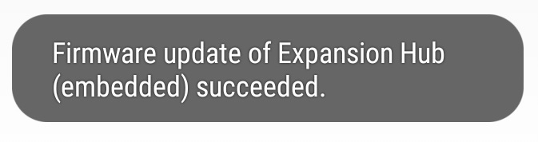

|

Updating the Robot Controller App
~~~~~~~~~~~~~~~~~~~~~~~~~~~~~~~~~

It is important to know how to update the Robot Controller app that is
installed on your smartphone. FIRST periodically releases new versions
of this app, which contain improvements and fixes, as well as
season-specific data and features.

Note that you can see the Robot Controller app version number through
the Robot Controller or Driver Station user interface. Select the
*About* menu option on the Robot Controller or Driver Station and note
the App Version number under the *ABOUT ROBOT CONTROLLER* section.

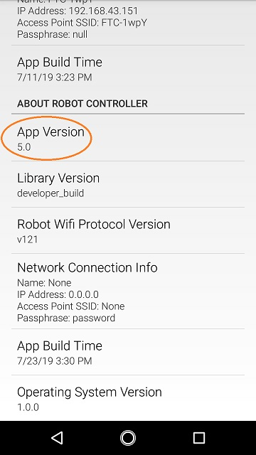

|

As of 2021, the apps (v 6.1 and higher) are no longer available on Google
Play.

The `REV Hardware Client software <https://docs.revrobotics.com/rev-hardware-client/>`__
will allow you to download the apps to approved devices: REV Control Hub, REV
Expansion Hub, REV Driver Hub, and approved Android devices. Here
are some of the benefits: 

*  Connect a REV Control Hub via WiFi. 
*  One Click update of all software on connected devices. 
*  Pre-download software updates without a connected device. 
*  Back up and restore user data from Control Hub. 
*  Install and switch between DS and RC applications on Android Devices. 
*  Access the Robot Control Console on the Control Hub.

Teams using Blocks or OnBot Java for programming can use the REV
Hardware Client to update the Robot Controller (RC) app on an RC phone.

Note it will take an estimated 7.5 minutes per device to complete this
task.

As an alternate, the app releases are available on the
`FTCRobotController
Github <https://github.com/FIRST-Tech-Challenge/FtcRobotController/releases>`__.
Download the Robot Controller APK file to a computer, transfer it to the
RC phone's Downloads folder, then open that file to install the RC app.
This process is called "side-loading".

.. tip:: If you update the Robot Controller (RC) app, you
   should also update the Driver Station (DS) app to the same version
   number.

.. important:: Teams using Android Studio should not update the RC
   app with the REV Hardware Client or by side-loading. Instead, by
   updating to the newest version of the Android Studio project folder,
   you will update the Robot Controller app when you build the project and
   install it on your RC device. You can download the newest version of the
   project folder
   `here <https://github.com/FIRST-Tech-Challenge/FtcRobotController>`__.

Uploading a Custom Webcam Calibration File
~~~~~~~~~~~~~~~~~~~~~~~~~~~~~~~~~~~~~~~~~~

The Robot Controller app has built-in calibration information for a
variety of commonly available webcams. Users can also create their own
custom calibration files and then upload these files to a Control Hub.

A commented example of what the contents of a calibration file should
look like can be found in a file called *teamwebcamcalibrations.xml*,
which is included with the Android Studio project folder. 
This example calibration file can be found
`here <https://github.com/FIRST-Tech-Challenge/FtcRobotController/blob/master/TeamCode/src/main/res/xml/teamwebcamcalibrations.xml>`__.

Uploading a Custom Webcam Calibration File Instructions
-------------------------------------------------------

1. On the *Manage* page, click on the *Select Webcam Calibration File* button to select the calibration file.

.. image:: images/selectWebcamCalibrationFile.jpg
   :align: center

|

   An *Upload* button should appear if a file was successfully selected.

2. Click on the *Upload* button to upload the selected file. If the upload was successful, then the *Manage* page will display a message indicating that the upload has completed.

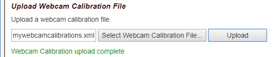

|
