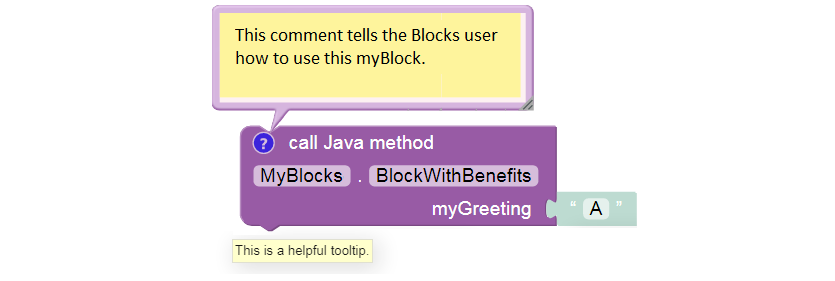

Annotation Details
==================

The required **annotation** ``@ExportToBlocks`` has optional fields,
which may be listed in any order. These fields allow a myBlock to have a
custom **comment**, **tooltip**, and **parameter labels**.

Comment
~~~~~~~

-  The **comment** text appears in a balloon when the Blocks user clicks
   the blue question-mark icon. Tell the user **how to use your
   myBlock**.
-  Must be entered on a **single line**, with no ‘line breaks’. This
   requirement can be met by **joining text strings**; an example is
   :ref:`here <programming_resources/shared/myblocks/hardware_example/hardware-example:hardware example: control a servo>`.
-  The blue icon will appear only if a custom comment is specified. The
   Blocks user can add and remove the blue icon, and can edit its text
   in the (re-sizeable) balloon.

Tooltip
~~~~~~~

-  A **tooltip** appears with a **mouseover**: hovering the mouse cursor
   over an image or icon. Every Block has a short tooltip to **indicate
   its purpose**.
-  Must be entered on a **single line**, with no line breaks.
-  If a custom tooltip is not specified, the default tooltip will name
   the method, its enclosing class, and return type.
-  Another tooltip, for the grey input socket (at right), is
   auto-generated based on parameter type.

Parameter Labels
~~~~~~~~~~~~~~~~

-  The **parameterLabels** text appears on the myBlock, each next to its
   grey input **socket**.
-  Multiple labels are separated by a comma. Line breaks may be used
   between labels.
-  For a single parameter, this also works:
   ``parameterLabels = "sampleParameter"``.

In the Hello World example, you may have noticed that the parameter
label **Recipient** was not the same as the Java input parameter name
**greetingRecipient**. They don’t need to be the same. One is for the
Blocks user, the other is for the Java programmer. Just list them in the
correct/same order, so their meanings correspond.

In fact you don’t need to label every input; a default label will
instead show the declared type (e.g. String, boolean, int, double,
etc.). In any case each grey socket will contain a sample of the
required type (e.g. A, false, 0), with an appropriate tooltip.

If the number of parameter labels does not match the actual number of
Java parameters, **all** custom label will be ignored. Instead the
default labels will be displayed.

A myBlock may have up to 21 parameters… not recommended! Keep things
simple.

Again, the annotation ``@ExportToBlocks`` **must** appear immediately
before each myBlock method, even if not using the optional fields.

Two more optional annotation labels, not illustrated here, are:

-  ``heading``, such as “My Amazing myBlock”. The default heading is
   “call Java method”.
-  ``color``, without quotes, just a color number (hue). For example 155
   is green, 255 is blue. Default is 289. Check it out!