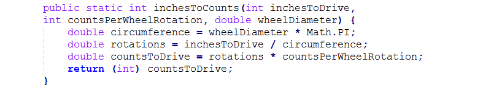
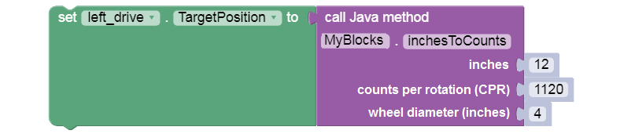

Driving Example
===============

Here is the Java code (method only) for converting an **inches of
driving** target into an **encoder counts** target. The conversion
depends on the drive motors’ counts-per-rotation (CPR), and the diameter
of the drive wheels. This example assumes 1:1 gear ratio between the
motor and wheel.

This method takes three inputs from the Blocks user, and **returns** one
output (of type ``int`` or integer) to the regular Block that **calls**
the myBlock.

.. tip:: Notice the calculation uses the variable or
      **constant** named PI, from the inherited class Math. This holds the
      fixed numeric value 3.14159….

Here is an example of typical usage.

.. tip:: Notice the ``(int)`` operator at the ``return``
      command. This converts or **casts** the countsToDrive variable of
      type ``double`` to type ``int``, to be compatible with the required
      **return type**. Learn more about **type casting**
      `here <https://www.w3schools.com/java/java_type_casting.asp>`__ or
      `here <https://www.geeksforgeeks.org/type-conversion-java-examples/>`__.

As programmer, you could modify this example in many ways, such as: -
handle a **gear ratio** between the drive motors and wheels - the second
and third parameters could be **‘hard-coded’** into the myBlock, if they
will never change - those 2 variables could be initialized in a
**non-myBlock method** and used by multiple myBlock methods in that same
Java class
