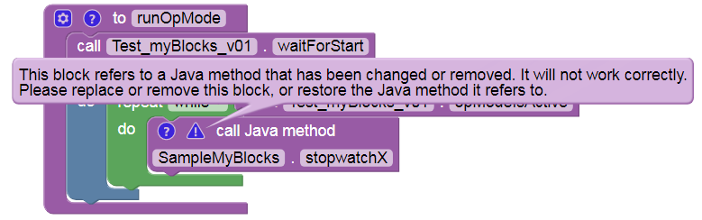

Editing a myBlock
=================

If you edit and re-Build a myBlock’s Java code, you might need to
**replace** that myBlock in the Blocks OpMode. It depends on whether you
change the myBlock’s visible or external features: annotation fields,
input parameters or returned outputs.

If your Java change does affect external features, its updated myBlock
is available only from the Java Classes menu in Blocks. Any such myBlock
**already placed in an OpMode** is obsolete and may generate a **Blocks
warning**; replace it with the new myBlock. In some cases you may need
to re-open the OpMode from the top-level Blocks listing.

If your edit affects only the myBlock’s **internal** processing, it
might update automatically after “Build Everything”, without needing a
fresh replacement from the Java Classes menu. In some cases you might
not even need to click Save OpMode in the Blocks screen – you could
simply re-run the OpMode on the Driver Station with INIT and Start. This
can allow very fast testing of minor/internal changes to the myBlock.

In any case, consider adding **versions** to your myBlock names, such as
myGreeting_v01. Copy and paste before editing, to keep all related
myBlock methods in the **same Java class**. In Blocks, all uniquely
named versions will be available in the Java Classes menu, under that
single class name.

Keep the class name **short and generic**, such as MyBlocks,
SampleMyBlocks, Team8604MyBlocks, DrivingMyBlocks, etc. It will contain
all or many related myBlocks, not just one myBlock per the simple
examples above.

In that single class, each myBlock method must appear after its own
annotation ``@ExportToBlocks``. That class may contain other methods
that are not myBlocks; omit the annotation before any non-myBlock
methods. Such methods might be used to initialize variables, or might be
(shared) submethods called by one or more myBlocks. An example is shown
:ref:`here <programming_resources/shared/myblocks/method_example/method-example:example: non-myblock methods>`.

This tutorial has covered these basic requirements so far: -
create/store in **org.firstinspires.ftc.teamcode** folder/package -
class **extends BlocksOpModeCompanion** - each myBlock method needs
annotation **@ExportToBlocks** - method must be **public** and
**static** (must not be abstract) - replace myBlocks after external
edits

The rest of this tutorial gives **examples** that you can **re-type in
OnBot Java** and **test in Blocks**. Try making changes and adding
features!