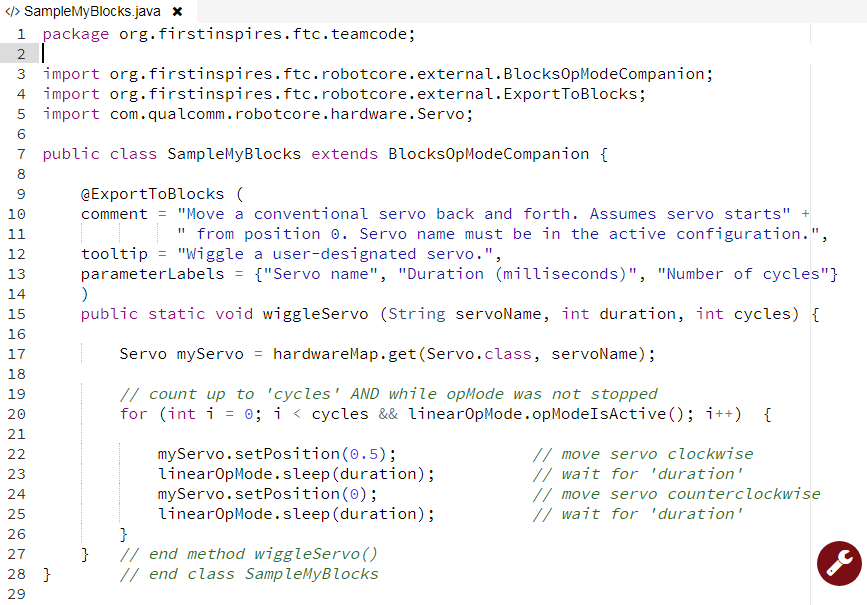
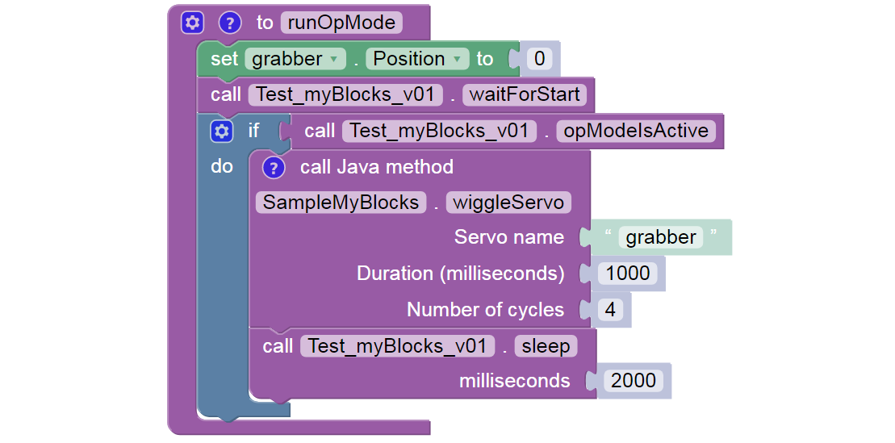

Hardware Example: control a servo
=================================

Here’s a very simple example to illustrate how a myBlock can access the
**robot hardware**. Here, the Blocks user enters the servo’s name as a
**parameter** of the myBlock.

.. dropdown:: Example Code

   :download:`SampleMyBlocks_v01.java <opmodes/SampleMyBlocks_v01.java>`

   .. literalinclude:: opmodes/SampleMyBlocks_v01.java
      :language: java

Lines 10-11 contain two strings of text (each in quotes), joined with a
**“+”** character to form a **single text string**. This is an alternate
way to meet the requirement that a comment field must be a **single
line** of text, with no ‘line break’. Shorter strings allow all the text
to be visible on-screen, without scrolling sideways.

Line 15: this method has 3 inputs and no outputs (keyword **void**).

Line 17 shows how to access **hardwareMap**, the configured devices list
provided from BlocksOpModeCompanion. That single line of Java does this:
- declare a new variable called myServo, of type (class) Servo - **get**
the properties (methods and variables) of the named servo from
hardwareMap - assign those properties to the new variable myServo

Line 20 is a **for loop**, which you can learn about
`here <https://www.w3schools.com/java/java_for_loop.asp>`__ or
`here <https://docs.oracle.com/javase/tutorial/java/nutsandbolts/for.html>`__.
It runs the specified servo back and forth, using the specified duration
and number of cycles. This **for loop** has the added condition
``opModeIsActive()``, to monitor and verify the OpMode has not been
stopped.

Lines 22 and 24: the object myServo uses a method ``setPosition()`` from
the Servo class.

Lines 23 and 25: the object linearOpMode uses a method ``sleep()`` from
the class inherited from BlocksOpModeCompanion.

The Blocks user must enter the exact device name from the **active
configuration**. Hardware device names (motors, servos, sensors) are
found in the Configure Robot menu of the RC app or paired DS app. Or, it
might be easier to retype the name from any Blocks drop-down list
containing those device types. For example, a green Servo
``set .Position`` Block will display all configured servo names – make
sure the correct configuration was made active **before** entering the
Blocks session.

.. image:: images/a0310-wiggle-myBlock.png

As an alternate, you could ‘hard-code’ the servo’s name directly into
the Java method, instead of the Blocks user entering the servo name as a
parameter.

PROs of hard-coding: - myBlock is simpler - Blocks user doesn’t need to
know or enter the servo name

CONs of hard-coding: - you need to know the exact servo name in advance
- if the name ever changes, your myBlock cannot find the servo

.. note:: As a programmer, you will constantly face choices like this,
      with pros and cons. This is part of software design, a key
      professional skill and career path.

A **different version** (gamepad-controlled, fully commented) of the
above Java program is provided below.
It illustrates using 5 of the 6 objects provided by
BlocksOpModeCompanion, including **telemetry** and the **gamepads**.
This longer example, or the short version above, could be used in an
OpMode like this:

The final ``.sleep`` Block allows any telemetry to remain visible on the
DS screen, before this sample OpMode ends.

.. dropdown:: Different Version of Example Code

   :download:`SampleMyBlocks_v02.java <opmodes/SampleMyBlocks_v02.java>`

   .. literalinclude:: opmodes/SampleMyBlocks_v02.java
      :language: java