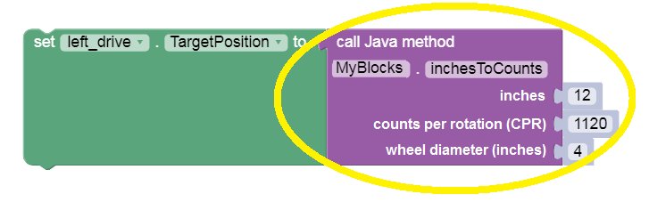

Introduction
============

This tutorial shows how to make **custom Blocks**, to be used in
regular Blocks programs. These **“myBlocks”** are programmed in Java,
with OnBot Java or Android Studio.

    
    sample myBlock: operate a servo, no value
    returned

A myBlock can add **advanced capability** previously available only to
teams using all-Java code. Or, a single myBlock can serve as a
**‘super-Function’**, containing robot instructions that previously
needed many regular Blocks. Now your team’s Blocks code can be more
powerful, and simpler!

    sample myBlock: return encoder target value based on inputs

Also, myBlocks programming allows some team members to begin learning
and using Java, contributing valuable new features. The other team
members can continue learning and working in Blocks, producing the
team’s official code. Nobody is held back, or left behind.

Hats off to Google engineer `Liz
Looney <https://github.com/lizlooney>`__ for this major development!

Notes on Java
~~~~~~~~~~~~~

-  This tutorial builds myBlocks with :ref:`OnBot Java <programming_resources/onbot_java/onbot-java-tutorial:onbot java programming tutorial>`,
   a programming tool running on the Control Hub or Robot Controller
   (RC) phone. Students already using :ref:`Android
   Studio <programming_resources/android_studio_java/android-studio-tutorial:android studio programming tutorial>`
   can easily follow the same programming.
-  This tutorial does not teach
   `Java <https://en.wikipedia.org/wiki/Java_(programming_language)>`__
   or OnBot Java (OBJ), beyond the bare minimum needed for basic
   myBlocks.
