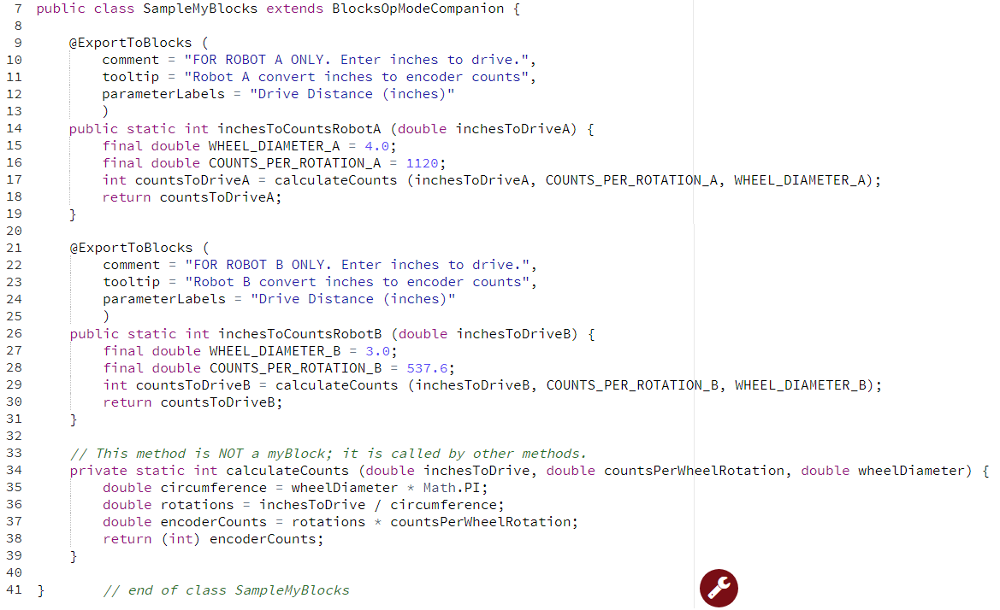
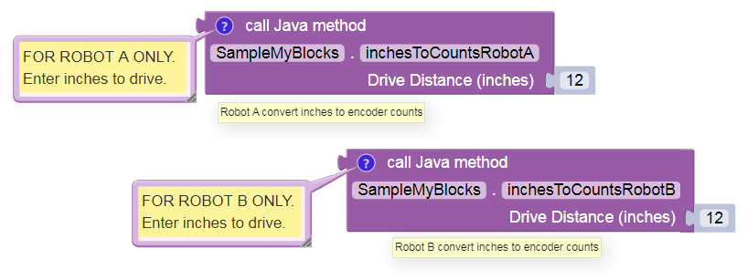

Example: non-myBlock methods
============================

Your Java class may also contain methods that are not myBlocks. Consider
this if you have multiple myBlocks that perform a shared internal
process or calculation. This is a good programming practice in general,
not specifically related to myBlocks.

To illustrate, consider the Driving Example above. Imagine you want to
create myBlocks to support **two** different robots. - Robot A has
**4-inch** drive wheels with AndyMark **NeveRest 40** motors. - Robot B
has **3-inch** drive wheels with NeveRest **Orbital 20** motors. - You
want the myBlocks to be **very simple** for your Blocks programming
teammates.

Your solution: - One MyBlock per robot. - Each Blocks user needs to
specify only the distance to drive, in inches. - Each myBlock uses the
appropriate wheel size and motor encoder CPR. - The myBlocks share a
‘utility’ method to convert distance to encoder counts.

Line 34 shows the shared method that is **not** a myBlock. Simply omit
the annotation @ExportToBlocks. The keyword ``private`` means the method
can be called only from inside the same class. Use this whenever
possible.

Lines 17 and 29 call the shared method. The method calls provide 3
parameters, which do not have the same **names** as the input parameters
of the ‘utility’ method – but their types should match.

At line 38, **(int)** converts, or **casts**, a decimal number to
integer type. This is called **type casting**. Programmers must pay
close attention to compatible data types. For example, a DC motor
``set .TargetPosition`` Block should be given an encoder value as a
simple integer, not a decimal number.

At line 15 and others, the keyword ``final`` indicates a Java
**constant**: a variable that cannot change value. Java constants are
traditionally ALL CAPS. Can you find the Math constant in this program?

Here are the Robot A and Robot B myBlocks, each with its **comment**
balloon and **tooltip**. Very simple, as you wanted!

.. note:: This tutorial intends for you to **manually type** the Java
      code above. If you require pre-typed text of this example, click
      `here <https://github.com/FIRST-Tech-Challenge/WikiSupport/blob/master/SampleOpModes/Custom-FTC-Blocks-(myBlocks)/SampleMyBlocks_v04.java>`__.
      The linked copy includes a proper/full amount of Java commenting,
      omitted above to focus on the Java code. Also not shown are the
      package and import statements.

.. dropdown:: Example Code

   :download:`SampleMyBlocks_v04.java <opmodes/SampleMyBlocks_v04.java>`

   .. literalinclude:: opmodes/SampleMyBlocks_v04.java
      :language: java