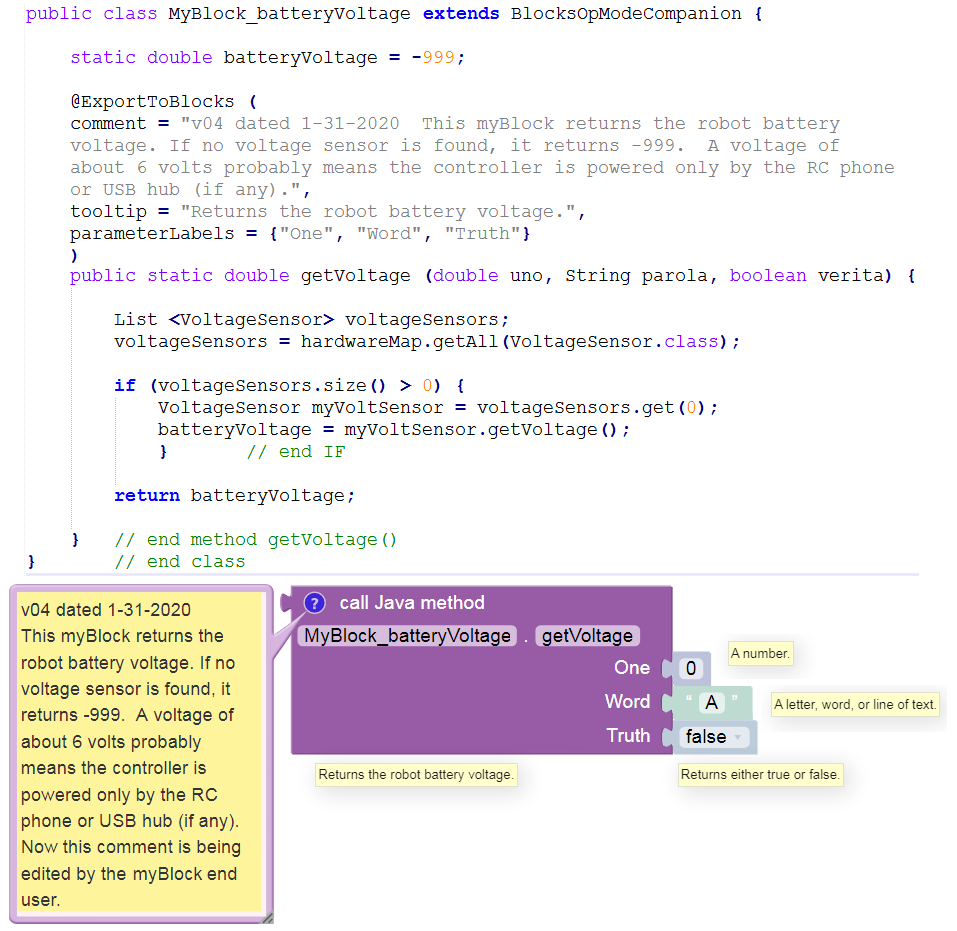

More about Parameter Types
==========================

Do not type or run the following myBlock example. Its dummy inputs
simply illustrate various **parameter types**. This myBlock does
correctly read the robot battery voltage, but Blocks now offers a
**VoltageSensor** Block in the **Sensors** menu.

Notice that the Java **parameters** ``uno``, ``parola`` and ``verita``
have **myBlock labels** ``One``, ``Word`` and ``Truth``. They are
allowed to be different.

The **comment** field explains this myBlock to the Blocks user, who can
edit or delete the comment. Only for display here, this sample text
appears on multiple lines; normally it must be typed as a single line of
text or as joined quotes (example
:ref:`here <programming_resources/shared/myblocks/hardware_example/hardware-example:hardware example: control a servo>`).

A myBlock **tooltip** should be brief. Note: the four tooltips don’t all
appear at the same time; each appears with a mouseover. One is custom,
three are auto-generated based on input type.

Each input socket shows a default value of its parameter type, with a
corresponding tooltip. As shown in the method signature, parameter
``uno`` is Java type ``double`` (a number), ``parola`` is type
``String`` (text), and ``verita`` is type ``boolean`` (true or false).

   Programming tip: unlike primitive types, Strings must be compared
   with ``Object.equals()`` rather than ``==``. That’s because a
   **text** parameter is actually an object or instance of the String
   class, which has its own methods equivalent to basic Java operators
   like ``==``, ``>``, ``<``, etc.

..

   Programming tip: In this example, the variable ``batteryVoltage`` is
   declared and initialized **outside** the method, and thus could be
   used by other methods in this class.

Some final notes about **parameter types**: - If your myBlock method
uses a parameter declared as type ``boolean`` or ``java.lang.Boolean``,
the myBlock’s input socket will accept any Block that returns (supplies)
a Boolean value. - For method parameters declared as ``float``,
``java.lang.Float``, ``double``, or ``java.lang.Double``, the myBlock
will accept any input Block that returns a number. - For method
parameters declared as ``byte``, ``java.lang.Byte``, ``short``,
``java.lang.Short``, ``int``, ``java.lang.Integer``, ``long``, or
``java.lang.Long``, the myBlock will accept any input Block that returns
a number and will round that value to the nearest whole number. - If
your myBlock method uses a parameter with only **one text character**,
you may use (instead of type ``String``) type ``char`` or
``java.lang.Character``. In that case, the myBlock’s input socket will
accept any Block that returns text and will use **only the first
character** in the text string.
