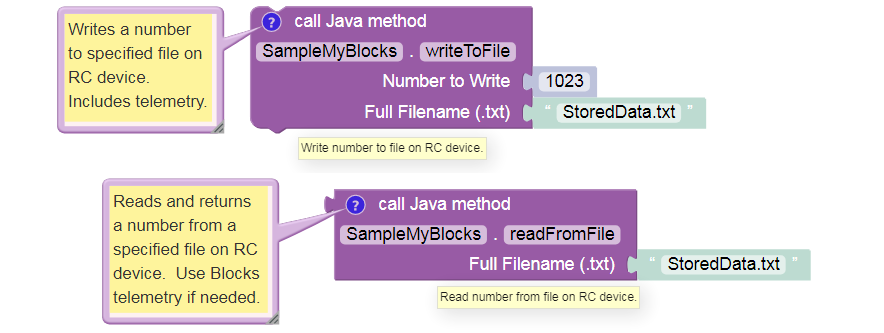
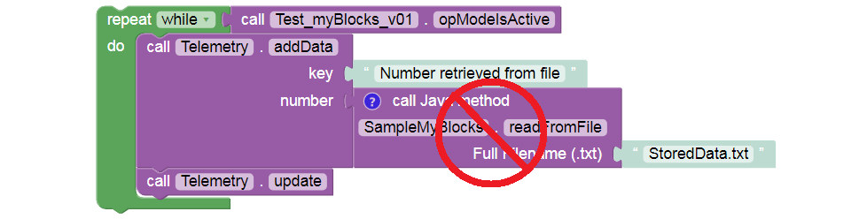
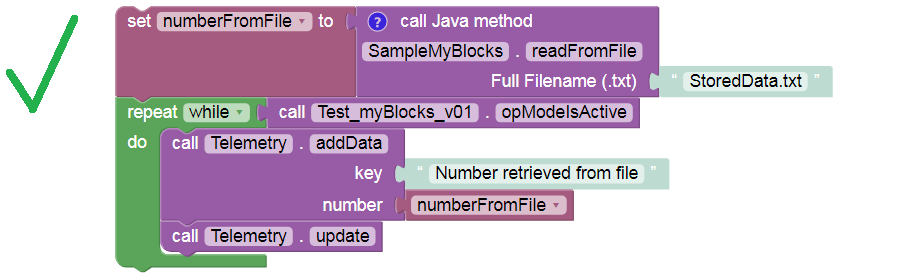

Example: Read-Write File Access
===============================

The current version of regular Blocks (SDK 7.0) does not provide
**read/write access to an external file**, other than automatic Log or
Match Log file entries. File access is a useful capability, available so
far to Java programmers only. Now it can be done with myBlocks!

Here’s an example pair of myBlocks. One myBlock **writes** a numeric
value to a specified filename, and a companion myBlock can later
**read** that value from the same file.

The file is stored on the Control Hub or RC phone, in the FIRST/settings
folder. It exists separately from the RC app, OpModes, and other 
files.

Write and read actions can happen in the same OpMode or **different
OpModes**, allowing various scenarios:

-  Autonomous passes information to TeleOp. For example, what was the
   latest value of a sensor or encoder?

-  A special **set-up OpMode** allows gamepad input to choose an
   autonomous strategy and adjust key parameters. The robot could then
   be idle for a long time, even turned off. When the match begins, the
   Autonomous OpMode would read those settings and implement the
   chosen/adjusted actions.

-  A **dedicated log file** reports key sensor data in a custom format,
   with optional time-stamps. For program development and debugging,
   this could be more efficient than working with the large standard
   logs or Match Logs.

The Java code for this example is available
below, with **extensive comments** that explain some unfamiliar Java
expressions. The code can be copied and pasted directly into OnBot Java
or Android Studio.

   Programming tip: Instead of memorizing every possible Java command,
   programmers often study and modify existing code for a similar task.
   Unfamiliar commands are explored with an internet search, reference
   book, at the `Javadoc
   reference <https://javadoc.io/doc/org.firstinspires.ftc>`__, or at
   the official `Oracle
   Javadoc <https://docs.oracle.com/javase/7/docs/api/>`__.

This simple example supports only a single numeric value per filename.
Better versions would allow multiple values and data types – a good
programming challenge!

Be careful about placing **myBlocks inside loops**. Expanding on the
current example, your myBlock might read a larger amount of (unchanging)
data from a file. If your OpMode needs that data only once, reading the
file in a loop needlessly adds cycle time and might increase the risk of
a corrupt or interrupted read operation.

Instead, read the file once and store the relevant data in a variable or
array. Then process the variable as needed, inside the loop.

The same suggestion might apply to reading sensors and encoders, if the
data are not changing and are needed only once.

.. dropdown:: Example Code

   :download:`SampleMyBlocks_v05.java <opmodes/SampleMyBlocks_v05.java>`

   .. literalinclude:: opmodes/SampleMyBlocks_v05.java
      :language: java
