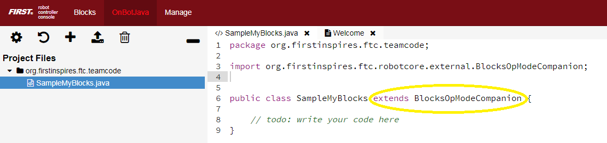

Simple Example: create myGreeting
=================================

Start with a simple myBlock that creates a greeting “Hello World” (of
course!).

Open a Chrome browser connected via Wi-Fi to a Control Hub or RC phone.
Go to the address **http://192.168.43.1:8080** (CH) or
**http://192.168.49.1:8080** (RC), and click the **OnBot Java** tab.

.. note:: A computer can usually connect to only one Wi-Fi network at a
   time. To follow this tutorial while programming please use the PDF version 
   of FTC Docs. If you need internet and programming together,
   connect an Ethernet cable to an internet router **or** try adding a
   USB Wi-Fi dongle.

Click the large **plus-sign icon** to open a new file; call it
**SampleMyBlocks.java**. Use the default ‘teamcode’ folder location.
Don’t choose a Sample OpMode, and use the default setting ‘Not an
OpMode’. Click OK.

.. image:: images/a0120-Hello-OBJ-circle.png

In the work area you see a simple/empty Java program.

.. image:: images/a0130-Hello-OBJ-empty.png

Line 1 shows the default storage folder ‘teamcode’, and Line 4 shows the
**class name**, same as the filename. It’s ``public`` so other classes
can access it. Notice the **left curly brace** at Line 4 and **right
curly brace** at Line 7. Place all your code between these curly braces.

The two forward-slash marks **//** indicate a **comment line**, all
ignored by the Java software. Good programmers use lots of comments, to
communicate with your teammates and with **your future self**! You
will not remember every little detail of your programs… and will thank
yourself later for commenting heavily!

   Programming note: A **class** describes **methods** (actions) and
   **fields** (properties) that can be used by **objects** (examples or
   **instances** of the class). A class called ‘dogs’ might contain
   methods ‘run’ and ‘sleep’, and fields ‘friendliness’ and ‘appetite’.
   Your pets Spot and Rover would be objects or instances of the ‘dogs’
   class.

After the class name, type ``extends BlocksOpModeCompanion``. This
declares your new class as a **subclass** or **child** of a higher
**superclass** or **parent**. The parent class BlocksOpModeCompanion
contains useful tools to be **inherited** by your new subclass.

When you enter that line, the OBJ software **automatically** creates an
``import`` statement, making the parent class available. Convenient!

   Programming note: classes inherited from BlocksOpModeCompanion
   include OpMode, LinearOpMode, Telemetry, HardwareMap, and Gamepad.
   All very useful! Your myBlock method can directly use **objects** or
   **instances** of these classes without declaring them. Examples
   follow below.

Inside the curly braces, type new lines as follows:

.. code:: java

   @ExportToBlocks (
          comment = "Here is a greeting for you.",
          tooltip = "Greet a person or group.",
          parameterLabels = {"Recipient"}
   )

These are optional labels to appear on your new myBlock; you’ll see
below. Even if you don’t want to use any of these features, you still
need the **annotation** line ``@ExportToBlocks``.

When you typed that annotation, OBJ automatically added the ``import``
statement.

Now you’re ready to create the method, namely your first myBlock. Type
the following lines:

.. code:: java

   public static String myGreeting (String greetingRecipient)  {
          return ("Hello " + greetingRecipient + "!");
   }

The method’s name is ``myGreeting``. It is a ``public`` method, so it
can be used or **called** from other classes. And it’s a ``static``
method, required for all myBlock methods.

The first usage of the word ``String`` indicates the method gives or
**returns** one **output** of type String or text. The second usage is
inside the parentheses, indicating the method takes one **input** named
``greetingRecipient``, also of type String.

   Programming note: the method’s name and list of parameters (inside
   the parentheses) is together called the **method signature**.

The method contains only one line of instruction, on Line 15: **three
text items are joined to form a single text string**. The middle text
item is the input parameter greetingRecipient, to be entered by the
Blocks user. The longer combined string is returned to the program that
called this method. Namely, the combined string is provided to the Block
that uses your new myBlock.

That’s it for the Java! Click the wrench icon to **Build Everything**
including your new class. If there are error messages, read carefully
and fix any mistakes. When you see “Build Successful!”, your new myBlock
is ready to use.

.. dropdown:: Example Code

   :download:`SampleMyBlocks_v00.java <opmodes/SampleMyBlocks_v00.java>`

   .. literalinclude:: opmodes/SampleMyBlocks_v00.java
      :language: java

Simple Example: run myGreeting
==============================

In the browser still connected to the RC phone or Control Hub, - click
the **Blocks** tab - click **Create New OpMode**, name it
**Test_myBlocks_v01** - use the default Sample, called **BasicOpMode** -
click **OK**

.. image:: images/a0160-Hello-run-create-arrow.png

You will now see a new menu choice at the bottom, called **Java
Classes**. Open that, to see the class you created, called
SampleMyBlocks. Click that, and drag your new myBlock out to the work
area.

.. image:: images/a0170-Hello-run-menu-arrows.png

This myBlock has one grey input field or **socket**, containing the
letter A to indicate a String or text input. Type the greeting
recipient, **World**.

To display the myBlock’s String or text output, look under **Utilities**
for the **Telemetry** menu. Drag out the **Telemetry.addData** Block
that **displays text** (not numbers).

In the ``key`` socket, type ``A greeting for you``. At the
``text`` socket, drag and connect your new myBlock. The myBlock’s
**text output** will be read and displayed by the **text** version of
the Telemetry.addData Block.

.. image:: images/a0180-Hello-run-telemetry-circle.png

Place these Blocks in the **repeat while** (loop) section of your
OpMode, before **Telemetry.update**. Click **Save OpMode**.

.. image:: images/a0190-Hello-run-OpMode-circle.png

On a connected Driver Station device, select this OpMode called
Test_myBlocks_v01, touch **INIT** and the **Start Arrow**. Look at the
Driver Station (DS) screen to see the traditional greeting for new
programmers.

\ **Congratulations!** You are now an OnBot Java programmer and myBlocks
creator.

   For extra fun: try the **Telemetry.speak** Block, followed by a 1500
   millisecond ``.sleep`` Block. You can learn more about DS spoken
   telemetry at `this separate
   tutorial <https://github.com/FIRST-Tech-Challenge/FtcRobotController/wiki/Driver-Station-Speech-Telemetry>`__.

This tutorial has three more sections with myBlocks guidelines, followed
by **six examples** for you to re-type in OnBot Java and test in Blocks.
Enjoy!
