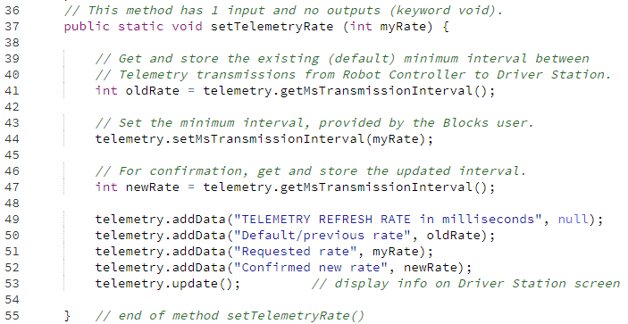

Example: Modify Telemetry Settings
==================================

Telemetry messages are sent from the Robot Controller to the Driver
Station up to **four time per second**, by default. This maximum refresh
rate can be changed with Android Studio or OnBot Java, but **not** with
regular Blocks. Now a myBlock can provide that capability too!

This simple example allows a Blocks user to change the standard time
interval from 250 milliseconds to any other interval.

.. image:: images/a0600-Telemetry-interval.png

A lower time interval can allow faster update of sensor or encoder data.
A higher interval can ease the RC-DS communication bandwidth load.

Here’s the Java code for the method only:

.. note:: This tutorial intends for you to **manually type** the Java
      code above. If you require pre-typed text of this example, click
      below. The linked copy includes the usual class declaration and 
      package/import statements.

.. dropdown:: Example Code

   :download:`W_myBlocks.java <opmodes/W_myBlocks.java>`

   .. literalinclude:: opmodes/W_myBlocks.java
      :language: java

Want to verify this actually works? Another, slightly more advanced
myBlock allows measuring the time between Telemetry updates; it’s posted below.
That myBlock can be used in a Blocks program like
the one attatched below; download the raw **.blk file** and click 
the **Upload Op Mode** button at the main Blocks menu. Read all 
comments and instructions.

.. dropdown:: Example Code

   :download:`W_myBlocks_Telemetry_v02.java <opmodes/W_myBlocks_Telemetry_v02.java>`

   :download:`W_Telemetry_myBlocks_v02.blk <opmodes/W_Telemetry_myBlocks_v02.blk>`

   .. literalinclude:: opmodes/W_myBlocks_Telemetry_v02.java
      :language: java