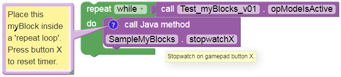

Timer Example
=============

FTC **timers** offer much more capability than the familiar ``.sleep``
Block. Java programmers can learn about timers from `this Blocks
tutorial <https://github.com/FIRST-Tech-Challenge/FtcRobotController/wiki/Timers-in-FTC-Blocks>`__;
you can easily apply its lessons to Java programs.

When creating myBlocks, be careful when converting or ‘packaging’ a
section of existing Java code into a myBlock method. As a programmer,
you must consider **where** your myBlock might be placed in the OpMode.
For example, if the myBlock is placed inside a **repeat while loop**,
the Java method will be called many times – this may or may not be what
you intended. Use the annotation **comment** to tell the Blocks user how
your myBlock should be run, including looping (or not).

A particular caution with timers: creating or **instantiating** a new
FTC timer also starts or **resets** that timer. If a timer is created
inside a myBlock that’s used in a Blocks **repeat loop**, that timer
will constantly reset and never advance to the intended time limit.

The following example separates the **create timer** task from the
**reset timer** task.

.. image:: images/a0440-Timer-Java.png

Line 15: this single line of Java does all this: - declare a field
called myStopwatch, of type (class) ElapsedTime - the field is
**private**, can be used only in this class SampleMyBlocks - the field
is **static**, can be used in static methods such as myBlocks - call the
**constructor** method ElapsedTime() to **instantiate** a **new**
ElapsedTime instance - assign that **instance** to the field myStopwatch

Lines 18-19 again show two strings of text (each in quotes), joined with
a **“+”** character to form a **single text string**. This is an
alternate way to meet the requirement that a comment field must be a
**single line** of text, with no ‘line break’.

Line 22: this method has **no inputs** (empty parentheses) and **no
outputs** (keyword **void**). This is why the annotation @ExportToBlocks
was missing the **parameterLabels** field.

In Line 24 the data is displayed using a **formatting code**, indicated
by the percent sign. The **.2f** will display a numeric value with 2
digits to the right of the decimal point.

Also on Line 24, the object myStopwatch uses a method ``time()`` to
retrieve that timer’s current value in seconds.

Line 28: the double-strokes operator **\|\|** means “OR”. Other
operators include **&&** (“AND”), **==** (“EQUALS”), and **!=** (“NOT
EQUAL TO”).

Line 29: the object myStopwatch uses a method ``reset()`` to start the
timer again from zero.

So, what was the danger? A programmer might naturally place Line 15
**inside** the method, perhaps at Line 23. But that would reset the
timer at every cycle of the **repeat while** loop. The stopwatch would
always show **zero**.

Or, a programmer might use Line 15 to **replace** Line 29, since they
“do the same thing”. But the object **myStopwatch** is needed at Line 24
also, for telemetry. Moving the telemetry to be **after** Line 29 does
not help. If the operator has not yet pressed gamepad button X, the
object does not exist and the program will crash.

When you clicked “Build Everything” in OnBot Java, all of the code in
your SampleMyBlocks class was processed. That included creating the
object myStopwatch, which became available for any method in that class.
It was not necessary to declare it inside the myBlock method. In this
case, it **needed** to be outside the method.

Here’s the myBlock in a repeat loop, with its **comment** and
**tooltip**:

Again, the comment field is the only way to communicate with future
users of your myBlock. They cannot see your Java code or its Java
comments. Keep your myBlocks interface simple, and the instructions
clear.

.. note:: This tutorial intends for you to **manually type** the Java
      code above. OnBot Java helps by suggesting some code as you type, and
      by entering import statements when classes are used. Android Studio
      helps even more. If you require pre-typed text of this example see below.
      The linked copy includes more Java comments, omitted above to focus
      on the Java code. Also not shown are the package and import
      statements.

.. dropdown:: Example Code

   :download:`SampleMyBlocks_v03.java <opmodes/SampleMyBlocks_v03.java>`

   .. literalinclude:: opmodes/SampleMyBlocks_v03.java
      :language: java